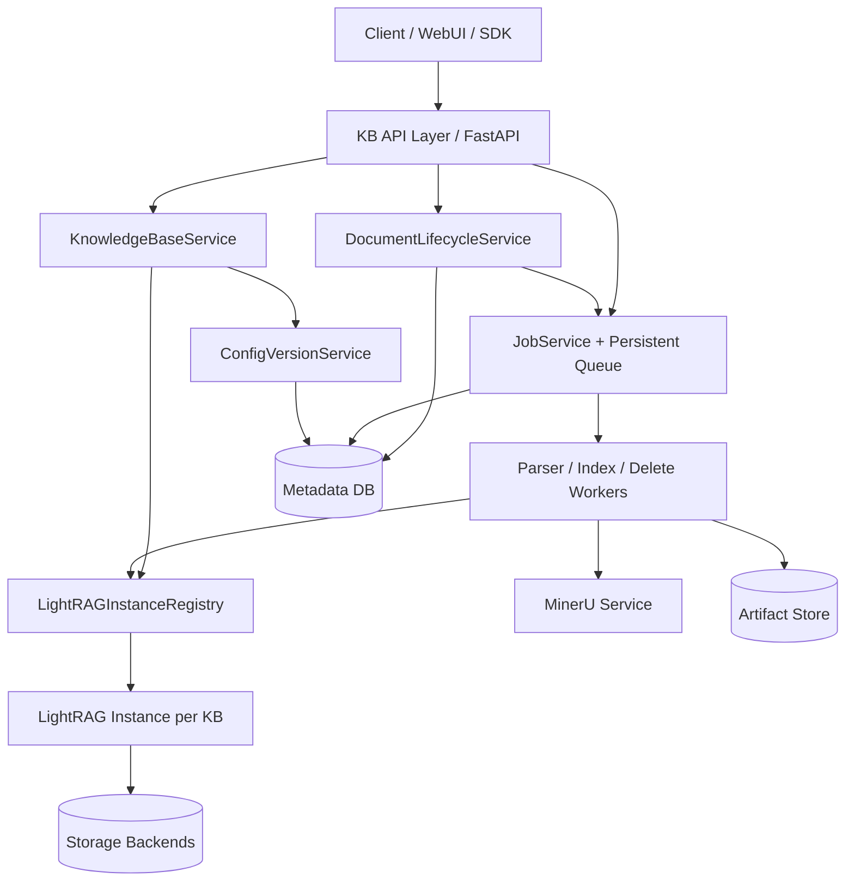

# LightRAG 生产级后端改造设计方案

> 目标：在现有 LightRAG API Server、MinerU 解析流水线、workspace 存储隔离能力之上，封装一个面向生产使用的知识库后端服务。本文优先设计知识库隔离、文档管理、MinerU 解析、知识图谱构建、增量更新、知识库级问答和知识库级配置；用户隔离、RBAC、计费、审计等放到后续阶段。

> 实施进度（2026-05-28）：Phase 1 的 KB CRUD/status 接口骨架、`KnowledgeBaseService`、`LightRAGInstanceRegistry`、server 集成、workspace 无碰撞映射、metadata 跨进程写锁、deleted tombstone 复用保护、PATCH 显式 `null` 语义已经完成并测试通过。Phase 2 已完成控制面补完切片：非向量控制面元数据临时落地 SQLite（`working_dir/metadata/metadata.sqlite3`），新增 `SQLiteMetadataStore`、`DocumentLifecycleService`、`JobService`、KB 级上传/文本导入/文档列表/详情/任务列表/详情接口，并实现文档 `PATCH`（metadata/enabled/archived，拒绝覆盖内部控制面保留 metadata key）、文档列表 `source_name` 过滤、文本导入和单/批 parse 的 idempotency key 复用（SQLite 写事务内 get-or-create、`(kb_id, job_type, idempotency_key)` 唯一索引、请求指纹不一致返回 409）、单文档 `:parse` 后台任务、批量 `documents:batch-parse` 聚合任务、`queued -> running -> succeeded/failed` job 状态流转、document `parse_queued/parsing/parsed/parse_failed` 状态同步、artifact list/detail API，以及文件型 artifact download API。KB 直接 parse 会保留 KB source 文件以保持 `source_uri` 稳定，并让 request-level `force_reparse=true` 覆盖 MinerU/Docling raw bundle cache。上传入口已复用支持扩展名和 `MAX_UPLOAD_SIZE` 保护，且 KB 批量上传要求 `MAX_UPLOAD_SIZE` 为正数，同时限制单请求总字节数不超过该值；另对 KB 批量文件数、文本大小和 metadata 大小做首版限制。同名源文件写入独立 doc 目录并使用独占创建，避免跨进程覆盖。artifact 下载首版仅允许 `original/blocks` 等文件型产物，执行 document 目录路径 containment 校验，目录型 `sidecar/raw_dir` 暂返回 400，跨 KB、缺失文件和路径逃逸均已覆盖测试。批量解析首版使用单个聚合 `parse` job（`document_id=null`、`batch_id` 非空）记录 per-item succeeded/failed 结果；任一 item 失败时聚合 job 终态为 `failed`，但成功 item 仍完成解析和 artifact 持久化。显式单文档/批量 parse 已通过 SQLite 原子 claim 防止同一文档重复进入 `parse_queued/parsing`：单文档 active conflict 返回 409 并保留原 active job，批量 active conflict 作为 per-item failure 且只执行 claim 成功的文档。Phase 3/4/5 MVP 主链路已补齐 KG/index、KB query、enable/disable、delete/batch-delete、document replace、batch incremental sync、job cancel/retry、orphan recovery 和 config version API；当前仍未执行共享图谱删除精确策略、全 KB rebuild、生产 metadata DB migration、durable worker 和用户隔离 / RBAC / 审计 / 配额 / 限流。

## 1. 背景与设计结论

> Phase 2 收尾 + Phase 3 主链路（2026-05-28 续）：
>
> - ✅ **Job cancel / retry API 已落地**。`POST /jobs/{job_id}:cancel` 在 queued 直接转 `cancelled`、running/retrying 转 `cancelling`，已 succeeded/cancelled/failed 视为 no-op；`POST /jobs/{job_id}:retry` 重置 failed/cancelled job 回 `queued`、清空 result/error、`retry_count+=1`、可换发新的 `idempotency_key`，超过 `max_retries` 返回 409。
> - ✅ **`IndexBuildService` + `:build-kg` / `:reindex` / `:batch-build-kg` / `:batch-reindex` 接口**。从 SQLite 中读取 `parsed` 文档对应的 sidecar/blocks artifact，调用 KB 实例的 `apipeline_enqueue_documents(docs_format="lightrag", lightrag_document_paths=[sidecar_uri])` + `apipeline_process_enqueue_documents()`，复用 LightRAG 现有 chunk/entity-relation/embedding/KG merge 流水线；构建成功后从 `doc_status` 回填 `chunks_count/entity_count/relation_count`，并把 `index_hash` 写到 documents 表，文档状态流转 `parsed/build_failed -> build_queued -> building -> ready`。
> - ✅ **基于三段 hash 的增量入库**。`source_hash` 决定要不要重解析（已在 Phase 2 的 parse cache 落实），`parser_hash` 决定 parse 复用还是重跑，`index_hash` 决定 KG/index 是否需要重建；当前 active runtime `index_hash` 只纳入已实际接入运行时的 chunk / embedding 字段，未接入 runtime 的抽取 prompt、role LLM、entity_types/language 等字段暂仅作为 metadata / diff 能力保留。命中且文档已 ready 时 `:build-kg` 直接走 skip 分支并把 job 标 `succeeded`、`result.skipped=true`，**不会触发 LightRAG pipeline**。
> - ✅ **`:reindex` 默认强制重建**。`force_rechunk=force_extract=force_embedding=true`，绕过 hash 跳过；单文档 `:build-kg` 接口允许显式 `force_*` 任一为 true 来局部强制。
> - ✅ **新文件加入已建好 KG 的 KB 时只对该新文档跑 pipeline**。已建文档 `index_hash`/`chunks_count`/`entity_count` 不变，已加测试 `test_incremental_build_does_not_touch_existing_documents`。
> - ✅ **Active build claim 与 parse 同样走 SQLite 原子事务**。单文档 `:build-kg` 遇到 `build_queued/building` 返回 409 + `error_code=build_job_active` + `existing_job_id`，新建 job 同步标 failed；批量 `:batch-build-kg` 把 active conflict 作为 per-item failure，只执行 claim 成功的文档，并记录在聚合 job `result.items` 中。
> - ✅ **失败隔离**。单文档 build 失败时文档进入 `build_failed`、聚合 job 终态 `failed`、`result.summary.outcome=partial_failure` 当且仅当部分成功。
>
> Phase 4 部分完成（2026-05-28 第三轮）：
>
> - ✅ **Registry LRU/TTL 与 destructive lock**。`LightRAGInstanceRegistry` 现支持 `max_entries` LRU 上限、`idle_ttl_seconds` 空闲回收、`destructive_lock(kb_id)` 上下文管理器和 `force_evict`；destructive 期间 `discard` / `reap_idle` / 重建均拒绝执行。
> - ✅ **启动时孤儿任务恢复**。Server lifespan 启动后调用 `JobService.recover_orphan_jobs`：遗留在 `queued/running/cancelling/retrying` 的任务全部转 `failed`、`error_code=worker_orphaned`；同时重置卡在 `parse_queued/parsing/build_queued/building` 的文档为对应 `*_failed`，避免 active claim 永远卡死。客户端可通过 `:retry` API 重新拉起。
> - ✅ **KB 同步硬删除流程**。`KBDeletionService` 在 destructive lock 下顺序执行 `force_evict` -> 清理 `working_dir/<workspace>` -> 清理 `input_dir/<workspace>` -> 清空 SQLite 控制面（documents/jobs/artifacts/config_versions）；落 `clear_kb` job 记录 `purged_rows/cleared_input_dir/finalized_storages/errors`。`DELETE /kbs/{kb_id}?hard=true` 当前在请求内同步执行并返回最终结果，durable/background hard-delete worker 仍未实现。
> - ✅ **目录型 artifact 下载**。`sidecar/raw_dir` 等目录 artifact 通过 `:download` 流式打包为 zip 返回，512MB 上限保护，文件型仍走 `FileResponse`。
> - ✅ **ConfigVersionService + 配置版本 API**。`POST/GET /kbs/{kb_id}/configs`、`GET /configs/{version_id}`、`:activate`、`:diff`；激活后写入 KB 的 `active_config_version_id` 并 discard registry 实例；`:diff` 返回 `requires_reparse/requires_reindex/requires_vector_rebuild` 与 `reasons`。
> - ✅ **Parse retry 自动替换 artifact**。`complete_document_parse` 在写入新 artifact 前先 `DELETE FROM document_artifacts`，已加回归测试覆盖 retry 后旧 `raw_dir` 不残留。
>
> Phase 5 MVP 闭环（2026-05-28 第四轮）：
>
> - ✅ **KB 级 query / query/stream / query/data / retrieve 接口**。`create_kb_query_routes` 封装 `POST /kbs/{kb_id}/query`、`/query/stream`、`/query/data`、`/retrieve`；通过 `LightRAGInstanceRegistry.get(kb_id)` 取 KB 对应实例，复用 `aquery_llm` / `aquery_data` 链路，返回 `kb_id / mode / response / references`。
> - ✅ **KB workspace 隔离已端到端验证**。`test_kb_query_returns_workspace_specific_answer` 创建两个 KB 并发起独立 query，断言 KB A 实例只看到自身的请求并返回 KB A 引用；KB B 反之。
> - ✅ **`filters.doc_ids` 边界校验**。请求若引用本 KB 之外的 document 立即 400（`error_code=doc_ids_not_in_kb` + `missing` 列表）；KB 边界由 workspace 强制保证。retrieval 内部按 doc 精确过滤待 LightRAG QueryParam 后续扩展。
> - ✅ **MVP 闭环全链路**：上传（含同名独立目录）→ 解析（MinerU/Docling/Native）→ 知识图谱与索引构建（含三段 hash 增量）→ KB 级问答（mix/local/global/hybrid/naive/bypass）→ 任务取消/重试/恢复 都已具备并通过测试。一个全新部署可以走完 `创建 KB / 上传文档 / parse / build-kg / query` 五步形成端到端 RAG 服务。
> - ✅ **Phase 4A/4B 文档生命周期动作**：`:enable/:disable`、单文档 `DELETE`、`documents:batch-delete` 已落地；删除 job 会 claim 文档进入 `deleting`、复用 `LightRAG.adelete_by_doc_id`，并在单文档目录 containment 下可选清理 source/artifact。
> - ✅ **Phase 4C document replace 已落地**。`POST /kbs/{kb_id}/documents/{doc_id}:replace` 创建 `replace` job，claim 文档进入 `replacing`，先预检 source/artifact cleanup 路径，再清理旧 `lightrag_doc_id`，随后替换 source/artifact 并重置 parse/index 派生状态；支持 `auto_parse/auto_index`、幂等 key、active conflict 409、query active 状态拒绝、路径 containment 失败转 `replace_failed`。
> - ✅ **Phase 4D batch incremental sync 已落地**。`POST /kbs/{kb_id}/documents:sync` 以同一 KB 内原子唯一的 `source_key` 作为生产文档稳定身份，一次请求内自动判断新增 / unchanged skip / parser-hash reparse / changed replace，并可默认串联 parse + build 到 `ready`，返回单个 `sync` 聚合 job 与 per-item `created/replaced/skipped/reparsed` 结果。
> - ⏭️ 仍未执行（按约定推迟）：共享图谱删除策略、生产 metadata DB 迁移、durable worker（重启自动恢复 queued）、用户隔离 / RBAC / 审计 / 配额 / 限流。

当前项目已经具备较完整的底层能力：

- `lightrag/api/routers/document_routes.py`：已有单文件上传、文本插入、批量文本插入、扫描、文档删除、pipeline status、track status、分页文档状态等接口。
- `lightrag/api/routers/query_routes.py`：已有 `/query`、`/query/stream`、`/query/data`，支持 `local/global/hybrid/naive/mix/bypass` 查询模式。
- `lightrag/api/routers/graph_routes.py`：已有图谱标签、子图、实体/关系编辑、创建、合并等接口。
- `lightrag/lightrag.py`：`LightRAG.workspace` 已作为存储隔离字段，初始化时传入 KV、Vector、Graph、DocStatus 等 storage。
- `lightrag/pipeline.py`：已有 native/mineru/docling 分队列解析、multimodal 分析、chunk、实体关系抽取、KG merge、向量写入流程。
- `lightrag/parser/external/mineru/`：已有 MinerU 外部解析、raw bundle 缓存、LightRAG sidecar 归一化能力。

主要生产化缺口：

1. 没有知识库 CRUD；当前只有一个 server-level `workspace`。
2. 普通 `/documents`、`/query`、`/graph` 接口没有 request-scoped `kb_id/workspace` 路由。
3. 没有 per-KB `LightRAG` 实例注册表，无法自然支持不同知识库不同配置。
4. 缺少持久化任务中心；现有 `pipeline_status` 更适合运行时观察，不适合作为生产事实来源。
5. 缺少多文件上传、指定单文件解析、批量解析、单文档 KG 构建、批量 KG 构建等明确阶段化接口。
6. 缺少知识库级配置版本和 hash 策略，无法可靠判断增量解析/重建范围。
7. 删除一致性需要强化：文档删除必须同时处理 full docs、chunks、vectors、graph、doc status、parser artifacts、输入文件和缓存。

核心设计结论：

```text
kb_id -> workspace -> LightRAG instance -> storage namespace / input dir / parser artifacts / jobs / configs
```

不要用一个全局 `LightRAG` 实例承载所有知识库。生产层应新增 `KnowledgeBaseService + LightRAGInstanceRegistry + DocumentLifecycleService + JobService + ConfigVersionService`，在上层做知识库业务隔离，在底层复用 LightRAG 的 workspace 隔离和 pipeline 能力。

## 2. 目标与非目标

### 2.1 优先目标

- 提供知识库级 API：创建、查询、更新、删除知识库。
- 以知识库为边界管理文档：批量上传、列表、详情、删除、重新解析、重新构建。
- 支持单文件解析和批量解析，优先使用 MinerU。
- 支持将解析结果分阶段送入 LightRAG：chunk、实体关系抽取、知识图谱构建、向量写入。
- 支持增量更新：已有知识库上传新文件只处理新增文件；删除文件自动删除相关存储信息。
- 支持基于指定知识库的问答，可选择 `local/global/hybrid/naive/mix/bypass` 等模式。
- 支持不同知识库使用不同配置：parser、chunk、embedding、rerank、query 默认值、并发限制等。
- 所有耗时操作任务化，返回 `job_id`，支持查询、取消、重试。

### 2.2 暂不作为第一优先级

- 用户体系、租户隔离、RBAC、组织空间。
- 计费、配额、限流、审计日志。
- 图谱人工标注平台。
- 完整 WebUI 重构。
- 多区域/多集群调度。

但第一阶段的数据模型必须预留：`owner_id`、`tenant_id`、`created_by`、`updated_by`、`visibility`，避免后续用户隔离改造时重构所有表和接口。

## 3. 总体架构



### 3.1 模块职责

| 模块 | 职责 |
|---|---|
| `KB API Layer` | 对外暴露 `/api/v1/kbs/...`，解析 `kb_id`，处理参数校验、幂等 key、错误码。 |
| `KnowledgeBaseService` | 管理知识库生命周期、workspace 映射、状态、基础元数据。 |
| `LightRAGInstanceRegistry` | 按 `kb_id` 懒加载/缓存/回收 `LightRAG` 实例，保证每个实例绑定固定 workspace 与配置版本。 |
| `ConfigVersionService` | 管理知识库配置快照，生成 parser/chunk/index/query hash，判断是否需要重建。 |
| `DocumentLifecycleService` | 管理文档元数据、状态机、source hash、artifact、LightRAG doc_id 映射。 |
| `JobService` | 持久化任务，支持 queued/running/succeeded/failed/cancelled、进度、重试、取消、幂等。 |
| `Worker` | 执行上传后解析、MinerU 调用、KG 构建、向量写入、删除清理等耗时工作。 |
| `LightRAG` | 作为底层 RAG 引擎，负责实际解析入库、实体关系抽取、KG merge、查询。 |

## 4. 核心数据模型

### 4.1 knowledge_bases

> 当前状态：✅ 第一阶段已用 JSON metadata 实现同等字段语义，存储位置为 `working_dir/metadata/knowledge_bases.json`；写入使用进程内锁 + 跨进程 `.lock` 文件锁 + reload-before-write + atomic replace。⏭️ 后续仍需迁移/抽象为生产 metadata DB schema。

| 字段 | 说明 |
|---|---|
| `id` | 业务知识库 ID，例如 `kb_...`。 |
| `name` | 知识库名称。 |
| `description` | 描述。 |
| `workspace` | LightRAG workspace，建议由 `kb_id` 派生：`kb_{safe_id}`。 |
| `status` | `creating/active/disabled/deleting/deleted/error`。 |
| `active_config_version_id` | 当前生效配置版本。 |
| `owner_id` | 后续用户隔离预留。 |
| `tenant_id` | 后续多租户预留。 |
| `visibility` | `private/public/internal`，后续权限预留。 |
| `created_at/updated_at/deleted_at` | 生命周期时间。 |

### 4.2 kb_config_versions

> 当前状态：✅ `kb_config_versions` 已在 SQLite metadata schema 中落地，并已暴露 ConfigVersionService/API：创建、列表、详情、`:activate`、`:diff` 均已实现并测试。激活会写入 KB 的 `active_config_version_id` 并 discard 缓存实例；后续 KB LightRAG 重建会应用已支持的 chunk / embedding / query runtime 字段。未接入 runtime 的配置字段仍仅作为 metadata / diff 信息保存。

配置版本必须不可变。修改配置时创建新版本，再决定是否触发重建。

| 字段 | 说明 |
|---|---|
| `id` | 配置版本 ID。 |
| `kb_id` | 所属知识库。 |
| `version` | 单调递增版本号。 |
| `parser_config` | parser engine、MinerU 参数、VLM 参数、force reparse 策略等。 |
| `chunk_config` | chunk 方法、chunk size、overlap、paragraph/vector/recursive 参数。 |
| `embedding_config` | embedding model、dim、token limit、base64 等。 |
| `llm_role_config` | extract/query/keywords/vlm 等角色模型配置。 |
| `query_config` | 默认 mode、top_k、chunk_top_k、token budget、rerank。 |
| `storage_config` | storage 类型和安全可暴露参数。 |
| `parser_hash` | 解析相关 hash。 |
| `index_hash` | 当前 active runtime 已接入的 chunk/embedding runtime hash；未接入 runtime 的 extraction/KG/role 配置暂仅作为 metadata/diff 信息保存。 |
| `query_hash` | 查询默认参数 hash。 |
| `created_at/created_by` | 审计预留。 |

### 4.3 documents

> 当前状态：✅ `documents` 已临时落地 SQLite（非向量控制面元数据），由 `DocumentLifecycleService` 写入；支持 upload/text source、source hash、source_uri、status、metadata、KB 隔离、列表、详情、`source_name` 过滤、`PATCH metadata/enabled/archived`、`:enable/:disable`、job-based `DELETE` / `batch-delete`、job-based `:replace`、`source_key` 增量 sync，以及 parse/build 后回填 `lightrag_doc_id`、`parser_hash`、`index_hash`、chunk/entity/relation 统计。🟡 `enabled/archived` 当前仍是控制面字段，尚未接入检索层过滤。

| 字段 | 说明 |
|---|---|
| `id` | 生产层文档 ID。 |
| `kb_id` | 所属知识库。 |
| `lightrag_doc_id` | LightRAG 内部 doc_id。 |
| `source_type` | `upload/text/url/scan/import`。 |
| `source_name` | 原始文件名或文本来源。 |
| `source_uri` | 原文件存储路径。 |
| `source_hash` | 原始内容 hash。 |
| `parser_hash` | 文档最近一次成功解析时的 parser hash。 |
| `index_hash` | 文档最近一次成功索引时的 index hash。 |
| `status` | 文档状态机，见第 8 节。 |
| `enabled` | 是否参与查询。 |
| `archived` | 是否归档。 |
| `chunks_count` | chunk 数。 |
| `entity_count/relation_count` | 可选统计。 |
| `error_code/error_message` | 最近错误。 |
| `created_at/updated_at` | 时间。 |

### 4.4 document_artifacts

> 当前状态：✅ SQLite schema 已创建 `document_artifacts` 表，并由 parse 成功路径写入 `original`、`sidecar`、`blocks`、`raw_dir` 等首版 artifact 记录；已提供 artifact list/detail API、文件型 artifact download API，以及目录型 artifact zip 下载。⏭️ markdown/content_list/middle_json/images/layout_pdf 等更细粒度 artifact 类型、对象存储签名 URL 待后续完善。

| 字段 | 说明 |
|---|---|
| `id` | artifact ID。 |
| `kb_id/doc_id` | 关联对象。 |
| `artifact_type` | `original/markdown/content_list/middle_json/model_json/image/layout_pdf/sidecar/raw_dir`。 |
| `uri` | 本地路径、对象存储路径或可签名 URL。 |
| `checksum` | 文件校验。 |
| `metadata` | 页码、bbox、mime、大小等。 |
| `created_at` | 时间。 |

### 4.5 jobs

> 当前状态：✅ `jobs` 已临时落地 SQLite，由 `JobService` 管理；支持 upload/parse/build/delete/replace/sync 等 job 创建、列表/详情、wait、cancel、retry、running_jobs 汇总、基础状态流转、批量 per-item result、active conflict、幂等 key 复用与冲突。🟡 执行器仍是 FastAPI in-process background task；durable worker、自动消费 queued retry job、running job cooperative cancellation 检查点和 dead-letter 策略仍待后续阶段。

| 字段 | 说明 |
|---|---|
| `id` | job ID。 |
| `kb_id` | 所属知识库。 |
| `batch_id` | 批量任务 ID，可为空。 |
| `doc_id` | 单文档任务 ID，可为空。 |
| `type` | `upload/parse/index/batch_index/delete/batch_delete/reindex/clear_kb`；批量解析复用 `parse` 聚合 job，并通过 `batch_id`/`total_items`/`result.items` 表达 per-item 结果。 |
| `status` | `queued/running/succeeded/failed/cancelling/cancelled/retrying`。 |
| `stage` | 当前阶段：`uploading/parsing/chunking/extracting_kg/embedding/committing/deleting`。 |
| `progress` | 0-1。 |
| `total_items/completed_items/failed_items` | 批量进度。 |
| `idempotency_key` | 幂等键。 |
| `config_version_id/config_hash` | 执行时配置。 |
| `retry_count/max_retries` | 重试。 |
| `error_code/error_message` | 错误。 |
| `created_at/started_at/finished_at` | 时间。 |

## 5. KB 隔离与 LightRAG 实例管理

### 5.1 隔离策略

- `kb_id` 是业务层主键。
- `workspace` 是 LightRAG 存储隔离主键。
- 每个 KB 对应一个 workspace，workspace 名称必须安全化：只允许字母、数字、下划线。
- 文件、解析产物、pipeline status、DocStatus、KV、Vector、Graph 都必须落在该 workspace 内。

建议映射：

```text
workspace = "kb_" + sanitize(kb_id)
```

当前实现状态：✅ 已完成并测试。允许的 `kb_id` 字符为字母、数字、下划线、连字符；workspace 只保留字母、数字、下划线，并对 `_` / `-` 做可区分编码，避免 `a-b` 与 `a_b` 映射冲突。

### 5.2 LightRAGInstanceRegistry

不能让所有知识库共享一个 `LightRAG` 实例。Registry 负责：

1. 按 `kb_id` 懒加载实例。
2. 为同一个 `kb_id` 加初始化锁，避免并发创建多个实例。
3. 实例创建时读取 `active_config_version`，将 workspace、storage、LLM、embedding、chunk、parser 等配置注入。
4. 调用 `await rag.initialize_storages()` 与必要的数据迁移。
5. 支持 LRU/TTL 回收空闲实例，并调用 `await rag.finalize_storages()`。
6. 配置版本变化后使旧实例失效，下次请求重建。
7. destructive job 期间阻止实例被错误回收或并发重建。

伪代码：

```python
class LightRAGInstanceRegistry:
    async def get(self, kb_id: str) -> LightRAG:
        async with self.init_locks[kb_id]:
            entry = self.cache.get(kb_id)
            config = await config_service.get_active_config(kb_id)
            if entry and entry.config_version_id == config.id:
                return entry.rag
            if entry:
                await entry.rag.finalize_storages()
            rag = build_lightrag_from_config(kb_id, config)
            await rag.initialize_storages()
            self.cache[kb_id] = RegistryEntry(rag=rag, config_version_id=config.id)
            return rag
```

## 6. 分阶段交付路线图

### Phase 0：现状封装与基线治理（准备阶段）

目标：不大改核心逻辑，先整理生产层边界和运行基线。

- 固化当前 `.env`、MinerU、VLM、embedding、Milvus、rerank 配置模板。
- 明确现有 `/documents`、`/query`、`/graph` 能力与缺口。
- 保留现有 API 作为兼容层。
- 增加生产层目录和模块草案：`kb_service`、`job_service`、`document_lifecycle_service`、`config_service`。
- 设计 metadata DB schema 和迁移脚本。

交付物：

- 本设计方案。
- API OpenAPI 草案。
- DB migration 草案。
- 最小集成测试计划。

### Phase 1：知识库隔离与 KB 级 API 骨架（最高优先级）

目标：所有新接口都以 KB 为第一路径边界。

当前状态：✅ 已完成第一阶段骨架并测试通过。代码路由保持自然路径 `/kbs`，部署时通过 FastAPI `root_path` / `--api-prefix /api/v1` 对外呈现为 `/api/v1/kbs`。

接口：

```http
POST   /api/v1/kbs                    ✅ 已实现 / 已测试
GET    /api/v1/kbs                    ✅ 已实现 / 已测试
GET    /api/v1/kbs/{kb_id}            ✅ 已实现 / 已测试
PATCH  /api/v1/kbs/{kb_id}            ✅ 已实现 / 已测试
DELETE /api/v1/kbs/{kb_id}            ✅ 已实现 / 已测试
GET    /api/v1/kbs/{kb_id}/status     ✅ 已实现 / 已测试
```

重点实现：

- 🟡 `knowledge_bases` 表：第一阶段已用 JSON metadata 落地；生产 DB schema/migration 待实现。
- ✅ `kb_id -> workspace` 映射：已实现无碰撞安全映射，并覆盖 `a-b` / `a_b` 回归测试。
- ✅ `LightRAGInstanceRegistry`：已实现 per-KB single-flight 初始化、缓存、discard、shutdown；LRU/TTL 与 destructive job 保护待后续增强。
- ✅ `KBService` / `KnowledgeBaseService`：已实现 CRUD、soft delete、deleted ID 禁止复用、PATCH omitted-vs-null 语义。
- ✅ `GET /status` 汇总 KB 状态、pipeline status、存储状态、运行中 jobs：KB/pipeline/registry/storage workspace 已实现；`running_jobs` 已接入 SQLite `JobService`，返回 queued/running/retrying/cancelling jobs。
- ✅ 保留 `owner_id/tenant_id/visibility` 字段但不强制实现权限。

验收标准：

- ✅ 创建两个 KB 后，对应不同 workspace。已测试 `a-b` 与 `a_b` 不冲突。
- 🟡 两个 KB 文档 metadata 互不影响已在文本导入/跨 KB batch-parse/artifact 访问中覆盖；KB A 查询不返回 KB B 内容依赖 Phase 5 KB 级 query，尚未执行端到端验收。
- 🟡 关闭/删除一个 KB 不影响另一个 KB。已测试 soft delete 与 registry discard；完整存储清理/异步删除任务待 Phase 4。
- ✅ 同一 KB 并发请求只创建一个 LightRAG 实例。已测试 registry single-flight。

Phase 1 已通过测试：

- ✅ `uv run pytest tests/api/routes/test_kb_routes.py -q` → `12 passed`
- ✅ `uv run pytest tests/api/test_path_prefixes.py -q` → `27 passed`
- ✅ `uv run ruff check ...` → `All checks passed!`
- ✅ `python -m py_compile ...` → passed
- ✅ 5 路 review（Goal、QA、Code Quality、Security、Context Mining）均 PASS，无 blocking issue。

### Phase 2：文档管理、批量上传、MinerU 解析任务化（最高优先级）

目标：基于 KB 管理文档，并允许解析阶段独立执行。

接口：

```http
POST   /api/v1/kbs/{kb_id}/documents:upload          ✅ metadata-only 已实现 / 已测试
POST   /api/v1/kbs/{kb_id}/documents:sync            ✅ source_key 增量同步 + parse/build 编排已实现 / 已测试
POST   /api/v1/kbs/{kb_id}/documents:texts           ✅ metadata-only 已实现 / 已测试
GET    /api/v1/kbs/{kb_id}/documents                 ✅ 已实现 / 已测试
GET    /api/v1/kbs/{kb_id}/documents/{doc_id}        ✅ 已实现 / 已测试
PATCH  /api/v1/kbs/{kb_id}/documents/{doc_id}        ✅ metadata/enabled/archived 已实现 / 已测试
POST   /api/v1/kbs/{kb_id}/documents/{doc_id}:disable ✅ 独立控制面禁用已实现 / 已测试
POST   /api/v1/kbs/{kb_id}/documents/{doc_id}:enable  ✅ 独立控制面启用已实现 / 已测试
DELETE /api/v1/kbs/{kb_id}/documents/{doc_id}        ✅ job-based 删除已实现 / 已测试
POST   /api/v1/kbs/{kb_id}/documents:batch-delete    ✅ 聚合 job 批量删除已实现 / 已测试
POST   /api/v1/kbs/{kb_id}/documents/{doc_id}:parse  ✅ parse-only 已实现 / 已测试
POST   /api/v1/kbs/{kb_id}/documents:batch-parse     ✅ parse-only 聚合 job 已实现 / 已测试
GET    /api/v1/kbs/{kb_id}/documents/{doc_id}/artifacts                ✅ list 已实现 / 已测试
GET    /api/v1/kbs/{kb_id}/documents/{doc_id}/artifacts/{artifact_id}  ✅ detail 已实现 / 已测试
GET    /api/v1/kbs/{kb_id}/documents/{doc_id}/artifacts/{artifact_id}:download ✅ 文件型 download 已实现 / 已测试
```

上传请求示例：

```http
POST /api/v1/kbs/kb_xxx/documents:upload?auto_parse=true&auto_index=false
Content-Type: multipart/form-data
files: [a.pdf, b.docx]
parser_engine: mineru
process_options: iteP
```

响应示例：

```json
{
  "job_id": "job_upload_001",
  "batch_id": "batch_001",
  "documents": [
    {"doc_id": "doc_001", "filename": "a.pdf", "status": "parse_queued"},
    {"doc_id": "doc_002", "filename": "b.docx", "status": "parse_queued"}
  ]
}
```

解析接口请求示例：

```json
{
  "engine": "mineru",
  "process_options": "iteP",
  "force_reparse": false,
  "page_range": null,
  "auto_index": false
}
```

重点实现：

- 多文件上传，每个文件独立创建 document 记录。
- ✅ 多文件上传，每个文件独立创建 document 记录；当前只持久化 source 文件和 SQLite metadata，不触发 LightRAG pipeline/vector/KG。
- ✅ 文档列表支持状态分页和 `source_name` 包含过滤；文档 `PATCH` 支持合并 metadata 并更新 `enabled/archived` 标记，同时拒绝覆盖内部控制面保留 metadata key。
- ✅ KB 上传继承旧 `/documents/upload` 的支持扩展名与 `MAX_UPLOAD_SIZE` 保护，并要求 KB 上传场景下 `MAX_UPLOAD_SIZE` 为正数；单文件和单请求总上传字节数均不得超过该值，同时新增单请求文件数限制。文本导入新增单文档文本大小、文档数和 metadata JSON 大小限制。
- ✅ 同名文件上传会写入每个 document 独立目录并使用独占创建，避免并发覆盖或 cleanup 误删其他请求文件。
- ✅ 解析 job 持久化，不依赖内存 queue 作为唯一状态；`auto_parse=true` 时创建 queued parse job，`auto_parse=false` 时创建 succeeded upload job；显式 `:parse` 会创建单文档 parse job 并在后台流转到 `running/succeeded/failed`。
- ✅ 首版 parse artifact 持久化：单文档 parse 成功后写入 `original`、`sidecar`、`blocks`，MinerU/Docling raw 目录存在时写入 `raw_dir`；KB 直接 parse 会关闭 parser 的源文件归档行为，保证 document `source_uri` 与 `original` artifact checksum/size 可持续使用。
- ✅ 文件型 artifact 下载：`original/blocks` 等文件 artifact 可通过 `:download` 获取；下载前按 `inputs/<workspace>/<document_id>` 做路径 containment 校验，跨 KB、路径逃逸、缺失文件返回错误，目录型 `sidecar/raw_dir` 首版安全拒绝。
- ✅ 批量解析：`documents:batch-parse` 创建单个聚合 parse job，按 item 记录成功/失败；运行时单个 parser 失败、缺失 document、缺失 source、已有 active parse job 等不会阻止其他可解析 document 完成。
- ✅ `source_hash + parser_hash` 命中时可跳过 MinerU/Docling 重解析；显式 `force_reparse=true` 会绕过 raw bundle cache。
- ✅ active parse conflict：显式单文档 parse 遇到已有 `parse_queued/parsing/build_queued/building/deleting/replacing` 时返回 409 并将新建 job 标记 failed；批量 parse 将 active 文档作为 per-item failure，且只执行 claim 成功的文档。
- ✅ Phase 2 创建型路径 idempotency key 复用：文本导入、单文档 parse、批量 parse 在 SQLite 写事务内 get-or-create；重复请求返回既有 job/batch，不重复创建 job 或重复执行 parser；同 key 不同请求指纹返回 409。
- ✅ Phase 4A/4B 文档启用/禁用与删除动作：`:enable/:disable` 仅更新 metadata 控制面；单文档 `DELETE` 和 `documents:batch-delete` 创建 `delete` job，原子 claim 文档进入 `deleting`，复用 `LightRAG.adelete_by_doc_id`，并支持受 `INPUT_DIR/<workspace>/<document_id>` containment 保护的 source/artifact 清理。
- ✅ Phase 4C document replace 已落地：`POST /kbs/{kb_id}/documents/{doc_id}:replace` 创建 `replace` job，claim 文档进入 `replacing`，先预检 source/artifact cleanup 路径，再清理旧 `lightrag_doc_id`，随后替换 source/artifact 并重置 parse/index 派生状态；支持 `auto_parse/auto_index`、幂等 key、active conflict 409、query active 状态拒绝、路径 containment 失败转 `replace_failed`。
- ✅ Phase 4D batch incremental sync 已落地：`POST /kbs/{kb_id}/documents:sync` 以同一 KB 内原子唯一的 `source_key` 作为生产文档稳定身份，一次请求内自动判断新增 / unchanged skip / parser-hash reparse / changed replace，并可默认串联 parse + build 到 `ready`，返回单个 `sync` 聚合 job 与 per-item `created/replaced/skipped/reparsed` 结果。
- 🟡 批量接口返回 per-item 结果，单个失败不影响整体任务可追踪；retry/cancel 和 durable worker 语义待后续阶段。

验收标准：

- ✅ 能指定单个文档解析。
- ✅ 能批量解析多个文档。
- ✅ MinerU/native/docling 解析失败后 job 进入 failed，document 进入 `parse_failed`；retry API 待实现。
- ✅ 服务重启后 job 状态仍可查询（SQLite metadata 持久化测试通过）。
- ✅ 上传/文本导入后可按 KB 查询文档列表、详情、jobs 列表、job 详情，并在 `/status` 看到 queued/running jobs。
- ✅ 文档列表 `source_name` 过滤、文档 `PATCH metadata/enabled/archived` 和保留 metadata key 拒绝已覆盖测试。
- ✅ 可下载文件型 parse artifacts，并拒绝目录型 artifact、跨 KB artifact、缺失文件和路径逃逸。
- ✅ 批量解析可处理全成功、部分 parser 失败、缺失 document、缺失 source、active parse 冲突，并在 job result 中返回 per-item 结果；单文档 active parse 冲突返回 409。

Phase 2 第二/第三/第四切片已通过测试：

- ✅ `uv run pytest tests/api/routes/test_kb_document_routes.py -q` → `30 passed`
- ✅ `uv run pytest tests/api/routes/test_kb_routes.py -q` → `12 passed`
- ✅ `uv run pytest tests/api/test_path_prefixes.py -q` → `27 passed`
- ✅ `uv run pytest tests/api/routes/test_kb_document_routes.py tests/api/routes/test_kb_routes.py tests/api/test_path_prefixes.py -q` → `69 passed`
- ✅ `uv run pytest tests/parser/external/mineru/test_parse_mineru_sidecar.py tests/parser/external/docling/test_parse_docling_sidecar.py -q` → `10 passed`
- ✅ `uv run ruff check ...` → `All checks passed!`
- ✅ `python -m py_compile ...` → passed
- ✅ post-fix Oracle 只读复核 PASS：active parse claim 并发语义、job/document 状态一致性、测试与文档覆盖无 blocking/high/medium/low finding。

#### Phase 1/2 完成、未完成和未测试盘点（2026-05-28）

| 范围 | 已完成并测试 | 仍未完成 | 仍未测试 / 仅部分测试 |
|---|---|---|---|
| KB metadata / CRUD | `POST/GET/PATCH/DELETE /kbs`、`GET /kbs/{kb_id}/status`、workspace 无碰撞映射、deleted tombstone、PATCH omitted-vs-null、跨进程 metadata 写锁、registry single-flight/discard。 | JSON metadata 迁移到生产 DB schema/migration；异步 hard delete / storage cleanup；registry LRU/TTL、destructive job 保护增强。 | KB 删除期间与上传/解析/查询的完整并发保护；hard delete 对底层 KV/Vector/Graph/DocStatus/input/artifact 的清理一致性。 |
| 文档 metadata / 上传 / 文本导入 | SQLite `documents/jobs/artifacts/config_versions` 临时 schema；上传/文本导入、列表/详情、状态分页、`source_name` 过滤、`PATCH metadata/enabled/archived`、`:enable/:disable` 独立动作、job-based `DELETE` / `batch-delete`、job-based `:replace`、保留 metadata key 拒绝、KB scoped metadata 查询；扩展名、大小、文件数、文本/metadata 限制；同名文件独立目录和独占创建；文本导入 / replace idempotency key 事务内复用。 | URL/scan/import 类型接入。 | 两个 KB 同名文件上传的完整端到端隔离只覆盖到 metadata/artifact 层，KB 级 query 隔离待 Phase 5。 |
| Parse-only / artifacts | 单文档 `:parse`、批量 `documents:batch-parse` 聚合 job、job/document 状态流转、fake MinerU/native/docling 成功/失败、request-level `force_reparse`、artifact list/detail、文件型 download、目录型 artifact 拒绝、跨 KB/缺失文件/路径逃逸。 | 独立 durable parse worker、worker 崩溃恢复、job cancel/retry、重试时 artifact 替换策略；目录 artifact zip/stream；对象存储签名 URL；更细粒度 MinerU/Docling artifact 类型。 | live MinerU 服务超时/不可用的集成测试；真实外部服务解析耗时/网络失败；服务重启后自动恢复 queued/running parse job。 |
| Job control plane | job 创建、列表、详情、状态流转、`running_jobs` 汇总、批量 per-item result、active conflict failed replacement job、文本导入/单文档 parse/批量 parse idempotency key 事务内复用、同 key 不同请求指纹 409。 | `POST /jobs/{job_id}:cancel`、`:retry`；dead-letter/retry policy。 | cancel/retry 状态机、跨进程 worker 竞争 claim。 |
| Index / query / delete / config | 仅预留表、hash 字段和 API 设计；尚未进入实现。 | `:build-kg`、`:reindex`、KB query/retrieve/query-data、删除一致性、config version service/API/hash diff。 | 新文件增量入库、KB A 查询不返回 KB B 内容、删除后查询不再返回引用、配置变更影响范围。 |

### Phase 3：KG 构建、实体关系抽取、增量入库（最高优先级）

目标：解析和索引解耦，允许先解析、再构建知识图谱。

接口：

```http
POST /api/v1/kbs/{kb_id}/documents/{doc_id}:build-kg
POST /api/v1/kbs/{kb_id}/documents:batch-build-kg
POST /api/v1/kbs/{kb_id}/documents/{doc_id}:reindex
POST /api/v1/kbs/{kb_id}/documents:batch-reindex
GET  /api/v1/kbs/{kb_id}/graph/status
GET  /api/v1/kbs/{kb_id}/graph/entities
GET  /api/v1/kbs/{kb_id}/graph/relations
```

构建请求示例：

```json
{
  "use_existing_parse_artifacts": true,
  "force_rechunk": false,
  "force_extract": false,
  "force_embedding": false
}
```

重点实现：

- 将解析结果转成 LightRAG 可消费的 sidecar/document content。
- 调用 KB 对应 `LightRAG` 实例执行 chunk、entity/relation extraction、KG merge、vector upsert。
- 记录构建 job 的阶段进度：`chunking/extracting_kg/embedding/merging/committing`。
- 记录每个文档的 `index_hash`。
- 已有 KB 上传新文件时只新增入库，不触发全库重建。

验收标准：

- 新文件可增量进入已有 KB。
- 单文档 KG 构建失败不会破坏同 KB 其他文档。
- 可通过 job 查询实体/关系抽取进度。
- 成功后 `documents.status=ready/indexed`，查询可命中新文档。

### Phase 4：删除一致性、增量更新、配置版本（高优先级）

目标：让生产系统能可靠更新和删除。

接口：

```http
POST /api/v1/kbs/{kb_id}/documents/{doc_id}:replace
POST /api/v1/kbs/{kb_id}/documents:sync
POST /api/v1/kbs/{kb_id}/documents/{doc_id}:disable
POST /api/v1/kbs/{kb_id}/documents/{doc_id}:enable
POST /api/v1/kbs/{kb_id}/configs
GET  /api/v1/kbs/{kb_id}/configs
GET  /api/v1/kbs/{kb_id}/configs/{version_id}
POST /api/v1/kbs/{kb_id}:rebuild
```

增量判断 hash：

| hash | 覆盖内容 | 变化后的动作 |
|---|---|---|
| `source_hash` | 原始文件 bytes 或文本内容 | 重新解析 + 重新索引。 |
| `parser_hash` | MinerU/native/docling 参数、版本、VLM 解析配置 | 重新解析 + 重新索引。 |
| `index_hash` | 已接入 active runtime 的 chunk / embedding 配置（如 chunk size/overlap、tokenizer、embedding model/dim/token limit） | 复用解析产物，重新索引。 |
| `query_hash` | 默认 mode、top_k、rerank、token budget | 通常无需重建，仅影响查询。 |

删除策略：

1. API 接收删除请求后创建 delete job。
2. document 先进入 `deleting/tombstoned`，查询层立即过滤。
3. worker 删除 LightRAG 中的 full_docs、text_chunks、entities_vdb、relationships_vdb、chunks_vdb、doc_status。
4. 清理 graph 中仅由该文档贡献的实体/关系；共享实体/关系需要来源引用计数或保守重建策略。
5. 可选删除 LLM cache、MinerU artifacts、原始输入文件。
6. 删除成功后 document 标记 `deleted`；失败则 `delete_failed`，允许重试。

替换策略：

1. API 接收替换请求后创建 `replace` job，document 先进入 `replacing`，查询和 parse/build/delete claim 都会拒绝并返回 active conflict。
2. 若旧文档已有 `lightrag_doc_id`，先调用 `LightRAG.adelete_by_doc_id` 清理旧 full docs/chunks/vector/doc_status；`success/not_found` 都可继续。
3. 在同一文档目录内写入 staging 文件，删除旧 source/artifact 时做 containment 校验；路径逃逸或文件替换失败会进入 `replace_failed`。
4. 替换成功保留原 `document_id`，重置 `parser_hash/index_hash/lightrag_doc_id/chunks_count/entity_count/relation_count` 与解析/索引派生 metadata，使后续 parse/build 必须基于新 `source_hash` 重新执行。
5. `auto_parse=true` 会在 replace job 内继续解析；`auto_index=true` 要求同步解析成功后继续 KG build，避免客户端需要手动串联多个 job。
6. 同一 `idempotency_key` + 相同文件/参数复用原 replace job；同 key 不同请求指纹返回 409。

批量同步策略：

1. `documents:sync` 要求每个上传文件携带稳定 `source_key`；metadata store 维护 `(kb_id, source_key)` 原子唯一索引，避免并发同步创建重复逻辑文档。
2. 找不到 `source_key` 时创建新文档；`source_hash` 相同时跳过 source 替换，但当前请求的 parser 配置若生成新的 `parser_hash`，仍会触发 reparse + rebuild；`source_hash` 不同时复用 replace 的旧索引删除和 source/artifact containment 保护。
3. `auto_parse=true&auto_index=true` 默认把每个成功 item 串到 `ready`；`index_hash` 命中时 build 阶段返回 skipped，不触发 LightRAG pipeline。
4. 聚合 `sync` job 记录 per-item `action/status/parse_result/build_result`，单个 item 失败不阻塞其他 item；active conflict 保留 `parse_job_active/build_job_active/delete_job_active/replace_job_active` 和 `existing_job_id`；同一 `idempotency_key` + 相同文件/参数复用原 sync job。

共享图谱风险：

- 如果实体/关系由多个文档共同贡献，不能简单按实体名删除。
- Phase 4 至少需要一种策略：
  - source attribution：每个实体/关系记录来源 doc_id 列表；删除时只移除当前 doc 来源。
  - reference count：来源数为 0 才删除实体/关系。
  - conservative rebuild：删除后触发 KB 局部或全量重建，保证一致性。

### Phase 5：KB 级问答、检索、图谱管理增强（中高优先级）

目标：稳定提供以 KB 为边界的查询服务。

接口：

```http
POST /api/v1/kbs/{kb_id}/query
POST /api/v1/kbs/{kb_id}/query/stream
POST /api/v1/kbs/{kb_id}/retrieve
POST /api/v1/kbs/{kb_id}/query/data
GET  /api/v1/kbs/{kb_id}/query/default-config
PATCH /api/v1/kbs/{kb_id}/query/default-config
```

查询请求示例：

```json
{
  "query": "低共熔溶剂在萃取分离中的应用有哪些？",
  "mode": "mix",
  "top_k": 60,
  "chunk_top_k": 20,
  "enable_rerank": true,
  "filters": {
    "doc_ids": ["doc_001"],
    "metadata": {"year": "2026"}
  },
  "stream": false,
  "include_references": true,
  "include_chunk_content": true
}
```

查询模式沿用 LightRAG：

| mode | 用途 |
|---|---|
| `mix` | 默认推荐，KG + vector 混合检索。 |
| `hybrid` | local + global 组合。 |
| `local` | 聚焦实体邻域和局部关系。 |
| `global` | 聚焦全局图谱/社区信息。 |
| `naive` | 仅文本向量检索，适合 fallback。 |
| `bypass` | 直通 LLM，建议仅调试或受控开放。 |

重点实现：

- 查询必须先解析 `kb_id`，获取对应 `LightRAG` 实例。
- 请求参数可覆盖 KB 默认查询配置，但要受服务端上限约束。
- 返回 references、chunks、实体、关系、耗时、使用的 config version。
- 后续可加入 query session/history/feedback，但不作为第一优先级。

### Phase 6：用户隔离、权限、审计、运维（后续阶段）

目标：在 KB 边界稳定后，引入多用户生产平台能力。

能力：

- 用户、组织、租户。
- KB owner/admin/editor/viewer 权限。
- API Key 分 KB 授权。
- 操作审计：上传、删除、配置变更、查询。
- 限流和配额：上传大小、文件数、tokens、并发 jobs。
- Job worker 横向扩展、死信队列、重试策略。
- 指标监控：job 延迟、MinerU 耗时、embedding 耗时、Milvus upsert 耗时、query 延迟。
- 备份恢复：metadata DB、artifact store、storage backend 一致性备份。

## 7. API 总览

### 7.1 Knowledge Base APIs

| 方法 | 路径 | 说明 | 当前状态 |
|---|---|---|---|
| `POST` | `/api/v1/kbs` | 创建知识库。 | ✅ 已实现 / 已测试 |
| `GET` | `/api/v1/kbs` | 知识库列表。 | ✅ 已实现 / 已测试 |
| `GET` | `/api/v1/kbs/{kb_id}` | 知识库详情。 | ✅ 已实现 / 已测试 |
| `PATCH` | `/api/v1/kbs/{kb_id}` | 更新名称、描述、owner/tenant/visibility 等 KB metadata；`active_config_version_id` 必须通过配置版本 `:activate` 修改。 | ✅ 已实现 / 已测试 |
| `DELETE` | `/api/v1/kbs/{kb_id}` | 删除知识库，建议异步。 | ✅ soft delete 已实现 / 已测试；`?hard=true` 同步 hard delete 流程已实现 / HTTP route 边界已测试；durable hard-delete worker 待后续 |
| `GET` | `/api/v1/kbs/{kb_id}/status` | KB 状态、pipeline、jobs、存储健康。 | ✅ KB/pipeline/storage/running_jobs 已实现 / 已测试 |

### 7.2 Document APIs

| 方法 | 路径 | 说明 | 当前状态 |
|---|---|---|---|
| `POST` | `/api/v1/kbs/{kb_id}/documents:upload` | 多文件上传，可选择自动解析/自动索引。 | ✅ metadata-only 已实现 / 已测试；`auto_parse=true` 仅创建 queued parse job，不等于 durable worker 已接管；实际 index worker 待后续 |
| `POST` | `/api/v1/kbs/{kb_id}/documents:sync` | 增量同步，自动判断新增/unchanged/changed。 | ✅ source_key 增量同步 + parse/build 编排已实现 / 已测试 |
| `POST` | `/api/v1/kbs/{kb_id}/documents:texts` | 批量文本导入。 | ✅ metadata-only 已实现 / 已测试 |
| `GET` | `/api/v1/kbs/{kb_id}/documents` | 文档列表，支持分页、状态、文件名过滤。 | ✅ 状态分页和 `source_name` 过滤已实现 / 已测试 |
| `GET` | `/api/v1/kbs/{kb_id}/documents/{doc_id}` | 文档详情。 | ✅ 已实现 / 已测试 |
| `PATCH` | `/api/v1/kbs/{kb_id}/documents/{doc_id}` | 更新 metadata、enabled、archived 等。 | ✅ metadata/enabled/archived 已实现 / 已测试 |
| `POST` | `/api/v1/kbs/{kb_id}/documents/{doc_id}:disable` | 独立禁用文档。 | ✅ metadata control-plane 已实现 / 已测试 |
| `POST` | `/api/v1/kbs/{kb_id}/documents/{doc_id}:enable` | 独立启用文档。 | ✅ metadata control-plane 已实现 / 已测试 |
| `DELETE` | `/api/v1/kbs/{kb_id}/documents/{doc_id}` | 单文档异步删除。 | ✅ job-based 删除、LightRAG cleanup、可选文件清理已实现 / 已测试 |
| `POST` | `/api/v1/kbs/{kb_id}/documents:batch-delete` | 批量异步删除。 | ✅ 聚合 job、per-item failure 已实现 / 已测试 |
| `POST` | `/api/v1/kbs/{kb_id}/documents/{doc_id}:replace` | 替换文件并触发增量重建。 | ✅ job-based 替换、old index cleanup、auto_parse/auto_index、active conflict、路径 containment 已实现 / 已测试 |

### 7.3 Parse APIs

| 方法 | 路径 | 说明 | 当前状态 |
|---|---|---|---|
| `POST` | `/api/v1/kbs/{kb_id}/documents/{doc_id}:parse` | 指定单文档解析。 | ✅ parse-only 已实现 / 已测试；active conflict 返回 409 |
| `POST` | `/api/v1/kbs/{kb_id}/documents:batch-parse` | 批量解析。 | ✅ parse-only 聚合 job 已实现 / 已测试；partial failure 和 active conflict 已覆盖 |
| `GET` | `/api/v1/kbs/{kb_id}/documents/{doc_id}/artifacts` | 查看解析产物。 | ✅ list 已实现 / 已测试 |
| `GET` | `/api/v1/kbs/{kb_id}/documents/{doc_id}/artifacts/{artifact_id}` | 读取指定产物元数据。 | ✅ detail 已实现 / 已测试 |
| `GET` | `/api/v1/kbs/{kb_id}/documents/{doc_id}/artifacts/{artifact_id}:download` | 下载指定文件型产物。 | ✅ 文件型 download 已实现 / 已测试 |

### 7.4 Index / KG APIs

| 方法 | 路径 | 说明 | 当前状态 |
|---|---|---|---|
| `POST` | `/api/v1/kbs/{kb_id}/documents/{doc_id}:build-kg` | 单文档实体关系抽取和 KG 构建。 | ✅ 已实现 / 已测试 |
| `POST` | `/api/v1/kbs/{kb_id}/documents:batch-build-kg` | 批量 KG 构建。 | ✅ 已实现 / 已测试 |
| `POST` | `/api/v1/kbs/{kb_id}/documents/{doc_id}:reindex` | 单文档重建索引。 | ✅ 已实现 / 已测试 |
| `POST` | `/api/v1/kbs/{kb_id}/documents:batch-reindex` | 批量重建索引。 | ✅ 已实现 / 已测试 |
| `POST` | `/api/v1/kbs/{kb_id}:rebuild` | 全 KB 重建。 | ⏭️ 待实现 |
| `GET` | `/api/v1/kbs/{kb_id}/graph/status` | 图谱统计。 | ⏭️ 待实现 |
| `GET` | `/api/v1/kbs/{kb_id}/graph/entities` | 实体列表。 | ⏭️ 待实现 |
| `GET` | `/api/v1/kbs/{kb_id}/graph/relations` | 关系列表。 | ⏭️ 待实现 |

### 7.5 Query APIs

| 方法 | 路径 | 说明 | 当前状态 |
|---|---|---|---|
| `POST` | `/api/v1/kbs/{kb_id}/query` | 非流式问答。 | ✅ 已实现 / 已测试；`filters.doc_ids` 仅做 KB 归属和 active 状态校验，尚未做检索层精确过滤 |
| `POST` | `/api/v1/kbs/{kb_id}/query/stream` | 流式问答。 | ✅ 已实现 / 已测试 |
| `POST` | `/api/v1/kbs/{kb_id}/retrieve` | 只检索，不生成答案。 | ✅ 已实现 / 已测试，`query/data` 别名 |
| `POST` | `/api/v1/kbs/{kb_id}/query/data` | 返回结构化检索数据。 | ✅ 已实现 / 已测试 |

### 7.6 Job APIs

| 方法 | 路径 | 说明 | 当前状态 |
|---|---|---|---|
| `GET` | `/api/v1/kbs/{kb_id}/jobs` | 任务列表。 | ✅ 已实现 / 已测试 |
| `GET` | `/api/v1/kbs/{kb_id}/jobs/{job_id}` | 任务详情。 | ✅ 已实现 / 已测试 |
| `POST` | `/api/v1/kbs/{kb_id}/jobs/{job_id}:cancel` | 取消任务。 | ✅ 已实现 / 已测试 |
| `POST` | `/api/v1/kbs/{kb_id}/jobs/{job_id}:retry` | 重试任务。 | ✅ 已实现 / 已测试 |

### 7.7 Config APIs

| 方法 | 路径 | 说明 | 当前状态 |
|---|---|---|---|
| `GET` | `/api/v1/kbs/{kb_id}/configs` | 配置版本列表。 | ✅ 已实现 / 已测试 |
| `POST` | `/api/v1/kbs/{kb_id}/configs` | 创建新配置版本。 | ✅ 已实现 / 已测试 |
| `GET` | `/api/v1/kbs/{kb_id}/configs/{version_id}` | 配置版本详情。 | ✅ 已实现 / 已测试 |
| `POST` | `/api/v1/kbs/{kb_id}/configs/{version_id}:activate` | 激活配置版本。 | ✅ 已实现 / 已测试；运行时生效范围需由 active config 测试约束 |
| `POST` | `/api/v1/kbs/{kb_id}/configs/{version_id}:diff` | 比较配置变化和重建影响。 | ✅ 已实现 / 已测试 |

## 8. 文档状态机

```text
created
  -> uploaded
  -> parse_queued
  -> parsing
  -> parsed
  -> index_queued
  -> chunking
  -> extracting_kg
  -> embedding
  -> merging_kg
  -> committing
  -> ready

失败分支：
  parse_failed
  index_failed
  delete_failed

人工/删除状态：
  disabled
  archived
  deleting
  deleted
  cancelled
```

状态说明：

| 状态 | 说明 |
|---|---|
| `created` | document 记录已创建，但文件可能尚未落盘完成。 |
| `uploaded` | 原始内容已保存。 |
| `parse_queued/parsing` | 等待或正在 MinerU/native/docling 解析。 |
| `parsed` | 解析产物可用。 |
| `index_queued` | 等待进入 LightRAG。 |
| `chunking` | 正在分块。 |
| `extracting_kg` | 正在实体关系抽取。 |
| `embedding` | 正在生成向量。 |
| `merging_kg` | 正在合并实体关系和构建图谱。 |
| `committing` | 正在写入最终存储。 |
| `ready` | 可查询。 |
| `disabled` | 当前仅表示控制面禁用标记；检索层过滤尚未接入，不能视为查询隔离。 |
| `archived` | 当前仅表示控制面归档标记；列表/业务展示可用，检索层过滤尚未接入。 |
| `deleting/deleted` | 删除中/已删除。 |

## 9. 任务化与幂等设计

### 9.1 为什么必须持久化 job

现有 LightRAG `pipeline_status` 可以展示运行时状态，但生产系统还需要处理：

- 服务重启后恢复任务状态。
- Worker 崩溃后重试。
- 客户端重复提交同一请求。
- 大文件 MinerU 解析耗时较长。
- 批量任务局部失败。
- 删除任务需要可重试、可审计。

因此，生产层必须持久化 `jobs`，LightRAG `pipeline_status` 只作为运行时辅助观察。

### 9.2 幂等键

建议所有创建型接口支持 `Idempotency-Key` header；未提供时服务端生成稳定 key。

幂等建议：

| 操作 | 幂等键 |
|---|---|
| 上传 | `kb_id + source_name + source_hash`。 |
| 解析 | `kb_id + doc_id + parser_hash`。 |
| KG 构建 | `kb_id + doc_id + index_hash`。 |
| 删除 | `kb_id + doc_id + delete_options_hash`。 |
| 全库重建 | `kb_id + config_version_id + rebuild_scope`。 |

## 10. MinerU 解析设计

### 10.1 Parser Profile

每个 KB 可配置默认解析策略：

```json
{
  "default_engine": "mineru",
  "rules": [
    {"pattern": "*.pdf", "engine": "mineru", "process_options": "iteP"},
    {"pattern": "*.docx", "engine": "native", "process_options": "iteP"},
    {"pattern": "*", "engine": "legacy", "process_options": "R"}
  ],
  "mineru": {
    "api_mode": "local",
    "model_version": "vlm",
    "is_ocr": false,
    "return_content_list": true,
    "return_middle_json": true,
    "return_images": true
  }
}
```

### 10.2 解析产物

保存以下 artifact：

- 原始文件。
- MinerU raw zip / raw dir。
- Markdown。
- content list。
- middle json。
- model json。
- 图片、表格、公式等资源。
- LightRAG sidecar。

### 10.3 解析缓存

解析缓存 key：

```text
parse_cache_key = hash(source_hash + parser_hash)
```

命中时：

- 不重新调用 MinerU。
- 直接复用 artifacts。
- 如果 `auto_index=true`，继续进入 index job。

## 11. KG 构建与实体关系抽取设计

KG 构建 job 内部阶段：

1. 读取 parsed artifacts / sidecar。
2. 根据 KB chunk config 生成 chunks。
3. 调用 LightRAG entity/relation extraction。
4. 执行 multimodal augmentation（如配置启用）。
5. 合并实体和关系。
6. 写入 graph storage。
7. 写入 entity/relation/chunk vector storage。
8. 更新 doc_status、document 状态、job 状态。

需要记录：

- chunks 数。
- entity 数。
- relation 数。
- embedding 耗时。
- graph merge 耗时。
- failed chunks。
- 使用的 config version。

## 12. KB 级配置方案

### 12.1 配置分类

| 配置 | 示例 | 是否通常需要重建 |
|---|---|---|
| Parser | MinerU/native/docling、OCR、VLM、process options | 是，影响解析产物。 |
| Chunk | chunk method、chunk size、overlap、paragraph/vector 参数 | 是，影响 chunks 和 embedding。 |
| Embedding | model、dim、token limit、base64 | 是，尤其 dim/model 改变必须重建向量。 |
| Extraction | entity prompt、summary language、merge prompt、LLM role | 通常需要重抽取。 |
| Query | mode、top_k、chunk_top_k、rerank、token budget | 通常不需要重建。 |
| Storage | Milvus/Qdrant/PG/Neo4j 等 backend | 通常需要迁移或重建。 |

### 12.2 激活配置的影响分析

`POST /configs/{version_id}:diff` 应返回：

```json
{
  "requires_reparse": true,
  "requires_reindex": true,
  "requires_vector_rebuild": true,
  "affected_documents": 120,
  "reasons": [
    "embedding_model_changed",
    "chunk_size_changed"
  ]
}
```

## 13. 查询设计

### 13.1 请求级覆盖规则

每个 KB 有默认 query config；请求可以覆盖部分参数，但不能超过服务端限制。

规则：

1. `mode` 默认用 KB 配置，允许请求覆盖。
2. `top_k/chunk_top_k/max_total_tokens` 允许覆盖，但不能超过 KB 或系统上限。
3. `bypass` 默认不开放给普通用户，后续权限阶段再控制。
4. `filters.doc_ids` 必须属于当前 KB。
5. 返回结果必须带 `kb_id`、`config_version_id`、`query_mode`、`references`。

### 13.2 响应示例

```json
{
  "kb_id": "kb_001",
  "query_id": "qry_001",
  "mode": "mix",
  "answer": "...",
  "references": [
    {
      "doc_id": "doc_001",
      "file_path": "paper.pdf",
      "chunk_id": "chunk_001",
      "score": 0.82,
      "content": "..."
    }
  ],
  "metadata": {
    "config_version_id": "cfg_003",
    "latency_ms": 2350,
    "token_usage": null
  }
}
```

## 14. 删除一致性设计

删除是生产风险最高的流程之一，当前已任务化并可重试；长期目标仍是 durable worker + cooperative cancellation，而不是仅依赖 in-process background task。

### 14.1 单文档删除流程

```text
DELETE /kbs/{kb_id}/documents/{doc_id}
  -> create delete job
  -> document.status = deleting
  -> query filter excludes doc_id
  -> worker acquires doc lock + kb destructive-compatible lock
  -> remove LightRAG doc data
  -> remove chunks/vectors/graph references
  -> remove doc_status/full_docs
  -> remove artifacts/input file/cache if requested
  -> document.status = deleted
```

### 14.2 删除选项

```json
{
  "delete_file": false,
  "delete_artifacts": true,
  "delete_llm_cache": false,
  "delete_graph_orphans": true,
  "strategy": "safe"
}
```

策略：

| strategy | 说明 |
|---|---|
| `safe` | 只删除明确归属当前 doc 的 chunks/vectors/references；共享实体保留。 |
| `rebuild_doc_scope` | 删除后重建受影响实体/关系。 |
| `rebuild_kb` | 删除后触发全 KB 重建，最慢但一致性最高。 |

## 15. 并发与锁

至少需要三类锁：

| 锁 | 用途 |
|---|---|
| `kb_lock:{kb_id}` | 配置激活、全库重建、删除 KB 等。 |
| `doc_lock:{doc_id}` | 防止同一文档同时解析、索引、删除。 |
| `destructive_lock:{kb_id}` | clear、hard delete、rebuild 期间保护存储一致性。 |

与现有 LightRAG pipeline 的关系：

- 普通 upload/index 可复用现有 `request_pending` 机制。
- destructive job 必须先在生产层 tombstone，再进入 LightRAG 删除。
- 同一 KB 内可以允许多个 parse job 并行，但 index/KG merge 并发要受 KB 配置限制。

当前已完成的锁能力：✅ KB metadata 写入已具备进程内 `asyncio.Lock`、跨进程 `.lock` 文件锁、锁内 reload-before-write、`atomic_write` 原子替换，并通过 spawned multiprocessing 并发写回归测试。

## 16. 兼容现有 API 的迁移策略

短期保留现有接口：

- `/documents/*`
- `/query*`
- `/graph/*`

新增生产接口：

- `/api/v1/kbs/*`

兼容策略：

1. 现有接口继续使用 server default workspace。
2. 新接口必须显式传 `kb_id`。
3. 后续可将旧接口标记 deprecated，并内部转发到 default KB。
4. WebUI 逐步切换到新接口。

## 17. 测试与验收计划

### 17.1 单元测试

- ✅ KB 创建、workspace 名称安全化。
- ✅ Config hash 计算、create/list/get/activate/diff 基本路径已覆盖；parser-only/query-only diff 边界仍需补充。
- ✅ LightRAG registry 并发初始化只创建一次实例。
- 🟡 Document parse 子状态流转已覆盖 `uploaded/parse_queued/parsing/parsed/parse_failed`；metadata/enabled/archived PATCH 和保留 key 拒绝已覆盖；完整状态机（build/delete/disable/replace）待后续阶段。
- ✅ Phase 2 创建型路径 idempotency key 复用与同 key 不同请求冲突已覆盖：文本导入、单文档 parse、批量 parse；并覆盖文本导入同 key 并发创建只生成一个 job/document。

### 17.2 集成测试

- ✅ 创建两个 KB，分别上传/导入文档并确认 metadata/artifact 访问互不影响已覆盖；KB 级 query workspace 隔离已覆盖。
- ✅ KB A 查询不返回 KB B 内容已由 KB query route 测试覆盖。
- ✅ 单文件 MinerU parse 成功并保存 artifacts（测试使用 fake parser，不依赖 live MinerU）。
- ✅ 批量 parse 部分失败时 per-item 状态正确；active parse conflict 已覆盖。
- ✅ 新文件增量 sync/build 只处理新增或变更文档的主路径已覆盖。
- 🟡 删除/替换 active 状态的 query guard 已部分覆盖；删除后共享图谱/跨 backend 检索一致性仍需补充。
- ✅ 配置变更后 diff 正确提示 reparse/reindex 的主路径已覆盖；parser-only/query-only 边界仍需补充。

### 17.3 可靠性测试

- ⏭️ Worker 解析中崩溃，重启后 job 可恢复或重试。
- ⏭️ 删除中失败，重试后最终一致。
- 🟡 parser 异常时 job/document failed 已用 fake parser 覆盖；live MinerU 服务超时/网络失败待集成测试。
- ✅ 并发上传与删除/替换同一文档时，SQLite active claim 会拒绝 parse/build/delete/replace 重入。
- ✅ KB metadata 跨进程并发写不丢记录。

## 18. 风险清单

| 风险 | 影响 | 缓解 |
|---|---|---|
| 单全局 LightRAG 实例承载多 KB | 配置、workspace、pipeline 状态混乱 | 使用 per-KB registry。 |
| 只依赖内存 pipeline status | 重启后状态丢失 | 持久化 jobs/documents。 |
| 删除图谱共享实体误删 | 查询结果损坏 | source attribution、reference count、保守重建。 |
| embedding/chunk 配置变化未重建 | 向量维度或索引语义不一致 | config version + hash diff。 |
| MinerU 解析与索引强耦合 | 索引失败导致重复解析大文件 | 持久化 artifacts，解析/索引解耦。 |
| 批量任务一个失败影响整体 | 用户无法定位局部失败 | per-item status 和 batch job。 |
| 后续加用户隔离成本高 | 大范围重构 | Phase 1 预留 owner/tenant 字段和 `/kbs/{kb_id}` 边界。 |

## 19. 推荐实施顺序

1. 🟡 新增 metadata DB schema：KB、config version、document、artifact、job。当前 KB metadata 已用 JSON 落地；documents/jobs/artifacts/config_versions 已用 SQLite 临时落地；生产 DB schema/migration 待实现。
2. ✅ 实现 `KnowledgeBaseService` 和 `LightRAGInstanceRegistry`。
3. ✅ 实现 `/api/v1/kbs` CRUD 和 `/status`。
4. ✅ 实现 KB 级多文件上传、文本导入和文档列表/详情（metadata-only 已测试）。
5. ✅ 实现持久化 job 查询、取消、重试。Job cancel/retry API + state machine 已落地并测试；durable worker 恢复仍由后续阶段补齐。
6. ✅ 实现单文档 parse job、批量 parse 聚合 job、首版 artifact 保存和文件型 artifact download（parse-only，未触发 KG/index）。
7. ✅ 实现 KG build/index job：基于 hash 三段判断的增量入库已通过测试。
8. ✅ 实现 KB 级 query。
9. ✅ 实现 batch delete、document replace 与首版删除一致性策略。
10. ✅ 实现 config version、hash diff、按需 reparse/reindex。
11. ⏭️ 用户隔离、RBAC、审计、配额、限流：按当前阶段约束暂不执行，仅保留字段/API 边界。

下一步执行建议：MVP 主链路和 Phase 4C document replace 已具备，后续应继续收敛共享图谱删除精度、全 KB rebuild、生产 metadata DB migration 和 durable worker。推荐顺序为：

1. 补齐共享图谱删除策略：source attribution / reference count / conservative rebuild 三选一或分层组合。
2. 实现 `/kbs/{kb_id}:rebuild`，用于删除/配置变更后的保守全量修复。
3. 迁移生产 metadata DB schema/migration，并保留 SQLite 测试覆盖。
4. 把 queued/running job 从同步背景任务推进到 durable worker，补重启后自动恢复。
5. 最后再进入用户隔离、RBAC、审计、配额、限流。

## 20. 最小可上线版本建议

第一版不要追求完整平台，建议只上线：

1. ✅ `POST /api/v1/kbs`
2. ✅ `GET /api/v1/kbs/{kb_id}`
3. ✅ `POST /api/v1/kbs/{kb_id}/documents:upload`（metadata-only）
4. ✅ `GET /api/v1/kbs/{kb_id}/documents`
5. ✅ `POST /api/v1/kbs/{kb_id}/documents/{doc_id}:parse`
6. ✅ `POST /api/v1/kbs/{kb_id}/documents/{doc_id}:build-kg`
7. ✅ `POST /api/v1/kbs/{kb_id}/query`
8. ✅ `GET /api/v1/kbs/{kb_id}/jobs/{job_id}`
9. ✅ `DELETE /api/v1/kbs/{kb_id}/documents/{doc_id}`
10. ✅ `POST /api/v1/kbs/{kb_id}/documents/{doc_id}:replace`

当前额外已完成并测试：`GET /api/v1/kbs`、`PATCH /api/v1/kbs/{kb_id}`、`DELETE /api/v1/kbs/{kb_id}` soft/hard delete、`GET /api/v1/kbs/{kb_id}/status`（含 SQLite running_jobs）、`POST /api/v1/kbs/{kb_id}/documents:texts`、`GET /api/v1/kbs/{kb_id}/documents/{doc_id}`、`POST /api/v1/kbs/{kb_id}/documents:batch-parse`、artifact list/detail/download、job list/cancel/retry/recovery、`:reindex`、`:batch-build-kg`、`:batch-reindex`、KB query stream/data/retrieve、`:enable/:disable`、`documents:batch-delete`。

这些接口已经支撑：创建知识库、上传文件、MinerU/Docling/native 解析、知识图谱构建、KB 级查询、状态追踪、删除和替换闭环。后续仍需补共享图谱删除精确策略、全 KB rebuild、生产 metadata DB migration 和 durable worker，才能覆盖更强的生产恢复能力。

## 21. 结论

生产级改造的关键不是重写 LightRAG，而是在 LightRAG 之上补齐业务层边界：

- 用 `kb_id/workspace` 做知识库隔离。
- 用 per-KB `LightRAGInstanceRegistry` 支撑不同知识库不同配置。
- 用持久化 `documents/jobs/config_versions/artifacts` 做生产事实来源。
- 将上传、解析、KG 构建、删除全部任务化。
- 用 hash 和配置版本驱动增量解析、增量索引和重建判断。
- 第一阶段不做复杂用户体系，但必须预留用户/租户字段和 `/kbs/{kb_id}` API 边界。

按以上路线推进，可以在不破坏现有 LightRAG 核心能力的前提下，把项目逐步封装成可恢复、可追踪、可扩展的生产级 RAG 后端。
