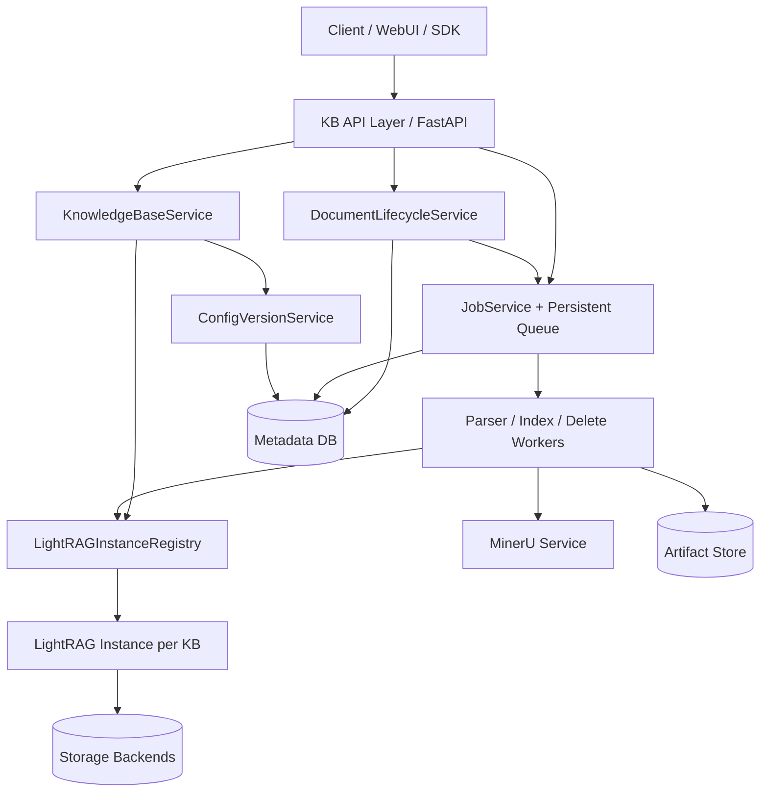

# LightRAG 生产级后端改造设计方案

> 目标：在现有 LightRAG API Server、MinerU 解析流水线、workspace 存储隔离能力之上，封装一个面向生产使用的知识库后端服务。本文优先设计知识库隔离、文档管理、MinerU 解析、知识图谱构建、增量更新、知识库级问答和知识库级配置；用户隔离、RBAC、计费、审计等放到后续阶段。

> 实施进度（2026-05-28）：Phase 1 的 KB CRUD/status 接口骨架、`KnowledgeBaseService`、`LightRAGInstanceRegistry`、server 集成、workspace 无碰撞映射、metadata 跨进程写锁、deleted tombstone 复用保护、PATCH 显式 `null` 语义已经完成并测试通过。Phase 2 已完成控制面补完切片：非向量控制面元数据临时落地 SQLite（`working_dir/metadata/metadata.sqlite3`），新增 `SQLiteMetadataStore`、`DocumentLifecycleService`、`JobService`、KB 级上传/文本导入/文档列表/详情/任务列表/详情接口，并实现文档 `PATCH`（metadata/enabled/archived，拒绝覆盖内部控制面保留 metadata key）、文档列表 `source_name` 过滤、文本导入和单/批 parse 的 idempotency key 复用（SQLite 写事务内 get-or-create、`(kb_id, job_type, idempotency_key)` 唯一索引、请求指纹不一致返回 409）、单文档 `:parse` 后台任务、批量 `documents:batch-parse` 聚合任务、`queued -> running -> succeeded/failed` job 状态流转、document `parse_queued/parsing/parsed/parse_failed` 状态同步、artifact list/detail API，以及文件型 artifact download API。KB 直接 parse 会保留 KB source 文件以保持 `source_uri` 稳定，并让 request-level `force_reparse=true` 覆盖 MinerU/Docling raw bundle cache。上传入口已复用支持扩展名和 `MAX_UPLOAD_SIZE` 保护，且 KB 批量上传要求 `MAX_UPLOAD_SIZE` 为正数，同时限制单请求总字节数不超过该值；另对 KB 批量文件数、文本大小和 metadata 大小做首版限制。同名源文件写入独立 doc 目录并使用独占创建，避免跨进程覆盖。artifact 下载首版仅允许 `original/blocks` 等文件型产物，执行 document 目录路径 containment 校验，目录型 `sidecar/raw_dir` 暂返回 400，跨 KB、缺失文件和路径逃逸均已覆盖测试。批量解析首版使用单个聚合 `parse` job（`document_id=null`、`batch_id` 非空）记录 per-item succeeded/failed 结果；任一 item 失败时聚合 job 终态为 `failed`，但成功 item 仍完成解析和 artifact 持久化。显式单文档/批量 parse 已通过 SQLite 原子 claim 防止同一文档重复进入 `parse_queued/parsing`：单文档 active conflict 返回 409 并保留原 active job，批量 active conflict 作为 per-item failure 且只执行 claim 成功的文档。Phase 3/4/5 MVP 主链路已补齐 KG/index、KB query、enable/disable、delete/batch-delete、document replace、batch incremental sync、job cancel/retry、orphan recovery、config version API、全 KB rebuild 和可选 durable worker；`:reindex` / `force_*` 已修复为「重建前先 `adelete_by_doc_id` 清旧索引再 re-enqueue」，确保真正绕过 LightRAG 引擎去重重跑抽取/嵌入；当时仍未执行共享图谱删除精确策略、生产 metadata DB migration 和用户隔离 / RBAC / 审计 / 配额 / 限流（后续已补共享图谱精确重建、PostgreSQL metadata 后端与迁移工具、replace/sync durable 续跑）。
>
> 实施进度（2026-05-30 补齐）：按“暂时 metadata 仍放 JSON + SQLite”的约束，继续补齐已做但未完成项：`parser_config.engine/process_options` 已接入 parse runtime 默认值（优先级为 request > 文档 metadata > active parser_config > 文件路由规则），配置创建时会校验并规范化 parser 默认值；parse artifact 记录已从 `original/sidecar/blocks/raw_dir` 扩展到 MinerU/Docling raw bundle 中的 `markdown/content_list/middle_json/model_json/image/layout_pdf` 等细粒度文件，并保留 `source` 与 `relative_path` metadata；durable delete worker 已支持 `documents:batch-delete` 聚合 job 的重启续跑，worker 可从 job payload 的 `document_ids` 和删除选项恢复批量删除，并在 `strategy=rebuild_kb` 时复用保守全 KB rebuild。当时仍未迁移生产 metadata DB，`replace` / `sync` / upload auto_parse 等依赖请求字节或一次性上下文的聚合任务仍不作为 durable 可恢复任务；后续 2026-05-31 已补 PostgreSQL 可选后端与 MinIO/S3 对象存储，2026-06-01 已补 JSON/SQLite → PostgreSQL 迁移/回填工具、单文档 replace 与批量 sync staged-bytes durable 续跑。
>
> 实施进度（2026-05-31 补齐「做了但没做完」项，按约定跳过生产 DB 迁移及其强依赖）：
> - ✅ **`llm_role_config` 接入运行时 + 哈希**。实例构建后通过已注册 role builder 调用 `aupdate_llm_role_config` 应用 per-role（`extract`/`keyword`/`query`/`vlm`）覆盖（字符串或对象形式，含 `model`/`binding`/`host`/`api_key`/`provider_options`/`model_kwargs`/`max_async`/`timeout`），配置创建时校验角色与字段名。`extract`/`vlm` 角色“输出身份”纳入 `index_hash`（变更触发 `requires_reindex`），`query`/`keyword` 纳入 `query_hash`；`api_key` 与 `max_async`/`timeout` 不参与哈希。后续已收紧配置边界：`storage_config` 与 parser 服务实例级参数不再作为 KB config metadata 保存，而是在创建配置版本时直接拒绝，避免单 KB 修改部署级基础设施。
> - ✅ **durable worker 恢复范围扩展到聚合 parse/build/reindex**。`_AGGREGATE_RESUMABLE_JOB_TYPES = {delete, parse, build_kg, reindex, clear_kb}`：多文件 `upload`/`texts` 的 auto_parse 聚合 job、`batch-parse`/`batch-build-kg`/`batch-reindex`/`:rebuild`（`document_id=null` + `document_ids` payload，源文件/产物已落盘）现可被 worker 凭持久化状态重新规划并逐个 claim 续跑；孤儿恢复保留这些 queued 聚合 job 不再直接标 `failed`。
> - ✅ **KB 硬删除 durable worker**。`KBDeletionService` 拆出幂等 `_execute_clear`，新增 `enqueue_hard_delete`（创建 queued `clear_kb` job）与 `resume_hard_delete`（worker executor 驱动已认领 job）；`clear_kb` 纳入可恢复聚合类型，`max_retries` 由 0 改为 3 使失败可 `:retry`。同步 `?hard=true` 路由语义不变。
> - ✅ **生产 KB control-plane metadata 可切 PostgreSQL**。新增 `PostgresKnowledgeBaseService` 与 `PostgresMetadataStore`，通过 `LIGHTRAG_KB_METADATA_BACKEND=postgres` 启用；catalog、documents、jobs、artifacts、config_versions 持久化到 PostgreSQL JSONB + projection/index 表，保留原 `KnowledgeBaseService`/`SQLiteMetadataStore` public API 兼容。默认 `local/json/sqlite` 仍使用 `knowledge_bases.json` + `metadata.sqlite3`。
> - ✅ **上传源文件与解析产物可持久化到 MinIO/S3**。新增 `ObjectStorage` 抽象与 `S3ObjectStorage`，通过 `LIGHTRAG_OBJECT_STORAGE=minio|s3` 启用。`aioboto3>=12,<16` 是该后端的运行时依赖：默认 `local`/未启用对象存储时不 import S3 client、不阻塞服务启动；启用 `minio|s3` 时运行环境必须包含该依赖（源码环境执行 `uv sync --extra api`，包安装使用 `lightrag-hku[api]`）。上传/replace 会先写 `INPUT_DIR/<workspace>/<document_id>/...` 本地 cache，再同步对象存储并记录 `metadata.source_object_uri`；parse artifact 记录 `metadata.object_uri` 或 `metadata.object_prefix_uri`；下载时本地 cache 缺失会从对象存储 restore；delete/replace/hard-delete 会同步删除对象。`LIGHTRAG_OBJECT_STORAGE_DISABLE_EXPECT_HEADER=true` 为默认兼容模式，上传前移除 botocore 的 `Expect: 100-continue` 头，避免部分 MinIO/代理组合在 PutObject 上挂起并最终 `RequestTimeout`。
> - ✅ **死信策略 + 可发现性**。`failed` 且 `retry_count >= max_retries` 的任务由 `reset_job_for_retry` 拒绝重试（既有），新增 `GET /kbs/{kb_id}/jobs/dead-letter` 单独列出终态死信任务做人工 triage，与仍可重试的 `failed` 区分。
> - ⏭️ **当时仍按约定推迟**：`replace`/批量 `sync` 的请求字节 durable executor（后续已通过 staged bytes + worker executor 补齐）；运行中单次长 await 的强制中断；共享图谱精确子图局部重建；live MinerU 真集成测试；PostgreSQL/MinIO 生产环境迁移与数据回填工具（后续已补 PostgreSQL metadata 迁移工具）。
> - 测试：`tests/api/routes/test_kb_config_routes.py`(22)、`tests/api/test_job_worker.py`(14)、`tests/api/routes/test_kb_build_kg_routes.py`、`tests/api/test_kb_hard_delete.py`(5) 全通过；完整 `tests/api/` 仅 1 个 Windows CRLF 既有失败（与本次改动无关）。
>
> 实施进度（2026-06-01 补齐「做了但没测」的两大高风险项 + 修复 1 个真实生产 bug）：
> - ✅ **PostgreSQL 控制面后端从「零行为覆盖」升级为「真实后端契约测试」**。新增 `tests/api/test_metadata_store_contract.py`：同一组用例参数化跑 `SQLiteMetadataStore` 与 `PostgresMetadataStore` 两个后端，覆盖 create/list（含 `source_name` 过滤）/idempotency 复用与冲突/job 状态机与非法转换/retry+max_retries/dead-letter/worker 单赢 claim/config 版本单调递增与激活/parse artifact 持久化与 retry 替换/purge/orphan 恢复。SQLite 参数始终运行；Postgres 参数在设置 `LIGHTRAG_KB_POSTGRES_TEST_DSN`（或 `POSTGRES_TEST_DSN`）时**真实连库执行**，否则按可读原因 skip，每次用唯一 `kb_id` 并在结束 `purge`，对共享库安全。**已在真实 PostgreSQL 上跑通（11 SQLite + 11 Postgres = 22 passed）**。
> - 🐞 **修复真实生产 bug：`PostgresMetadataStore.list_documents` 的 `source_name` 过滤在 Postgres 上必然报错**。原 `ESCAPE '\\\\'`（SQL 中两个反斜杠）触发 `asyncpg.exceptions.InvalidEscapeSequenceError`（Postgres 要求 escape 串恰为 1 个字符），导致**按文件名过滤文档列表在 Postgres 后端完全不可用**；该缺陷此前因无真实 Postgres 测试而长期隐藏。已改为单字符 `ESCAPE '\\'`，与 `_escape_like` 的单反斜杠转义一致，并由上面的 live Postgres 契约测试守护。
> - ✅ **对象存储从「仅 FakeObjectStorage 重写接口」升级为「直测出厂代码」**。新增 `tests/api/test_object_storage_s3.py`：仅在 boto3 client 边界打桩（`aioboto3` 在 `S3ObjectStorage._new_session` 内惰性 import，可注入 fake session 完全离线运行；这只表示默认 local/测试 fake session 路径不需要真实 MinIO/S3，生产运行启用 `LIGHTRAG_OBJECT_STORAGE=minio|s3` 仍需要 `aioboto3>=12,<16`），驱动**真实** `S3ObjectStorage` 的 key 前缀规范化、`s3://` URI 构建/解析、bucket 自动创建、upload/download 往返、`upload_directory` 逐文件 key、`list_objects_v2` 分页 + 续传 token（含删除中分页的稳定游标）、`delete_uri`/`delete_prefix`/`delete_workspace` 计数与隔离、非 s3 scheme 拒绝、`DisabledObjectStorage` 语义、`create_object_storage_from_env` 选择；后续补充默认 local 不导入 `aioboto3`、API extra 依赖声明与缺依赖错误提示回归覆盖。
> - ✅ **共享图谱删除从「黑盒委托」升级为「引擎级正确性断言」**。新增 `tests/pipeline/test_shared_graph_delete.py`：用真实 `LightRAG`（内存存储 + fake LLM/embedding）播种「两文档共享 SHARED 实体/关系 + drop 文档独有 ORPHAN 实体/关系」，删除 drop 文档后断言：SHARED 实体**存活**且 `source_id`/`entity_chunks` 收窄到幸存 chunk、仍在 entities_vdb 可检索；ORPHAN 实体与共享-孤儿关系（最后来源被删）从图谱与 entity/relation 向量库**双双被剪除**。这正面验证 `safe`/`rebuild_doc_scope` 的 source-attribution 语义。1 passed。
> - ✅ **API 层 `strategy=rebuild_kb` 补齐成功路径**。`tests/api/routes/test_kb_build_kg_routes.py` 新增 `test_delete_rebuild_kb_strategy_reindexes_survivors`：两文档建到 ready，删除其一并带 `strategy=rebuild_kb`，断言 delete job 终态 `succeeded`、`result.rebuild` 概要（`rebuilt_documents>=1`、`failed_documents==0`、`total_candidates==1`），并通过幸存文档 FakeRAG 的 `delete_calls`/`enqueue_calls`/`doc_status.stamp_counts>=2` 证明保守重建**真正重跑了引擎**（不是空操作）；此前仅有缺 IndexBuildService 的 503 错误路径覆盖。
> - 测试：上述新增/修改集合 `tests/api/test_object_storage_s3.py` + `tests/api/test_metadata_store_contract.py` + `tests/pipeline/test_shared_graph_delete.py` + `tests/api/routes/test_kb_build_kg_routes.py` + `tests/api/test_kb_hard_delete.py` 共 80 passed（含 live Postgres）；完整 `tests/api/` + `tests/pipeline/` 524 passed / 25 skipped，仅 3 个**既有**失败（2 个 LLM-cache 清理用例 + 1 个 Windows CRLF docx 用例，已在 baseline 复现，与本次改动无关）。ruff 全通过。
>
> 实施进度（2026-06-01 第二轮：补齐先前「按约定推迟」的四项，全部可运行 + 有测试）：
> - ✅ **精确共享子图局部重建 `strategy="rebuild_subgraph"`**。删除前先快照被删文档的图谱足迹（`full_entities`/`full_relations` 的实体名 + 关系对），删除成功后**只对与该足迹有交集的幸存文档**做 force-reindex（通过 `full_entities`/`full_relations` 反查共同贡献者），未触及该子图的文档完全不动——区别于 `rebuild_kb` 的全 KB 重建。单/批量 delete 均支持（批量合并各 item 足迹）；`result.rebuild` 额外返回 `affected_documents`/`footprint_entities`/`footprint_relations`；缺 `IndexBuildService` 返回 503。新增 `_capture_graph_footprint`/`_merge_footprints`/`_document_overlaps_footprint`/`_run_subgraph_rebuild`，足迹读取全程 best-effort（缺存储/行 → 空足迹，绝不破坏删除本身）。测试 `test_delete_rebuild_subgraph_reindexes_only_affected_survivors`（只重建受影响幸存者，无关文档 stamp 不变）+ `test_delete_rebuild_subgraph_requires_index_service`（503）。
> - ✅ **parse 阶段 await 内强制中断**。新增 `_run_parse_with_forced_cancel`：把单次长 parse await（MinerU/Docling/native）作为独立 `asyncio.Task` 运行，并发轮询 job 状态，翻转 `cancelling` 即 `cancel()` 在途任务，**不再等待解析跑完**，文档释放回 `parse_failed`（可 `:retry`）。**仅限 parse 阶段**（解析幂等，重跑覆盖 raw bundle/sidecar）；build_kg/向量写入刻意保持阶段边界协作式取消，避免半合并图谱/半写入向量。`job_service=None` 时退化为无轮询开销的普通 await。测试 `tests/api/test_parse_forced_cancel.py`：在途 parse 被中断（`run_parse` 实收 `CancelledError`、`complete_parse` 不执行、文档转 `parse_failed`）、无 job_service 退化、未取消时正常 `succeeded`。
> - ✅ **单文档 `replace` durable 续跑**。replace claim 时把替换源字节落盘到 `INPUT_DIR/<workspace>/<document_id>/.replace-staging-<job_id>.bin`（`stage_replacement_bytes`）；把原 inline 闭包 `_execute_replace_document` 提取为模块级函数供 worker 复用；新增 `build_replace_executor` 凭 staged 字节重建 `DocumentReplacementSource`、重新 claim 文档进入 `replacing`、replay 同一替换逻辑（删旧索引→换 source→可选 auto_parse/auto_index），终态后清理 staging 文件；`replace` 注册进 worker executors（单文档 `document_id IS NOT NULL` 自动纳入认领谓词与孤儿恢复保留）。staged 缺失时以 `replace_not_resumable` 明确失败。测试 `tests/api/test_replace_durable_resume.py`：worker 凭 staged 字节把 queued replace 驱到 succeeded（source 实际更换 + 旧索引删除 + staging 清理）、无 staged 字节明确失败、孤儿恢复保留 queued replace；后续补充普通 in-process replace 成功后 staging 清理，以及终态 transition 失败时保留 staged bytes 供 retry/worker 续跑。
> - ✅ **批量 `sync` durable 续跑**。sync route 在创建聚合 job 前把每个 item 的请求字节落盘到 `INPUT_DIR/<workspace>/.sync-staging/<batch_id>/`，并在 job payload 持久化 `batch_id`、`source_key`、`source_name`、`source_hash`、`content_type` 与 parse/build/delete 选项；`build_sync_executor` 可在重启/`:retry` 后重建 `DocumentSourceInput`，复用同一 per-item sync helper 继续执行 created/replaced/skipped + 可选 parse/build。staging 仅在终态 job transition 成功后 best-effort 清理；缺失或 hash 不匹配以 `sync_not_resumable` 明确失败。测试覆盖 queued sync 从 staged bytes 续跑、孤儿恢复保留 queued sync、终态 transition 失败时 staged bytes 不被提前删除。
> - ✅ **live MinerU 集成测试（gated）**。新增 `tests/parser/external/mineru/test_parse_mineru_live.py`：与 stub 版不同，驱动**真实** MinerU 客户端端到端打到 live 服务；设置 `LIGHTRAG_MINERU_TEST_ENDPOINT`（可选 `LIGHTRAG_MINERU_TEST_PDF`）时执行，否则**干净 skip**（CI 不依赖 MinerU）。断言 live bundle 归一化为 lightrag-format parse 结果、`*.mineru_raw` 目录与 markdown 落盘。
> - ⏭️ **仍按约定推迟**：多文件 `upload` 且 `auto_parse=false` 时不产生可重驱动解析工作；用户隔离/RBAC/审计/配额/限流仍未进入本轮。
> - 测试合计：新增/修改集合 `test_replace_durable_resume.py`(3) + `test_parse_forced_cancel.py`(3) + `test_parse_mineru_live.py`(1 skipped 无端点) + `test_kb_build_kg_routes.py`(subgraph 2) 等共 119 passed / 1 skipped；完整 `tests/api/` + `tests/pipeline/` **532 passed / 25 skipped**（较上一轮 +8），仍仅 3 个既有失败（与本次改动无关，baseline 复现）。ruff 全通过。
>
> 实施进度（2026-06-02：聚合任务流水线并发改造）：
> - ✅ **聚合 `parse` 任务从"逐文档串行 drain"改造为两阶段并发**。Phase 1 受 `MAX_PARALLEL_PARSE_MINERU` 约束并发解析；Phase 2 把全部解析成功的文档一次性批量入队、单次流水线 drain，使 analyze/extract/merge 跨文档重叠。覆盖 4 个 call site：`_run_auto_parse_batch`（`:upload`/`:texts` auto_parse）、`_sync_task`（`:sync`）、`build_parse_executor._run_aggregate` 与 `build_sync_executor._run`（durable worker 续跑）。HTTP 接口/job 协议/文档状态机/客户端**零变更**——纯服务端内部改造，未新增 REST 端点。
> - ✅ **新增服务层接口**：`IndexBuildService.run_build_batch()`（批量入队 + 单次 drain + 轮询 read-back）、`IndexBuildService.collect_doc_status()`、`kb_document_routes._execute_build_plan_batch()`；`_run_sync_followups` / `_execute_sync_item` 新增 `defer_build` 参数把构建推迟到 Phase 2 统一批处理。
> - ✅ **对抗式审查修复 4 个并发缺陷**：(1) 并发 drain 竞态——read-back 改为轮询 `doc_status` 终态，避免把仍在其它流水线 drain 中的文档误判 `build_failed`（同时修了单 doc `run_build` 的同源既存竞态）；(2) 4 处 `asyncio.gather` 补 `return_exceptions=True`，防止 Phase 1 异常泄漏 `build_queued` claim；(3) 批量构建途中取消正确分类为 `cancelled`（非 `build_failed`）；(4) 非强制重建陈旧计数为**重构前既存**缺陷，忠实保留并记为后续单独项。
> - ✅ **配置**：`.env` 的 `MAX_PARALLEL_PARSE_MINERU` 由 `1` 调到 `4`（MinerU 后端单 VLLM 部署、可承受多路 batch）；新增可选 `KB_BUILD_DRAIN_TIMEOUT_SECONDS`(3600) / `KB_BUILD_DRAIN_POLL_SECONDS`(1.0)。详见 `docs/KB聚合任务流水线并发改造设计方案.md` 附录 D。
> - 测试：新增 `tests/api/routes/test_kb_aggregate_concurrent.py`(9)；完整 `tests/api/` **426 passed / 26 skipped**，仅 1 个既有 CRLF/LF 失败（`test_document_routes_docx_archive.py`，与本改造无关，baseline 复现）。ruff 全通过。


## 1. 背景与设计结论

> Phase 2 收尾 + Phase 3 主链路（2026-05-28 续）：
>
> - ✅ **Job cancel / retry API 已落地**。`POST /jobs/{job_id}:cancel` 在 queued 直接转 `cancelled`、running/retrying 转 `cancelling`，已 succeeded/cancelled/failed 视为 no-op；`POST /jobs/{job_id}:retry` 重置 failed/cancelled job 回 `queued`、清空 result/error、`retry_count+=1`、可换发新的 `idempotency_key`，超过 `max_retries` 返回 409。
> - ✅ **`IndexBuildService` + `:build-kg` / `:reindex` / `:batch-build-kg` / `:batch-reindex` 接口**。从 SQLite 中读取 `parsed` 文档对应的 sidecar/blocks artifact，调用 KB 实例的 `apipeline_enqueue_documents(docs_format="lightrag", lightrag_document_paths=[sidecar_uri])` + `apipeline_process_enqueue_documents()`，复用 LightRAG 现有 chunk/entity-relation/embedding/KG merge 流水线；构建成功后从 `doc_status` 回填 `chunks_count/entity_count/relation_count`，并把 `index_hash` 写到 documents 表，文档状态流转 `parsed/build_failed -> build_queued -> building -> ready`。
> - ✅ **基于三段 hash 的增量入库**。`source_hash` 决定要不要重解析（已在 Phase 2 的 parse cache 落实），`parser_hash` 决定 parse 复用还是重跑，`index_hash` 决定 KG/index 是否需要重建；当前 active runtime `index_hash` 纳入已实际接入运行时的 chunk / embedding / extraction 字段（含抽取 language、entity_types/guidance、抽取 caps），`parser_config.engine/process_options` 已接入 parse runtime 默认值，KB config 不允许保存 parser 服务实例级参数或 storage 配置；这些部署级参数必须通过 `.env` / 部署编排统一修改。命中且文档已 ready 时 `:build-kg` 直接走 skip 分支并把 job 标 `succeeded`、`result.skipped=true`，**不会触发 LightRAG pipeline**。
> - ✅ **`:reindex` 默认强制重建**。`force_rechunk=force_extract=force_embedding=true`，绕过 hash 跳过；单文档 `:build-kg` 接口允许显式 `force_*` 任一为 true 来局部强制。
> - ✅ **新文件加入已建好 KG 的 KB 时只对该新文档跑 pipeline**。已建文档 `index_hash`/`chunks_count`/`entity_count` 不变，已加测试 `test_incremental_build_does_not_touch_existing_documents`。
> - ✅ **Active build claim 与 parse 同样走 SQLite 原子事务**。单文档 `:build-kg` 遇到 `build_queued/building` 返回 409 + `error_code=build_job_active` + `existing_job_id`，新建 job 同步标 failed；批量 `:batch-build-kg` 把 active conflict 作为 per-item failure，只执行 claim 成功的文档，并记录在聚合 job `result.items` 中。
> - ✅ **失败隔离**。单文档 build 失败时文档进入 `build_failed`、聚合 job 终态 `failed`、`result.summary.outcome=partial_failure` 当且仅当部分成功。
>
> Phase 4 部分完成（2026-05-28 第三轮）：
>
> - ✅ **Registry LRU/TTL 与 destructive lock**。`LightRAGInstanceRegistry` 现支持 `max_entries` LRU 上限、`idle_ttl_seconds` 空闲回收、`destructive_lock(kb_id)` 上下文管理器和 `force_evict`；destructive 期间 `discard` / `reap_idle` / 重建均拒绝执行。
> - ✅ **启动时孤儿任务恢复**。Server lifespan 启动后调用 `JobService.recover_orphan_jobs`：遗留在 `queued/running/cancelling/retrying` 的任务全部转 `failed`、`error_code=worker_orphaned`；同时重置卡在 `parse_queued/parsing/build_queued/building` 的文档为对应 `*_failed`，避免 active claim 永远卡死。客户端可通过 `:retry` API 重新拉起。
> - ✅ **KB 同步硬删除流程**。`KBDeletionService` 在 destructive lock 下顺序执行 `force_evict` -> 清理 `working_dir/<workspace>` -> 清理 `input_dir/<workspace>` -> 清理对象存储 workspace（启用时）-> 清空 metadata store 控制面（documents/jobs/artifacts/config_versions）；落 `clear_kb` job 记录 `purged_rows/cleared_input_dir/cleared_object_storage/deleted_objects/finalized_storages/errors`。`DELETE /kbs/{kb_id}?hard=true` 当前在请求内同步执行并返回最终结果；后续已补 durable `clear_kb` worker 续跑能力。
> - ✅ **目录型 artifact 下载**。`sidecar/raw_dir` 等目录 artifact 通过 `:download` 流式打包为 zip 返回，512MB 上限保护，文件型仍走 `FileResponse`。
> - ✅ **ConfigVersionService + 配置版本 API**。`POST/GET /kbs/{kb_id}/configs`、`GET /configs/{version_id}`、`:activate`、`:diff`；激活后写入 KB 的 `active_config_version_id` 并 discard registry 实例；`:diff` 返回 `requires_reparse/requires_reindex/requires_vector_rebuild` 与 `reasons`。
> - ✅ **Parse retry 自动替换 artifact**。`complete_document_parse` 在写入新 artifact 前先 `DELETE FROM document_artifacts`，已加回归测试覆盖 retry 后旧 `raw_dir` 不残留。
>
> Phase 5 MVP 闭环（2026-05-28 第四轮）：
>
> - ✅ **KB 级 query / query/stream / query/data / retrieve 接口**。`create_kb_query_routes` 封装 `POST /kbs/{kb_id}/query`、`/query/stream`、`/query/data`、`/retrieve`；通过 `LightRAGInstanceRegistry.get(kb_id)` 取 KB 对应实例，复用 `aquery_llm` / `aquery_data` 链路，返回 `kb_id / mode / response / references`。
> - ✅ **KB workspace 隔离已端到端验证**。`test_kb_query_returns_workspace_specific_answer` 创建两个 KB 并发起独立 query，断言 KB A 实例只看到自身的请求并返回 KB A 引用；KB B 反之。
> - ✅ **`filters.doc_ids` 边界校验 + 检索层精确过滤**。请求若引用本 KB 之外的 document 立即 400（`error_code=doc_ids_not_in_kb` + `missing` 列表）；KB 边界由 workspace 强制保证。检索层精确过滤已落地：服务端把 `filters.doc_ids` 与「可检索集合」（`enabled=true` 且 `archived=false` 且有 `lightrag_doc_id`）取交集映射为 `QueryParam.ids` 白名单，在 `operate.py` 的 naive 向量、实体派生、关系派生三路 chunk 证据上按 `full_doc_id` 精确过滤（全部可检索时传 `ids=None` 零开销）。
> - ✅ **MVP 闭环全链路**：上传（含同名独立目录）→ 解析（MinerU/Docling/Native）→ 知识图谱与索引构建（含三段 hash 增量）→ KB 级问答（mix/local/global/hybrid/naive/bypass）→ 任务取消/重试/恢复 都已具备并通过测试。一个全新部署可以走完 `创建 KB / 上传文档 / parse / build-kg / query` 五步形成端到端 RAG 服务。
> - ✅ **Phase 4A/4B 文档生命周期动作**：`:enable/:disable`、单文档 `DELETE`、`documents:batch-delete` 已落地；删除 job 会 claim 文档进入 `deleting`、复用 `LightRAG.adelete_by_doc_id`，并在单文档目录 containment 下可选清理 source/artifact。
> - ✅ **Phase 4C document replace 已落地**。`POST /kbs/{kb_id}/documents/{doc_id}:replace` 创建 `replace` job，claim 文档进入 `replacing`，先预检 source/artifact cleanup 路径，再清理旧 `lightrag_doc_id`，随后替换 source/artifact 并重置 parse/index 派生状态；支持 `auto_parse/auto_index`、幂等 key、active conflict 409、query active 状态拒绝、路径 containment 失败转 `replace_failed`。
> - ✅ **Phase 4D batch incremental sync 已落地**。`POST /kbs/{kb_id}/documents:sync` 以同一 KB 内原子唯一的 `source_key` 作为生产文档稳定身份，一次请求内自动判断新增 / unchanged skip / parser-hash reparse / changed replace，并可默认串联 parse + build 到 `ready`，返回单个 `sync` 聚合 job 与 per-item `created/replaced/skipped/reparsed` 结果。
> - ⏭️ 仍未执行（按约定推迟）：用户隔离 / RBAC / 审计 / 配额 / 限流。（全 KB rebuild、可选 durable worker、共享图谱删除策略 API（`strategy` + `safe`/`rebuild_doc_scope`/`rebuild_kb`）、运行 job 协作式取消检查点、单文档和批量 delete 的 durable 恢复、parser_config runtime 默认值、细粒度 parse artifact 记录、PostgreSQL 可选后端、MinIO/S3 对象存储、JSON/SQLite → PostgreSQL metadata 迁移/回填工具均已落地。）

当前项目已经具备较完整的底层能力：

- `lightrag/api/routers/document_routes.py`：已有单文件上传、文本插入、批量文本插入、扫描、文档删除、pipeline status、track status、分页文档状态等接口。
- `lightrag/api/routers/query_routes.py`：已有 `/query`、`/query/stream`、`/query/data`，支持 `local/global/hybrid/naive/mix/bypass` 查询模式。
- `lightrag/api/routers/graph_routes.py`：已有图谱标签、子图、实体/关系编辑、创建、合并等接口。
- `lightrag/lightrag.py`：`LightRAG.workspace` 已作为存储隔离字段，初始化时传入 KV、Vector、Graph、DocStatus 等 storage。
- `lightrag/pipeline.py`：已有 native/mineru/docling 分队列解析、multimodal 分析、chunk、实体关系抽取、KG merge、向量写入流程。
- `lightrag/parser/external/mineru/`：已有 MinerU 外部解析、raw bundle 缓存、LightRAG sidecar 归一化能力。

主要生产化缺口：

1. 没有知识库 CRUD；当前只有一个 server-level `workspace`。
2. 普通 `/documents`、`/query`、`/graph` 接口没有 request-scoped `kb_id/workspace` 路由。
3. 没有 per-KB `LightRAG` 实例注册表，无法自然支持不同知识库不同配置。
4. 缺少持久化任务中心；现有 `pipeline_status` 更适合运行时观察，不适合作为生产事实来源。
5. 缺少多文件上传、指定单文件解析、批量解析、单文档 KG 构建、批量 KG 构建等明确阶段化接口。
6. 缺少知识库级配置版本和 hash 策略，无法可靠判断增量解析/重建范围。
7. 删除一致性需要强化：文档删除必须同时处理 full docs、chunks、vectors、graph、doc status、parser artifacts、输入文件和缓存。

核心设计结论：

```text
kb_id -> workspace -> LightRAG instance -> storage namespace / input dir / parser artifacts / jobs / configs
```

不要用一个全局 `LightRAG` 实例承载所有知识库。生产层应新增 `KnowledgeBaseService + LightRAGInstanceRegistry + DocumentLifecycleService + JobService + ConfigVersionService`，在上层做知识库业务隔离，在底层复用 LightRAG 的 workspace 隔离和 pipeline 能力。

## 2. 目标与非目标

### 2.1 优先目标

- 提供知识库级 API：创建、查询、更新、删除知识库。
- 以知识库为边界管理文档：批量上传、列表、详情、删除、重新解析、重新构建。
- 支持单文件解析和批量解析，优先使用 MinerU。
- 支持将解析结果分阶段送入 LightRAG：chunk、实体关系抽取、知识图谱构建、向量写入。
- 支持增量更新：已有知识库上传新文件只处理新增文件；删除文件自动删除相关存储信息。
- 支持基于指定知识库的问答，可选择 `local/global/hybrid/naive/mix/bypass` 等模式。
- 支持不同知识库使用不同配置：parser、chunk、embedding、rerank、query 默认值、并发限制等。
- 所有耗时操作任务化，返回 `job_id`，支持查询、取消、重试。

### 2.2 暂不作为第一优先级

- 用户体系、租户隔离、RBAC、组织空间。
- 计费、配额、限流、审计日志。
- 图谱人工标注平台。
- 完整 WebUI 重构。
- 多区域/多集群调度。

但第一阶段的数据模型必须预留：`owner_id`、`tenant_id`、`created_by`、`updated_by`、`visibility`，避免后续用户隔离改造时重构所有表和接口。

## 3. 总体架构


```mermaid
flowchart TD
    Client[Client / WebUI / SDK]
    API[KB API Layer / FastAPI]
    KBS[KnowledgeBaseService]
    REG[LightRAGInstanceRegistry]
    CFG[ConfigVersionService]
    DOC[DocumentLifecycleService]
    JOB[JobService + Persistent Queue]
    WORKER[Parser / Index / Delete Workers]
    LR[LightRAG Instance per KB]
    MINERU[MinerU Service]
    STORE[(Storage Backends)]
    ART[(Artifact Store)]
    META[(Metadata DB)]

    Client --> API
    API --> KBS
    API --> DOC
    API --> JOB
    KBS --> CFG
    KBS --> REG
    REG --> LR
    DOC --> META
    DOC --> JOB
    JOB --> WORKER
    WORKER --> MINERU
    WORKER --> ART
    WORKER --> REG
    LR --> STORE
    JOB --> META
    CFG --> META
```

### 3.1 模块职责

| 模块 | 职责 |
|---|---|
| `KB API Layer` | 对外暴露 `/api/v1/kbs/...`，解析 `kb_id`，处理参数校验、幂等 key、错误码。 |
| `KnowledgeBaseService` | 管理知识库生命周期、workspace 映射、状态、基础元数据。 |
| `LightRAGInstanceRegistry` | 按 `kb_id` 懒加载/缓存/回收 `LightRAG` 实例，保证每个实例绑定固定 workspace 与配置版本。 |
| `ConfigVersionService` | 管理知识库配置快照，生成 parser/chunk/index/query hash，判断是否需要重建。 |
| `DocumentLifecycleService` | 管理文档元数据、状态机、source hash、artifact、LightRAG doc_id 映射。 |
| `JobService` | 持久化任务，支持 queued/running/succeeded/failed/cancelled、进度、重试、取消、幂等。 |
| `Worker` | 执行上传后解析、MinerU 调用、KG 构建、向量写入、删除清理等耗时工作。 |
| `LightRAG` | 作为底层 RAG 引擎，负责实际解析入库、实体关系抽取、KG merge、查询。 |

## 4. 核心数据模型

### 4.1 knowledge_bases

> 当前状态：✅ 第一阶段已用 JSON metadata 实现同等字段语义，存储位置为 `working_dir/metadata/knowledge_bases.json`；写入使用进程内锁 + 跨进程 `.lock` 文件锁 + reload-before-write + atomic replace。✅ 现已新增 PostgreSQL catalog 后端：`LIGHTRAG_KB_METADATA_BACKEND=postgres` 时使用 `PostgresKnowledgeBaseService`，写入 `kb_catalog` 表（JSONB record + id/status/workspace 等 projection columns）；默认 `local/json/sqlite` 仍保留原 JSON 文件实现。

| 字段 | 说明 |
|---|---|
| `id` | 业务知识库 ID，例如 `kb_...`。 |
| `name` | 知识库名称。 |
| `description` | 描述。 |
| `workspace` | LightRAG workspace，建议由 `kb_id` 派生：`kb_{safe_id}`。 |
| `status` | `creating/active/disabled/deleting/deleted/error`。 |
| `active_config_version_id` | 当前生效配置版本。 |
| `owner_id` | 后续用户隔离预留。 |
| `tenant_id` | 后续多租户预留。 |
| `visibility` | `private/public/internal`，后续权限预留。 |
| `created_at/updated_at/deleted_at` | 生命周期时间。 |

### 4.2 kb_config_versions

> 当前状态：✅ `kb_config_versions` 已在 metadata store schema 中落地，并已暴露 ConfigVersionService/API：创建、列表、详情、`:activate`、`:diff` 均已实现并测试。local 模式写入 SQLite；PostgreSQL 模式写入 `kb_config_versions` JSONB 表。激活会写入 KB 的 `active_config_version_id` 并 discard 缓存实例；后续 KB LightRAG 重建会应用已支持的 chunk / embedding / query / extraction runtime 字段（`extraction_config` 的 `language`、`entity_types`/`entity_types_guidance`、`entity_type_prompt_file`、抽取 caps 已接入 `addon_params` 与构造参数，并纳入 `index_hash`）。`parser_config.engine/process_options` 已接入 parse runtime 默认值，并在配置创建时校验/规范化；`storage_config` 与 parser 服务实例级参数（endpoint/token/api_mode/timeout/workers 等）属于部署级字段，创建 KB config 时直接拒绝。

配置版本必须不可变。修改配置时创建新版本，再决定是否触发重建。

| 字段 | 说明 |
|---|---|
| `id` | 配置版本 ID。 |
| `kb_id` | 所属知识库。 |
| `version` | 单调递增版本号。 |
| `parser_config` | 仅允许 KB 级解析默认值：`engine`/`parser_engine`、`process_options`/`options`。MinerU/Docling endpoint、token、api_mode、timeout、workers 等服务实例级参数不允许写入 KB config。 |
| `chunk_config` | chunk 方法、chunk size、overlap、paragraph/vector/recursive 参数。 |
| `embedding_config` | embedding model、dim、token limit、base64 等。 |
| `llm_role_config` | extract/query/keywords/vlm 等角色模型配置。 |
| `query_config` | 默认 mode、top_k、chunk_top_k、token budget、rerank。 |
| `storage_config` | 部署级字段，不允许写入 KB config；storage backend / 对象存储 endpoint / 连接参数必须通过 `.env` / 部署编排统一管理。 |
| `parser_hash` | 解析相关 hash。 |
| `index_hash` | 当前 active runtime 已接入的 chunk / embedding / extraction / index-affecting LLM role runtime hash；部署级 storage/parser-service 配置不参与 KB config。 |
| `query_hash` | 查询默认参数 hash。 |
| `created_at/created_by` | 审计预留。 |

### 4.3 documents

> 当前状态：✅ `documents` 控制面元数据由 `DocumentLifecycleService` 写入；local 模式临时落地 SQLite，PostgreSQL 模式落地 `kb_documents` JSONB 表。支持 upload/text/url/import/scan source、source hash、source_uri、status、metadata、KB 隔离、列表、详情、`source_name` 过滤、`PATCH metadata/enabled/archived`、`:enable/:disable`、job-based `DELETE` / `batch-delete`、job-based `:replace`、`source_key` 增量 sync，以及 parse/build 后回填 `lightrag_doc_id`、`parser_hash`、`index_hash`、chunk/entity/relation 统计。✅ URL 导入已带 SSRF 基线防护（http/https、禁止 userinfo、解析 hostname 并拒绝 private/local/link-local 等地址、禁用自动 redirect、streaming size cap）；本地 import/scan 仅允许读取 `INPUT_DIR` 下 staged 文件/子目录，拒绝路径逃逸、symlink、空文件、unsupported extension 和超限批次。✅ 若启用对象存储，source 文件会同时持久化到 MinIO/S3，`metadata.source_object_uri` 保存对象 URI；`source_uri` 继续指向 `INPUT_DIR/<workspace>/<document_id>/...` 本地 cache，以兼容 parser/build/download 的本地路径流程。✅ `enabled/archived` 已接入检索层过滤：KB query 在解析 `kb_id` 后把"可检索集合"（`enabled=true` 且 `archived=false` 且有 `lightrag_doc_id`）与 `filters.doc_ids` / `filters.metadata` 取交集映射为 `QueryParam.ids` 白名单，过滤 naive/实体/关系三路 chunk 证据。

| 字段 | 说明 |
|---|---|
| `id` | 生产层文档 ID。 |
| `kb_id` | 所属知识库。 |
| `lightrag_doc_id` | LightRAG 内部 doc_id。 |
| `source_type` | `upload/text/url/scan/import`。 |
| `source_name` | 原始文件名或文本来源。 |
| `source_uri` | 本地 cache 路径；启用对象存储时对象 URI 放在 `metadata.source_object_uri`。 |
| `source_hash` | 原始内容 hash。 |
| `parser_hash` | 文档最近一次成功解析时的 parser hash。 |
| `index_hash` | 文档最近一次成功索引时的 index hash。 |
| `status` | 文档状态机，见第 8 节。 |
| `enabled` | 是否参与查询。 |
| `archived` | 是否归档。 |
| `chunks_count` | chunk 数。 |
| `entity_count/relation_count` | 可选统计。 |
| `error_code/error_message` | 最近错误。 |
| `created_at/updated_at` | 时间。 |

### 4.4 document_artifacts

> 当前状态：✅ metadata store 已创建 `document_artifacts` / `kb_document_artifacts` 记录，并由 parse 成功路径写入 `original`、`sidecar`、`blocks`、`raw_dir` 以及 `markdown/content_list/middle_json/model_json/image/layout_pdf` 等细粒度 artifact；已提供 artifact list/detail API、文件型 artifact download API、目录型 artifact zip 下载，以及文件型 artifact `:preview` inline 预览（text/json/markdown/ndjson/image/pdf，10 MB cap，目录拒绝）。✅ 启用 MinIO/S3 后，文件 artifact 记录 `metadata.object_uri`，目录 artifact 记录 `metadata.object_prefix_uri`；下载/预览时如本地 cache 缺失会按 URI/prefix 自动恢复，delete/replace/hard-delete 同步清理对象。✅ 文件型 object artifact 已支持 `:download-url` 生成对象存储 `GET Object` 预签名 URL，目录型 artifact 仍通过 zip 代理下载。

| 字段 | 说明 |
|---|---|
| `id` | artifact ID。 |
| `kb_id/doc_id` | 关联对象。 |
| `artifact_type` | `original/markdown/content_list/middle_json/model_json/image/layout_pdf/sidecar/raw_dir`。 |
| `uri` | 本地 cache 路径；启用对象存储时对象 URI/prefix 放在 `metadata.object_uri` / `metadata.object_prefix_uri`。 |
| `checksum` | 文件校验。 |
| `metadata` | 页码、bbox、mime、大小等。 |
| `created_at` | 时间。 |

### 4.5 jobs

> 当前状态：✅ `jobs` 已由 `JobService` 管理；local 模式落地 SQLite，PostgreSQL 模式落地 `kb_jobs` JSONB 表。支持 upload/parse/build/reindex/delete/replace/sync/clear_kb 等 job 创建、列表/详情、wait、cancel、retry、running_jobs 汇总、基础状态流转、批量 per-item result、active conflict、幂等 key 复用与冲突。✅ 可选 durable worker（`LIGHTRAG_KB_JOB_WORKER=true`）已落地：原子认领（`queued→running` 单赢 CAS）并自动消费 `parse`/`build_kg`/`reindex`/单文档 `delete`/`replace` 的 queued job（含 `:retry` 重置后），同时支持 `documents:batch-delete` 聚合 `delete` job（`document_id=null`，从 payload 恢复 `document_ids` 与删除选项）、聚合 `sync` job（从 `.sync-staging/<batch_id>/` staged request bytes 与 payload 恢复 per-item source）、以及 `clear_kb` 硬删除 job。重启时保留这些可恢复类型的 queued job 交由 worker 续跑；running parse/build job 已具备阶段边界协作式取消检查点，且 parse 阶段进一步支持 await 内强制中断（在途 MinerU/Docling 解析可被 `:cancel` 立即打断，因解析幂等可安全重跑）。单文档 `replace` 与批量 `sync` 均已 durable：请求字节先落盘 staging，worker 凭 staged bytes 重建并续跑，终态 transition 成功后再 best-effort 清理。🟡 剩余范围：多文件 `upload` 且 `auto_parse=false` 不产生可重驱动解析工作；用户隔离/RBAC/审计/配额/限流未进入本轮。

| 字段 | 说明 |
|---|---|
| `id` | job ID。 |
| `kb_id` | 所属知识库。 |
| `batch_id` | 批量任务 ID，可为空。 |
| `doc_id` | 单文档任务 ID，可为空。 |
| `type` | `upload/parse/index/batch_index/delete/batch_delete/reindex/clear_kb`；批量解析复用 `parse` 聚合 job，并通过 `batch_id`/`total_items`/`result.items` 表达 per-item 结果。 |
| `status` | `queued/running/succeeded/failed/cancelling/cancelled/retrying`。 |
| `stage` | 当前阶段：`uploading/parsing/chunking/extracting_kg/embedding/committing/deleting`。 |
| `progress` | 0-1。 |
| `total_items/completed_items/failed_items` | 批量进度。 |
| `idempotency_key` | 幂等键。 |
| `config_version_id/config_hash` | 执行时配置。 |
| `retry_count/max_retries` | 重试。 |
| `error_code/error_message` | 错误。 |
| `created_at/started_at/finished_at` | 时间。 |

## 5. KB 隔离与 LightRAG 实例管理

### 5.1 隔离策略

- `kb_id` 是业务层主键。
- `workspace` 是 LightRAG 存储隔离主键。
- 每个 KB 对应一个 workspace，workspace 名称必须安全化：只允许字母、数字、下划线。
- 文件、解析产物、pipeline status、DocStatus、KV、Vector、Graph 都必须落在该 workspace 内。

建议映射：

```text
workspace = "kb_" + sanitize(kb_id)
```

当前实现状态：✅ 已完成并测试。允许的 `kb_id` 字符为字母、数字、下划线、连字符；workspace 只保留字母、数字、下划线，并对 `_` / `-` 做可区分编码，避免 `a-b` 与 `a_b` 映射冲突。

### 5.2 LightRAGInstanceRegistry

不能让所有知识库共享一个 `LightRAG` 实例。Registry 负责：

1. 按 `kb_id` 懒加载实例。
2. 为同一个 `kb_id` 加初始化锁，避免并发创建多个实例。
3. 实例创建时读取 `active_config_version`，将 workspace、storage、LLM、embedding、chunk、parser 等配置注入。
4. 调用 `await rag.initialize_storages()` 与必要的数据迁移。
5. 支持 LRU/TTL 回收空闲实例，并调用 `await rag.finalize_storages()`。
6. 配置版本变化后使旧实例失效，下次请求重建。
7. destructive job 期间阻止实例被错误回收或并发重建。

伪代码：

```python
class LightRAGInstanceRegistry:
    async def get(self, kb_id: str) -> LightRAG:
        async with self.init_locks[kb_id]:
            entry = self.cache.get(kb_id)
            config = await config_service.get_active_config(kb_id)
            if entry and entry.config_version_id == config.id:
                return entry.rag
            if entry:
                await entry.rag.finalize_storages()
            rag = build_lightrag_from_config(kb_id, config)
            await rag.initialize_storages()
            self.cache[kb_id] = RegistryEntry(rag=rag, config_version_id=config.id)
            return rag
```

## 6. 分阶段交付路线图

### Phase 0：现状封装与基线治理（准备阶段）

目标：不大改核心逻辑，先整理生产层边界和运行基线。

- 固化当前 `.env`、MinerU、VLM、embedding、Milvus、rerank 配置模板。
- 明确现有 `/documents`、`/query`、`/graph` 能力与缺口。
- 保留现有 API 作为兼容层。
- 增加生产层目录和模块草案：`kb_service`、`job_service`、`document_lifecycle_service`、`config_service`。
- 设计 metadata DB schema 和迁移脚本。

交付物：

- 本设计方案。
- API OpenAPI 草案。
- DB migration 草案。
- 最小集成测试计划。

### Phase 1：知识库隔离与 KB 级 API 骨架（最高优先级）

目标：所有新接口都以 KB 为第一路径边界。

当前状态：✅ 已完成第一阶段骨架并测试通过。代码路由保持自然路径 `/kbs`，部署时通过 FastAPI `root_path` / `--api-prefix /api/v1` 对外呈现为 `/api/v1/kbs`。

接口：

```http
POST   /api/v1/kbs                    ✅ 已实现 / 已测试
GET    /api/v1/kbs                    ✅ 已实现 / 已测试
GET    /api/v1/kbs/{kb_id}            ✅ 已实现 / 已测试
PATCH  /api/v1/kbs/{kb_id}            ✅ 已实现 / 已测试
DELETE /api/v1/kbs/{kb_id}            ✅ 已实现 / 已测试
GET    /api/v1/kbs/{kb_id}/status     ✅ 已实现 / 已测试
```

重点实现：

- ✅ `knowledge_bases` 表：JSON metadata 默认实现、PostgreSQL `kb_catalog` 后端、JSON/SQLite → PostgreSQL metadata 迁移/回填工具均已落地。
- ✅ `kb_id -> workspace` 映射：已实现无碰撞安全映射，并覆盖 `a-b` / `a_b` 回归测试。
- ✅ `LightRAGInstanceRegistry`：已实现 per-KB single-flight 初始化、缓存、discard、shutdown、LRU(`max_entries`)、idle-TTL 回收、`destructive_lock` / `force_evict` 保护，均已测试。
- ✅ `KBService` / `KnowledgeBaseService`：已实现 CRUD、soft delete、deleted ID 禁止复用、PATCH omitted-vs-null 语义。
- ✅ `GET /status` 汇总 KB 状态、pipeline status、存储状态、运行中 jobs：KB/pipeline/registry/storage workspace 已实现；`running_jobs` 已接入 metadata store，返回 queued/running/retrying/cancelling jobs。
- ✅ 保留 `owner_id/tenant_id/visibility` 字段但不强制实现权限。

验收标准：

- ✅ 创建两个 KB 后，对应不同 workspace。已测试 `a-b` 与 `a_b` 不冲突。
- 🟡 两个 KB 文档 metadata 互不影响已在文本导入/跨 KB batch-parse/artifact 访问中覆盖；KB A 查询不返回 KB B 内容依赖 Phase 5 KB 级 query，尚未执行端到端验收。
- 🟡 关闭/删除一个 KB 不影响另一个 KB。已测试 soft delete 与 registry discard；完整存储清理/异步删除任务待 Phase 4。
- ✅ 同一 KB 并发请求只创建一个 LightRAG 实例。已测试 registry single-flight。

Phase 1 已通过测试：

- ✅ `uv run pytest tests/api/routes/test_kb_routes.py -q` → `12 passed`
- ✅ `uv run pytest tests/api/test_path_prefixes.py -q` → `27 passed`
- ✅ `uv run ruff check ...` → `All checks passed!`
- ✅ `python -m py_compile ...` → passed
- ✅ 5 路 review（Goal、QA、Code Quality、Security、Context Mining）均 PASS，无 blocking issue。

### Phase 2：文档管理、批量上传、MinerU 解析任务化（最高优先级）

目标：基于 KB 管理文档，并允许解析阶段独立执行。

接口：

```http
POST   /api/v1/kbs/{kb_id}/documents:upload          ✅ 已实现 / 已测试（auto_parse 后台并发执行解析；auto_index 批量单次 drain 构建）
POST   /api/v1/kbs/{kb_id}/documents:sync            ✅ source_key 增量同步 + parse/build 编排已实现 / 已测试（并发解析 + 批量构建）
POST   /api/v1/kbs/{kb_id}/documents:texts           ✅ 已实现 / 已测试（auto_parse 后台并发执行解析；auto_index 批量单次 drain 构建）
GET    /api/v1/kbs/{kb_id}/documents                 ✅ 已实现 / 已测试
GET    /api/v1/kbs/{kb_id}/documents/{doc_id}        ✅ 已实现 / 已测试
PATCH  /api/v1/kbs/{kb_id}/documents/{doc_id}        ✅ metadata/enabled/archived 已实现 / 已测试
POST   /api/v1/kbs/{kb_id}/documents/{doc_id}:disable ✅ 独立控制面禁用已实现 / 已测试
POST   /api/v1/kbs/{kb_id}/documents/{doc_id}:enable  ✅ 独立控制面启用已实现 / 已测试
DELETE /api/v1/kbs/{kb_id}/documents/{doc_id}        ✅ job-based 删除已实现 / 已测试
POST   /api/v1/kbs/{kb_id}/documents:batch-delete    ✅ 聚合 job 批量删除已实现 / 已测试
POST   /api/v1/kbs/{kb_id}/documents/{doc_id}:parse  ✅ parse-only 已实现 / 已测试
POST   /api/v1/kbs/{kb_id}/documents:batch-parse     ✅ parse-only 聚合 job 已实现 / 已测试
GET    /api/v1/kbs/{kb_id}/documents/{doc_id}/artifacts                ✅ list 已实现 / 已测试
GET    /api/v1/kbs/{kb_id}/documents/{doc_id}/artifacts/{artifact_id}  ✅ detail 已实现 / 已测试
GET    /api/v1/kbs/{kb_id}/documents/{doc_id}/artifacts/{artifact_id}:download ✅ 文件型 download 已实现 / 已测试
```

上传请求示例：

```http
POST /api/v1/kbs/kb_xxx/documents:upload?auto_parse=true&auto_index=false
Content-Type: multipart/form-data
files: [a.pdf, b.docx]
parser_engine: mineru
process_options: iteP
```

响应示例：

```json
{
  "job_id": "job_upload_001",
  "batch_id": "batch_001",
  "documents": [
    {"doc_id": "doc_001", "filename": "a.pdf", "status": "parse_queued"},
    {"doc_id": "doc_002", "filename": "b.docx", "status": "parse_queued"}
  ]
}
```

解析接口请求示例：

```json
{
  "engine": "mineru",
  "process_options": "iteP",
  "force_reparse": false,
  "page_range": null,
  "auto_index": false
}
```

重点实现：

- 多文件上传，每个文件独立创建 document 记录。
- ✅ 多文件上传，每个文件独立创建 document 记录；`auto_parse=false` 仅持久化 source 文件和 metadata（local SQLite 或 PostgreSQL），`auto_parse=true` 则在后台**并发执行解析**（Phase 1 受 `MAX_PARALLEL_PARSE_MINERU` 约束），`auto_index=true` 在 Phase 2 把解析成功的文档**批量单次 drain** 构建到 `ready`；启用对象存储时 source 同步写 MinIO/S3 并记录 `source_object_uri`。
- ✅ 文档列表支持状态分页和 `source_name` 包含过滤；文档 `PATCH` 支持合并 metadata 并更新 `enabled/archived` 标记，同时拒绝覆盖内部控制面保留 metadata key。
- ✅ KB 上传继承旧 `/documents/upload` 的支持扩展名与 `MAX_UPLOAD_SIZE` 保护，并要求 KB 上传场景下 `MAX_UPLOAD_SIZE` 为正数；单文件和单请求总上传字节数均不得超过该值，同时新增单请求文件数限制。文本导入新增单文档文本大小、文档数和 metadata JSON 大小限制。
- ✅ 同名文件上传会写入每个 document 独立目录并使用独占创建，避免并发覆盖或 cleanup 误删其他请求文件。
- ✅ 解析 job 持久化，不依赖内存 queue 作为唯一状态；`auto_parse=true` 时创建 `job_type=parse` 聚合 queued job 并由 in-process 后台任务**并发执行解析**（`auto_index=true` 在 Phase 2 批量单次 drain 构建），`auto_parse=false` 时创建 succeeded upload job；显式 `:parse` 会创建单文档 parse job 并在后台流转到 `running/succeeded/failed`。
- ✅ 首版 parse artifact 持久化：单文档 parse 成功后写入 `original`、`sidecar`、`blocks`，MinerU/Docling raw 目录存在时写入 `raw_dir`；KB 直接 parse 会关闭 parser 的源文件归档行为，保证 document `source_uri` 与 `original` artifact checksum/size 可持续使用；启用对象存储时 artifact file/dir 同步写 MinIO/S3 并记录 `object_uri` / `object_prefix_uri`。
- ✅ 文件型 artifact 下载：`original/blocks` 等文件 artifact 可通过 `:download` 获取；下载前按 `inputs/<workspace>/<document_id>` 做路径 containment 校验，跨 KB、路径逃逸、缺失文件返回错误，目录型 `sidecar/raw_dir` 以流式 zip 返回（512MB 上限，超限 413）；启用对象存储时本地 cache 缺失会先从 MinIO/S3 restore。
- ✅ 批量解析：`documents:batch-parse` 创建单个聚合 parse job，按 item 记录成功/失败；运行时单个 parser 失败、缺失 document、缺失 source、已有 active parse job 等不会阻止其他可解析 document 完成。
- ✅ `source_hash + parser_hash` 命中时可跳过 MinerU/Docling 重解析；显式 `force_reparse=true` 会绕过 raw bundle cache。
- ✅ active parse conflict：显式单文档 parse 遇到已有 `parse_queued/parsing/build_queued/building/deleting/replacing` 时返回 409 并将新建 job 标记 failed；批量 parse 将 active 文档作为 per-item failure，且只执行 claim 成功的文档。
- ✅ Phase 2 创建型路径 idempotency key 复用：文本导入、单文档 parse、批量 parse 在 metadata store 写事务内 get-or-create；重复请求返回既有 job/batch，不重复创建 job 或重复执行 parser；同 key 不同请求指纹返回 409。
- ✅ Phase 4A/4B 文档启用/禁用与删除动作：`:enable/:disable` 仅更新 metadata 控制面；单文档 `DELETE` 和 `documents:batch-delete` 创建 `delete` job，原子 claim 文档进入 `deleting`，复用 `LightRAG.adelete_by_doc_id`，并支持受 `INPUT_DIR/<workspace>/<document_id>` containment 保护的 source/artifact 清理；启用对象存储时同步删除 source/artifact 对象。
- ✅ Phase 4C document replace 已落地：`POST /kbs/{kb_id}/documents/{doc_id}:replace` 创建 `replace` job，claim 文档进入 `replacing`，先预检 source/artifact cleanup 路径，再清理旧 `lightrag_doc_id`，随后替换 source/artifact 并重置 parse/index 派生状态；支持 `auto_parse/auto_index`、幂等 key、active conflict 409、query active 状态拒绝、路径 containment 失败转 `replace_failed`。
- ✅ Phase 4D batch incremental sync 已落地：`POST /kbs/{kb_id}/documents:sync` 以同一 KB 内原子唯一的 `source_key` 作为生产文档稳定身份，一次请求内自动判断新增 / unchanged skip / parser-hash reparse / changed replace，并可默认串联 parse + build 到 `ready`，返回单个 `sync` 聚合 job 与 per-item `created/replaced/skipped/reparsed` 结果。
- ✅ 批量接口返回 per-item 结果，单个失败不影响整体任务可追踪；job cancel/retry、dead-letter、durable worker 自动消费 `:retry`，以及 parse/build/reindex/delete/replace/sync/clear_kb 的可恢复 queued job 语义均已补齐并有回归测试。

验收标准：

- ✅ 能指定单个文档解析。
- ✅ 能批量解析多个文档。
- ✅ MinerU/native/docling 解析失败后 job 进入 failed，document 进入 `parse_failed`；job `:retry` 已实现并可由 durable worker 自动消费可恢复 queued 任务。
- ✅ 服务重启后 job 状态仍可查询（metadata store 持久化测试通过）。
- ✅ 上传/文本导入后可按 KB 查询文档列表、详情、jobs 列表、job 详情，并在 `/status` 看到 queued/running jobs。
- ✅ 文档列表 `source_name` 过滤、文档 `PATCH metadata/enabled/archived` 和保留 metadata key 拒绝已覆盖测试。
- ✅ 可下载文件型 parse artifacts；目录型 `sidecar/raw_dir` 已支持 512MB 上限的流式 zip 下载；跨 KB artifact、缺失文件和路径逃逸均会拒绝。
- ✅ 批量解析可处理全成功、部分 parser 失败、缺失 document、缺失 source、active parse 冲突，并在 job result 中返回 per-item 结果；单文档 active parse 冲突返回 409。

Phase 2 第二/第三/第四切片已通过测试：

- ✅ `uv run pytest tests/api/routes/test_kb_document_routes.py -q` → `30 passed`
- ✅ `uv run pytest tests/api/routes/test_kb_routes.py -q` → `12 passed`
- ✅ `uv run pytest tests/api/test_path_prefixes.py -q` → `27 passed`
- ✅ `uv run pytest tests/api/routes/test_kb_document_routes.py tests/api/routes/test_kb_routes.py tests/api/test_path_prefixes.py -q` → `69 passed`
- ✅ `uv run pytest tests/parser/external/mineru/test_parse_mineru_sidecar.py tests/parser/external/docling/test_parse_docling_sidecar.py -q` → `10 passed`
- ✅ `uv run ruff check ...` → `All checks passed!`
- ✅ `python -m py_compile ...` → passed
- ✅ post-fix Oracle 只读复核 PASS：active parse claim 并发语义、job/document 状态一致性、测试与文档覆盖无 blocking/high/medium/low finding。

#### Phase 1/2 完成、未完成和未测试盘点（2026-06-02 同步当前状态）

| 范围 | 已完成并测试 | 仍未完成 | 仍未测试 / 仅部分测试 |
|---|---|---|---|
| KB metadata / CRUD | `POST/GET/PATCH/DELETE /kbs`、`GET /kbs/{kb_id}/status`、workspace 无碰撞映射、deleted tombstone、PATCH omitted-vs-null、跨进程 metadata 写锁、registry single-flight/discard；默认 JSON catalog、PostgreSQL `kb_catalog` 后端、JSON/SQLite → PostgreSQL metadata 迁移/回填工具、soft/hard delete 与 durable `clear_kb` 续跑均已实现。 | MinIO bucket/prefix 备份恢复 runbook 与生产演练。 | hard delete 对真实底层 KV/Vector/Graph/DocStatus/input/artifact/object-storage 的跨后端清理一致性仍需更大范围生产环境演练。 |
| 文档 metadata / 上传 / 文本导入 | local SQLite 与 PostgreSQL `documents/jobs/artifacts/config_versions` metadata store；上传/文本导入、URL 导入（含 hostname 预检与实际连接 peer address 复验的 SSRF/DNS rebinding 防护）、本地 staged 文件 import、staged 目录 scan、列表/详情、状态分页、`source_name` 过滤、`PATCH metadata/enabled/archived`、`:enable/:disable`、job-based `DELETE` / `batch-delete`、job-based `:replace`、`documents:sync`、保留 metadata key 拒绝、KB scoped `filters.doc_ids` / `filters.metadata` 查询；扩展名、大小、文件数、文本/metadata 限制；同名文件独立目录和独占创建；文本/URL/import/scan 导入、replace、sync idempotency key 事务内复用；MinIO/S3 source 持久化与本地 cache fallback；JSON/SQLite → PostgreSQL metadata 迁移工具。 | — | 两个 KB 同名文件上传的 metadata/artifact/query 隔离主路径已覆盖；URL/import/scan 已有 mock/本地 staged 回归测试，但跨真实生产后端组合仍需集成演练。 |
| Parse-only / artifacts | 单文档 `:parse`、批量 `documents:batch-parse` 聚合 job、job/document 状态流转、fake MinerU/native/docling 成功/失败、request-level `force_reparse`、artifact list/detail、文件型 download、目录型 zip download、文件型 artifact inline preview、文件型 artifact 对象存储预签名 URL、对象存储 URI/prefix 持久化与 restore、跨 KB/缺失文件/路径逃逸/不可信 object URI 拒绝。 | — | live MinerU 服务超时/不可用、真实外部服务解析耗时/网络失败仍需更多集成测试；当前 live MinerU 测试为 gated，未配置端点时 skip。 |
| Job control plane | job 创建、列表、详情、wait、cancel、retry、dead-letter、状态流转、`running_jobs` 汇总、批量 per-item result、active conflict、幂等 key 复用与冲突、worker 单赢 claim、`:retry` 自动消费、重启后保留 parse/build_kg/reindex/delete/replace/sync/clear_kb 的可恢复 queued job 均已实现并有回归测试。 | 多文件 `upload` 且 `auto_parse=false` 不产生可重驱动解析工作（需要客户端重新触发 parse）。 | live 服务故障、真实多进程/多 worker 部署恢复仍需生产级演练。 |
| Index / query / delete / config | `:build-kg`、`:batch-build-kg`、`:reindex`、`:batch-reindex`、`/kbs/{kb_id}:rebuild`、KB query/query-stream/query-data/retrieve、`filters.doc_ids` 精确过滤、删除一致性、`safe/rebuild_doc_scope/rebuild_kb/rebuild_subgraph`、ConfigVersionService/API/hash diff、active parser/chunk/embedding/query/extraction/llm role runtime 字段均已实现并测试；`storage_config` 与 parser 服务实例级参数已作为部署级字段在配置创建时拒绝。 | query/default-config GET/PATCH 早期设想未实现，已由 active config 的 `query_config` 替代。 | storage backend 切换、对象存储、PostgreSQL、live MinerU 等真实环境组合仍需部署级验证。 |

### Phase 3：KG 构建、实体关系抽取、增量入库（最高优先级）

目标：解析和索引解耦，允许先解析、再构建知识图谱。

接口：

```http
POST /api/v1/kbs/{kb_id}/documents/{doc_id}:build-kg
POST /api/v1/kbs/{kb_id}/documents:batch-build-kg
POST /api/v1/kbs/{kb_id}/documents/{doc_id}:reindex
POST /api/v1/kbs/{kb_id}/documents:batch-reindex
GET  /api/v1/kbs/{kb_id}/graph/status
GET  /api/v1/kbs/{kb_id}/graph/entities
GET  /api/v1/kbs/{kb_id}/graph/relations
```

构建请求示例：

```json
{
  "use_existing_parse_artifacts": true,
  "force_rechunk": false,
  "force_extract": false,
  "force_embedding": false
}
```

重点实现：

- 将解析结果转成 LightRAG 可消费的 sidecar/document content。
- 调用 KB 对应 `LightRAG` 实例执行 chunk、entity/relation extraction、KG merge、vector upsert。
- 记录构建 job 的阶段进度：`chunking/extracting_kg/embedding/merging/committing`。
- 记录每个文档的 `index_hash`。
- 已有 KB 上传新文件时只新增入库，不触发全库重建。

验收标准：

- 新文件可增量进入已有 KB。
- 单文档 KG 构建失败不会破坏同 KB 其他文档。
- 可通过 job 查询实体/关系抽取进度。
- 成功后 `documents.status=ready/indexed`，查询可命中新文档。

### Phase 4：删除一致性、增量更新、配置版本（高优先级）

目标：让生产系统能可靠更新和删除。

接口：

```http
POST /api/v1/kbs/{kb_id}/documents/{doc_id}:replace
POST /api/v1/kbs/{kb_id}/documents:sync
POST /api/v1/kbs/{kb_id}/documents/{doc_id}:disable
POST /api/v1/kbs/{kb_id}/documents/{doc_id}:enable
POST /api/v1/kbs/{kb_id}/configs
GET  /api/v1/kbs/{kb_id}/configs
GET  /api/v1/kbs/{kb_id}/configs/{version_id}
POST /api/v1/kbs/{kb_id}:rebuild
```

增量判断 hash：

| hash | 覆盖内容 | 变化后的动作 |
|---|---|---|
| `source_hash` | 原始文件 bytes 或文本内容 | 重新解析 + 重新索引。 |
| `parser_hash` | MinerU/native/docling 参数、版本、VLM 解析配置 | 重新解析 + 重新索引。 |
| `index_hash` | 已接入 active runtime 的 chunk / embedding 配置（如 chunk size/overlap、tokenizer、embedding model/dim/token limit） | 复用解析产物，重新索引。 |
| `query_hash` | 默认 mode、top_k、rerank、token budget | 通常无需重建，仅影响查询。 |

删除策略：

1. API 接收删除请求后创建 delete job。
2. document 先进入 `deleting/tombstoned`，查询层立即过滤。
3. worker 删除 LightRAG 中的 full_docs、text_chunks、entities_vdb、relationships_vdb、chunks_vdb、doc_status。
4. 清理 graph 中仅由该文档贡献的实体/关系；共享实体/关系需要来源引用计数或保守重建策略。
5. 可选删除 LLM cache、MinerU artifacts、原始输入文件。
6. 删除成功后 document 标记 `deleted`；失败则 `delete_failed`，允许重试。

替换策略：

1. API 接收替换请求后创建 `replace` job，document 先进入 `replacing`，查询和 parse/build/delete claim 都会拒绝并返回 active conflict。
2. 若旧文档已有 `lightrag_doc_id`，先调用 `LightRAG.adelete_by_doc_id` 清理旧 full docs/chunks/vector/doc_status；`success/not_found` 都可继续。
3. 在同一文档目录内写入 staging 文件，删除旧 source/artifact 时做 containment 校验；路径逃逸或文件替换失败会进入 `replace_failed`。
4. 替换成功保留原 `document_id`，重置 `parser_hash/index_hash/lightrag_doc_id/chunks_count/entity_count/relation_count` 与解析/索引派生 metadata，使后续 parse/build 必须基于新 `source_hash` 重新执行。
5. `auto_parse=true` 会在 replace job 内继续解析；`auto_index=true` 要求同步解析成功后继续 KG build，避免客户端需要手动串联多个 job。
6. 同一 `idempotency_key` + 相同文件/参数复用原 replace job；同 key 不同请求指纹返回 409。

批量同步策略：

1. `documents:sync` 要求每个上传文件携带稳定 `source_key`；metadata store 维护 `(kb_id, source_key)` 原子唯一索引，避免并发同步创建重复逻辑文档。
2. 找不到 `source_key` 时创建新文档；`source_hash` 相同时跳过 source 替换，但当前请求的 parser 配置若生成新的 `parser_hash`，仍会触发 reparse + rebuild；`source_hash` 不同时复用 replace 的旧索引删除和 source/artifact containment 保护。
3. `auto_parse=true&auto_index=true` 默认把每个成功 item 串到 `ready`；`index_hash` 命中时 build 阶段返回 skipped，不触发 LightRAG pipeline。
4. 聚合 `sync` job 记录 per-item `action/status/parse_result/build_result`，单个 item 失败不阻塞其他 item；active conflict 保留 `parse_job_active/build_job_active/delete_job_active/replace_job_active` 和 `existing_job_id`；同一 `idempotency_key` + 相同文件/参数复用原 sync job。

共享图谱风险：

- 如果实体/关系由多个文档共同贡献，不能简单按实体名删除。
- Phase 4 至少需要一种策略：
  - source attribution：每个实体/关系记录来源 doc_id 列表；删除时只移除当前 doc 来源。
  - reference count：来源数为 0 才删除实体/关系。
  - conservative rebuild：删除后触发 KB 局部或全量重建，保证一致性。

### Phase 5：KB 级问答、检索、图谱管理增强（中高优先级）

目标：稳定提供以 KB 为边界的查询服务。

接口：

```http
POST /api/v1/kbs/{kb_id}/query
POST /api/v1/kbs/{kb_id}/query/stream
POST /api/v1/kbs/{kb_id}/retrieve
POST /api/v1/kbs/{kb_id}/query/data
# 注：query/default-config GET/PATCH 为早期设想，当前未实现；
# KB 级查询默认值改由 active config version 的 query_config 提供。
```

查询请求示例：

```json
{
  "query": "低共熔溶剂在萃取分离中的应用有哪些？",
  "mode": "mix",
  "top_k": 60,
  "chunk_top_k": 20,
  "enable_rerank": true,
  "filters": {
    "doc_ids": ["doc_001"],
    "metadata": {"year": "2026"}
  },
  "stream": false,
  "include_references": true,
  "include_chunk_content": true
}
```

查询模式沿用 LightRAG：

| mode | 用途 |
|---|---|
| `mix` | 默认推荐，KG + vector 混合检索。 |
| `hybrid` | local + global 组合。 |
| `local` | 聚焦实体邻域和局部关系。 |
| `global` | 聚焦全局图谱/社区信息。 |
| `naive` | 仅文本向量检索，适合 fallback。 |
| `bypass` | 直通 LLM，建议仅调试或受控开放。 |

重点实现：

- 查询必须先解析 `kb_id`，获取对应 `LightRAG` 实例。
- 请求参数可覆盖 KB 默认查询配置，但要受服务端上限约束。
- 返回 references、chunks、实体、关系、耗时、使用的 config version。
- 后续可加入 query session/history/feedback，但不作为第一优先级。

### Phase 6：用户隔离、权限、审计、运维（后续阶段）

目标：在 KB 边界稳定后，引入多用户生产平台能力。

能力：

- 用户、组织、租户。
- KB owner/admin/editor/viewer 权限。
- API Key 分 KB 授权。
- 操作审计：上传、删除、配置变更、查询。
- 限流和配额：上传大小、文件数、tokens、并发 jobs。
- Job worker 横向扩展、死信队列、重试策略。
- 指标监控：job 延迟、MinerU 耗时、embedding 耗时、Milvus upsert 耗时、query 延迟。
- 备份恢复：metadata DB、artifact store、storage backend 一致性备份。

## 7. API 总览

### 7.1 Knowledge Base APIs

| 方法 | 路径 | 说明 | 当前状态 |
|---|---|---|---|
| `POST` | `/api/v1/kbs` | 创建知识库。 | ✅ 已实现 / 已测试 |
| `GET` | `/api/v1/kbs` | 知识库列表。 | ✅ 已实现 / 已测试 |
| `GET` | `/api/v1/kbs/{kb_id}` | 知识库详情。 | ✅ 已实现 / 已测试 |
| `PATCH` | `/api/v1/kbs/{kb_id}` | 更新名称、描述、owner/tenant/visibility 等 KB metadata；`active_config_version_id` 必须通过配置版本 `:activate` 修改。 | ✅ 已实现 / 已测试 |
| `DELETE` | `/api/v1/kbs/{kb_id}` | 删除知识库，建议异步。 | ✅ soft delete 已实现 / 已测试；`?hard=true` 同步 hard delete 流程已实现 / HTTP route 边界已测试；`clear_kb` 已纳入 durable worker，可通过 `resume_hard_delete` 幂等续跑 |
| `GET` | `/api/v1/kbs/{kb_id}/status` | KB 状态、pipeline、jobs、存储健康。 | ✅ KB/pipeline/storage/running_jobs 已实现 / 已测试 |

### 7.2 Document APIs

| 方法 | 路径 | 说明 | 当前状态 |
|---|---|---|---|
| `POST` | `/api/v1/kbs/{kb_id}/documents:upload` | 多文件上传，可选择自动解析/自动索引。 | ✅ 已实现 / 已测试；`auto_parse=true` 创建 `parse` 聚合 job 并由 in-process 后台任务**并发解析**（Phase 1 受 `MAX_PARALLEL_PARSE_MINERU` 约束），`auto_index=true` 在 Phase 2 **批量单次 drain** 构建到 `ready`；启用 `LIGHTRAG_KB_JOB_WORKER=true` 时，queued 且超过 grace window 的 upload auto_parse 聚合 job 可被 durable worker 凭 `document_ids` 续跑（续跑亦走并发解析 + 批量构建）；`auto_parse=false` 不产生需恢复的解析工作 |
| `POST` | `/api/v1/kbs/{kb_id}/documents:sync` | 增量同步，自动判断新增/unchanged/changed。 | ✅ source_key 增量同步 + parse/build 编排已实现 / 已测试 |
| `POST` | `/api/v1/kbs/{kb_id}/documents:texts` | 批量文本导入。 | ✅ 已实现 / 已测试；`auto_parse`/`auto_index` 同 `:upload`（后台实际执行） |
| `GET` | `/api/v1/kbs/{kb_id}/documents` | 文档列表，支持分页、状态、文件名过滤。 | ✅ 状态分页和 `source_name` 过滤已实现 / 已测试 |
| `GET` | `/api/v1/kbs/{kb_id}/documents/{doc_id}` | 文档详情。 | ✅ 已实现 / 已测试 |
| `PATCH` | `/api/v1/kbs/{kb_id}/documents/{doc_id}` | 更新 metadata、enabled、archived 等。 | ✅ metadata/enabled/archived 已实现 / 已测试 |
| `POST` | `/api/v1/kbs/{kb_id}/documents/{doc_id}:disable` | 独立禁用文档。 | ✅ metadata control-plane 已实现 / 已测试 |
| `POST` | `/api/v1/kbs/{kb_id}/documents/{doc_id}:enable` | 独立启用文档。 | ✅ metadata control-plane 已实现 / 已测试 |
| `DELETE` | `/api/v1/kbs/{kb_id}/documents/{doc_id}` | 单文档异步删除。 | ✅ job-based 删除、LightRAG cleanup、可选文件清理已实现 / 已测试 |
| `POST` | `/api/v1/kbs/{kb_id}/documents:batch-delete` | 批量异步删除。 | ✅ 聚合 job、per-item failure 已实现 / 已测试 |
| `POST` | `/api/v1/kbs/{kb_id}/documents/{doc_id}:replace` | 替换文件并触发增量重建。 | ✅ job-based 替换、old index cleanup、auto_parse/auto_index、active conflict、路径 containment 已实现 / 已测试 |

### 7.3 Parse APIs

| 方法 | 路径 | 说明 | 当前状态 |
|---|---|---|---|
| `POST` | `/api/v1/kbs/{kb_id}/documents/{doc_id}:parse` | 指定单文档解析。 | ✅ parse-only 已实现 / 已测试；active conflict 返回 409 |
| `POST` | `/api/v1/kbs/{kb_id}/documents:batch-parse` | 批量解析。 | ✅ parse-only 聚合 job 已实现 / 已测试；partial failure 和 active conflict 已覆盖 |
| `GET` | `/api/v1/kbs/{kb_id}/documents/{doc_id}/artifacts` | 查看解析产物。 | ✅ list 已实现 / 已测试 |
| `GET` | `/api/v1/kbs/{kb_id}/documents/{doc_id}/artifacts/{artifact_id}` | 读取指定产物元数据。 | ✅ detail 已实现 / 已测试 |
| `GET` | `/api/v1/kbs/{kb_id}/documents/{doc_id}/artifacts/{artifact_id}:download` | 下载指定文件型产物或目录型产物 zip。 | ✅ 文件/目录代理下载已实现 / 已测试 |
| `GET` | `/api/v1/kbs/{kb_id}/documents/{doc_id}/artifacts/{artifact_id}:download-url` | 为对象存储中的文件型产物生成预签名下载 URL。 | ✅ `GET Object` 预签名 URL 已实现 / 已测试；目录型 artifact 仍走 zip 代理 |

### 7.4 Index / KG APIs

| 方法 | 路径 | 说明 | 当前状态 |
|---|---|---|---|
| `POST` | `/api/v1/kbs/{kb_id}/documents/{doc_id}:build-kg` | 单文档实体关系抽取和 KG 构建。 | ✅ 已实现 / 已测试 |
| `POST` | `/api/v1/kbs/{kb_id}/documents:batch-build-kg` | 批量 KG 构建。 | ✅ 已实现 / 已测试 |
| `POST` | `/api/v1/kbs/{kb_id}/documents/{doc_id}:reindex` | 单文档重建索引。 | ✅ 已实现 / 已测试 |
| `POST` | `/api/v1/kbs/{kb_id}/documents:batch-reindex` | 批量重建索引。 | ✅ 已实现 / 已测试 |
| `POST` | `/api/v1/kbs/{kb_id}:rebuild` | 全 KB 重建。 | ✅ 已实现 / 已测试（枚举全部可构建文档批量 force reindex；空 KB no-op） |
| `GET` | `/api/v1/kbs/{kb_id}/graph/status` | 图谱统计。 | ✅ 已实现 / 已测试（node/edge/label 计数，含 is_truncated） |
| `GET` | `/api/v1/kbs/{kb_id}/graph/entities` | 实体列表。 | ✅ 已实现 / 已测试（分页 + 模糊搜索 q） |
| `GET` | `/api/v1/kbs/{kb_id}/graph/relations` | 关系列表。 | ✅ 已实现 / 已测试（分页 edge 列表） |

### 7.5 Query APIs

| 方法 | 路径 | 说明 | 当前状态 |
|---|---|---|---|
| `POST` | `/api/v1/kbs/{kb_id}/query` | 非流式问答。 | ✅ 已实现 / 已测试；`filters.doc_ids` 做 KB 归属 + active 状态校验，并在检索层映射为 `QueryParam.ids` 白名单精确过滤（naive/实体/关系三路 chunk 证据） |
| `POST` | `/api/v1/kbs/{kb_id}/query/stream` | 流式问答。 | ✅ 已实现 / 已测试 |
| `POST` | `/api/v1/kbs/{kb_id}/retrieve` | 只检索，不生成答案。 | ✅ 已实现 / 已测试，`query/data` 别名 |
| `POST` | `/api/v1/kbs/{kb_id}/query/data` | 返回结构化检索数据。 | ✅ 已实现 / 已测试 |

### 7.6 Job APIs

| 方法 | 路径 | 说明 | 当前状态 |
|---|---|---|---|
| `GET` | `/api/v1/kbs/{kb_id}/jobs` | 任务列表。 | ✅ 已实现 / 已测试 |
| `GET` | `/api/v1/kbs/{kb_id}/jobs/{job_id}` | 任务详情。 | ✅ 已实现 / 已测试 |
| `POST` | `/api/v1/kbs/{kb_id}/jobs/{job_id}:cancel` | 取消任务。 | ✅ 已实现 / 已测试 |
| `POST` | `/api/v1/kbs/{kb_id}/jobs/{job_id}:retry` | 重试任务。 | ✅ 已实现 / 已测试 |

### 7.7 Config APIs

| 方法 | 路径 | 说明 | 当前状态 |
|---|---|---|---|
| `GET` | `/api/v1/kbs/{kb_id}/configs` | 配置版本列表。 | ✅ 已实现 / 已测试 |
| `POST` | `/api/v1/kbs/{kb_id}/configs` | 创建新配置版本。 | ✅ 已实现 / 已测试 |
| `GET` | `/api/v1/kbs/{kb_id}/configs/{version_id}` | 配置版本详情。 | ✅ 已实现 / 已测试 |
| `POST` | `/api/v1/kbs/{kb_id}/configs/{version_id}:activate` | 激活配置版本。 | ✅ 已实现 / 已测试；运行时生效范围需由 active config 测试约束 |
| `POST` | `/api/v1/kbs/{kb_id}/configs/{version_id}:diff` | 比较配置变化和重建影响。 | ✅ 已实现 / 已测试 |

## 8. 文档状态机

```text
created
  -> uploaded
  -> parse_queued
  -> parsing
  -> parsed
  -> index_queued
  -> chunking
  -> extracting_kg
  -> embedding
  -> merging_kg
  -> committing
  -> ready

失败分支：
  parse_failed
  index_failed
  delete_failed

人工/删除状态：
  disabled
  archived
  deleting
  deleted
  cancelled
```

状态说明：

| 状态 | 说明 |
|---|---|
| `created` | document 记录已创建，但文件可能尚未落盘完成。 |
| `uploaded` | 原始内容已保存。 |
| `parse_queued/parsing` | 等待或正在 MinerU/native/docling 解析。 |
| `parsed` | 解析产物可用。 |
| `index_queued` | 等待进入 LightRAG。 |
| `chunking` | 正在分块。 |
| `extracting_kg` | 正在实体关系抽取。 |
| `embedding` | 正在生成向量。 |
| `merging_kg` | 正在合并实体关系和构建图谱。 |
| `committing` | 正在写入最终存储。 |
| `ready` | 可查询。 |
| `disabled` | 控制面禁用标记，并已接入检索层：禁用文档被排除出 `QueryParam.ids` 白名单，不参与 KB 级问答检索。 |
| `archived` | 控制面归档标记，并已接入检索层过滤（同 `disabled`）；列表/业务展示仍可见。 |
| `deleting/deleted` | 删除中/已删除。 |

## 9. 任务化与幂等设计

### 9.1 为什么必须持久化 job

现有 LightRAG `pipeline_status` 可以展示运行时状态，但生产系统还需要处理：

- 服务重启后恢复任务状态。
- Worker 崩溃后重试。
- 客户端重复提交同一请求。
- 大文件 MinerU 解析耗时较长。
- 批量任务局部失败。
- 删除任务需要可重试、可审计。

因此，生产层必须持久化 `jobs`，LightRAG `pipeline_status` 只作为运行时辅助观察。

### 9.2 幂等键

建议所有创建型接口支持 `Idempotency-Key` header；未提供时服务端生成稳定 key。

幂等建议：

| 操作 | 幂等键 |
|---|---|
| 上传 | `kb_id + source_name + source_hash`。 |
| 解析 | `kb_id + doc_id + parser_hash`。 |
| KG 构建 | `kb_id + doc_id + index_hash`。 |
| 删除 | `kb_id + doc_id + delete_options_hash`。 |
| 全库重建 | `kb_id + config_version_id + rebuild_scope`。 |

## 10. MinerU 解析设计

### 10.1 Parser Profile

每个 KB 只能配置安全的解析默认值，例如 active config 中的 runtime 字段：

```json
{
  "parser_config": {
    "engine": "mineru",
    "process_options": "iteP"
  }
}
```

Parser 服务实例级字段（如 MinerU / Docling endpoint、token、api_mode、worker、timeout 等）属于部署级配置，必须通过 `.env` / 部署编排统一管理，例如：

```env
LIGHTRAG_PARSER=*.pdf:mineru-iteP,*.docx:native-iteP,*:legacy-R
MINERU_API_MODE=local
MINERU_LOCAL_ENDPOINT=http://localhost:8000
```

### 10.2 解析产物

保存以下 artifact：

- 原始文件。
- MinerU raw zip / raw dir。
- Markdown。
- content list。
- middle json。
- model json。
- 图片、表格、公式等资源。
- LightRAG sidecar。

### 10.3 解析缓存

解析缓存 key：

```text
parse_cache_key = hash(source_hash + parser_hash)
```

命中时：

- 不重新调用 MinerU。
- 直接复用 artifacts。
- 如果 `auto_index=true`，继续进入 index job。

## 11. KG 构建与实体关系抽取设计

KG 构建 job 内部阶段：

1. 读取 parsed artifacts / sidecar。
2. 根据 KB chunk config 生成 chunks。
3. 调用 LightRAG entity/relation extraction。
4. 执行 multimodal augmentation（如配置启用）。
5. 合并实体和关系。
6. 写入 graph storage。
7. 写入 entity/relation/chunk vector storage。
8. 更新 doc_status、document 状态、job 状态。

需要记录：

- chunks 数。
- entity 数。
- relation 数。
- embedding 耗时。
- graph merge 耗时。
- failed chunks。
- 使用的 config version。

## 12. KB 级配置方案

### 12.1 配置分类

| 配置 | 示例 | 是否通常需要重建 |
|---|---|---|
| Parser | MinerU/native/docling、OCR、VLM、process options | 是，影响解析产物。 |
| Chunk | chunk method、chunk size、overlap、paragraph/vector 参数 | 是，影响 chunks 和 embedding。 |
| Embedding | model、dim、token limit、base64 | 是，尤其 dim/model 改变必须重建向量。 |
| Extraction | entity prompt、summary language、merge prompt、LLM role | 通常需要重抽取。 |
| Query | mode、top_k、chunk_top_k、rerank、token budget | 通常不需要重建。 |
| Storage | Milvus/Qdrant/PG/Neo4j 等 backend | 通常需要迁移或重建。 |

### 12.2 激活配置的影响分析

`POST /configs/{version_id}:diff` 返回（当前实现）：

```json
{
  "target_version_id": "cfg_xxx",
  "active_version_id": "cfg_yyy",
  "requires_reparse": false,
  "requires_reindex": true,
  "requires_vector_rebuild": true,
  "reasons": [
    "embedding_changed",
    "index_hash_changed"
  ]
}
```

> 注：`reasons` 取值为 `parser_hash_changed` / `index_hash_changed` / `embedding_changed` / `query_hash_changed`；无 active 版本时三标志均为 `true` 且 `reasons=["no_active_version"]`。`affected_documents` 为早期设想字段，当前实现未返回。

## 13. 查询设计

### 13.1 请求级覆盖规则

每个 KB 有默认 query config；请求可以覆盖部分参数，但不能超过服务端限制。

规则：

1. `mode` 默认用 KB 配置，允许请求覆盖。
2. `top_k/chunk_top_k/max_total_tokens` 允许覆盖，但不能超过 KB 或系统上限。
3. `bypass` 默认不开放给普通用户，后续权限阶段再控制。
4. `filters.doc_ids` 必须属于当前 KB（否则 400 + `doc_ids_not_in_kb`），并在检索层与可检索集合取交集映射为 `QueryParam.ids` 白名单精确过滤（已实现）。
5. 返回结果必须带 `kb_id`、`config_version_id`、`query_mode`、`references`。

### 13.2 响应示例

```json
{
  "kb_id": "kb_001",
  "query_id": "qry_001",
  "mode": "mix",
  "answer": "...",
  "references": [
    {
      "doc_id": "doc_001",
      "file_path": "paper.pdf",
      "chunk_id": "chunk_001",
      "score": 0.82,
      "content": "..."
    }
  ],
  "metadata": {
    "config_version_id": "cfg_003",
    "latency_ms": 2350,
    "token_usage": null
  }
}
```

## 14. 删除一致性设计

删除是生产风险最高的流程之一，当前已任务化、可重试、单文档 delete 可经 durable worker 重启续跑，且 parse/build 执行器已具备阶段边界的协作式取消检查点（running job 转 `cancelling` 后在进入昂贵阶段前停下）。

### 14.1 单文档删除流程

```text
DELETE /kbs/{kb_id}/documents/{doc_id}
  -> create delete job
  -> document.status = deleting
  -> query filter excludes doc_id
  -> worker acquires doc lock + kb destructive-compatible lock
  -> remove LightRAG doc data
  -> remove chunks/vectors/graph references
  -> remove doc_status/full_docs
  -> remove artifacts/input file/cache if requested
  -> document.status = deleted
```

### 14.2 删除选项

当前实现支持以下选项（query param / 请求体字段）：

```json
{
  "delete_source_file": false,
  "delete_artifacts": true,
  "delete_llm_cache": false,
  "delete_graph_orphans": true,
  "strategy": "safe"
}
```

> `delete_graph_orphans` 默认 `true`，显式传 `false` 返回 `400`（引擎始终修剪失去最后来源的孤立实体/关系，暂不支持关闭）。`strategy` 已在 API 层落地：

| strategy | 说明 |
|---|---|
| `safe` | 复用 `adelete_by_doc_id` 内建 source-attribution，只删除失去最后来源的 chunks/vectors/实体/关系；共享实体保留。 |
| `rebuild_doc_scope` | 语义同 `safe`：底层删除即已按文档来源做保守重建（`rebuild_knowledge_from_chunks`），无需额外编排。 |
| `rebuild_kb` | 删除成功后对 KB 内剩余可构建文档执行一次保守全量 force-reindex，重派生可能受删除影响的共享图谱；结果记录在 job `result.rebuild`。需注入 `IndexBuildService`，否则 `503`。 |

## 15. 并发与锁

至少需要三类锁：

| 锁 | 用途 |
|---|---|
| `kb_lock:{kb_id}` | 配置激活、全库重建、删除 KB 等。 |
| `doc_lock:{doc_id}` | 防止同一文档同时解析、索引、删除。 |
| `destructive_lock:{kb_id}` | clear、hard delete、rebuild 期间保护存储一致性。 |

与现有 LightRAG pipeline 的关系：

- 普通 upload/index 可复用现有 `request_pending` 机制。
- destructive job 必须先在生产层 tombstone，再进入 LightRAG 删除。
- 同一 KB 内可以允许多个 parse job 并行，但 index/KG merge 并发要受 KB 配置限制。

当前已完成的锁能力：✅ KB metadata 写入已具备进程内 `asyncio.Lock`、跨进程 `.lock` 文件锁、锁内 reload-before-write、`atomic_write` 原子替换，并通过 spawned multiprocessing 并发写回归测试。

## 16. 兼容现有 API 的迁移策略

短期保留现有接口：

- `/documents/*`
- `/query*`
- `/graph/*`

新增生产接口：

- `/api/v1/kbs/*`

兼容策略：

1. 现有接口继续使用 server default workspace。
2. 新接口必须显式传 `kb_id`。
3. 后续可将旧接口标记 deprecated，并内部转发到 default KB。
4. WebUI 逐步切换到新接口。

## 17. 测试与验收计划

### 17.1 单元测试

- ✅ KB 创建、workspace 名称安全化。
- ✅ Config hash 计算、create/list/get/activate/diff 基本路径已覆盖；parser-only diff（requires_reparse）、query-only diff（无重建）边界与 activate 在 destructive lock 下跳过 discard 均已补测。
- ✅ LightRAG registry 并发初始化只创建一次实例。
- 🟡 Document parse 子状态流转已覆盖 `uploaded/parse_queued/parsing/parsed/parse_failed`；metadata/enabled/archived PATCH 和保留 key 拒绝已覆盖；完整状态机（build/delete/disable/replace）待后续阶段。
- ✅ Phase 2 创建型路径 idempotency key 复用与同 key 不同请求冲突已覆盖：文本导入、单文档 parse、批量 parse；并覆盖文本导入同 key 并发创建只生成一个 job/document。

### 17.2 集成测试

- ✅ 创建两个 KB，分别上传/导入文档并确认 metadata/artifact 访问互不影响已覆盖；KB 级 query workspace 隔离已覆盖。
- ✅ KB A 查询不返回 KB B 内容已由 KB query route 测试覆盖。
- ✅ 单文件 MinerU parse 成功并保存 artifacts（测试使用 fake parser，不依赖 live MinerU）。
- ✅ 批量 parse 部分失败时 per-item 状态正确；active parse conflict 已覆盖。
- ✅ 新文件增量 sync/build 只处理新增或变更文档的主路径已覆盖。
- 🟡 删除/替换 active 状态的 query guard 已覆盖主路径；共享图谱删除正确性已有引擎级断言，`rebuild_kb` / `rebuild_subgraph` API 成功路径已覆盖。跨真实 backend 检索一致性仍建议做生产级演练。
- ✅ 配置变更后 diff 正确提示 reparse/reindex 的主路径已覆盖；parser-only 与 query-only 边界、destructive lock 下 activate 跳过 discard 均已补测。

### 17.3 可靠性测试

- 🟡 Worker 崩溃/重启恢复：可选 durable worker 的原子认领、`:retry` 自动消费、重启后保留 parse/build_kg/reindex/delete/replace/sync/clear_kb 的可恢复 queued job、真实 parse/build/delete/replace/sync/clear_kb executor 重驱动、后台轮询 loop 生命周期（start/_run_loop/stop）均已加测试；仍待覆盖 live 服务故障。
- ✅ 删除/替换/同步中失败后的 retry 一致性主路径已补：单文档 delete、批量 delete、replace、sync 均纳入 durable worker；replace/sync 请求字节通过 staging 保留到终态 transition 成功后再清理，避免 transition 失败导致不可 retry。
- ✅ 运行中 parse/build job 的协作式取消检查点：`:cancel` 把 running job 转 `cancelling` 后，执行器在进入解析/构建昂贵阶段前停止，job 转 `cancelled`、文档回 `*_failed`，已测试。
- 🟡 parser 异常时 job/document failed 已用 fake parser 覆盖；live MinerU 服务超时/网络失败待集成测试。
- ✅ 并发上传与删除/替换同一文档时，SQLite active claim 会拒绝 parse/build/delete/replace 重入。
- ✅ KB metadata 跨进程并发写不丢记录。
- ✅ PostgreSQL metadata 后端选择、source/artifact 对象存储 URI/prefix 持久化、对象存储 restore/download、delete/replace/hard-delete 对象清理均已补回归测试；**`PostgresMetadataStore` 与 `S3ObjectStorage` 现已有真实后端契约测试**：`tests/api/test_metadata_store_contract.py` 参数化跑 SQLite + 真实 PostgreSQL（`LIGHTRAG_KB_POSTGRES_TEST_DSN` 设置时 live 执行，已跑通 22 passed），`tests/api/test_object_storage_s3.py` 在 boto3 client 边界打桩直测出厂 `S3ObjectStorage`，并补充默认 local 不导入 `aioboto3`、API extra 依赖声明与缺依赖错误提示覆盖。live MinerU 仍需集成环境验证。
- ✅ **共享图谱删除正确性**已有引擎级断言：`tests/pipeline/test_shared_graph_delete.py` 验证删除一个文档后共享实体存活且来源收窄、孤儿实体/关系从图谱与向量库被剪除；API 层 `strategy=rebuild_kb` 成功路径由 `test_kb_build_kg_routes.py::test_delete_rebuild_kb_strategy_reindexes_survivors` 验证保守重建真正重跑引擎。

## 18. 风险清单

| 风险 | 影响 | 缓解 |
|---|---|---|
| 单全局 LightRAG 实例承载多 KB | 配置、workspace、pipeline 状态混乱 | 使用 per-KB registry。 |
| 只依赖内存 pipeline status | 重启后状态丢失 | 持久化 jobs/documents。 |
| 删除图谱共享实体误删 | 查询结果损坏 | source attribution、reference count、保守重建。 |
| embedding/chunk 配置变化未重建 | 向量维度或索引语义不一致 | config version + hash diff。 |
| MinerU 解析与索引强耦合 | 索引失败导致重复解析大文件 | 持久化 artifacts，解析/索引解耦。 |
| 批量任务一个失败影响整体 | 用户无法定位局部失败 | per-item status 和 batch job。 |
| 后续加用户隔离成本高 | 大范围重构 | Phase 1 预留 owner/tenant 字段和 `/kbs/{kb_id}` 边界。 |

## 19. 推荐实施顺序

1. ✅ metadata DB schema 与迁移工具：KB、config version、document、artifact、job 的 PostgreSQL 后端已实现（JSONB record + projection/index）；JSON/SQLite → PostgreSQL metadata 迁移/回填工具已补，生产 rollout 指南仍需随部署环境补充。
2. ✅ 实现 `KnowledgeBaseService` 和 `LightRAGInstanceRegistry`。
3. ✅ 实现 `/api/v1/kbs` CRUD 和 `/status`。
4. ✅ 实现 KB 级多文件上传、文本导入和文档列表/详情（metadata-only 已测试）。
5. ✅ 实现持久化 job 查询、取消、重试。Job cancel/retry API + state machine 已落地并测试；durable worker 已补 parse/build/reindex/delete/replace/sync/clear_kb 的 queued job 自动续跑与 `:retry` 自动消费。
6. ✅ 实现单文档 parse job、批量 parse 聚合 job、artifact 保存、文件型 artifact download 和目录型 artifact zip download；启用对象存储时支持 source/artifact 持久化、restore 和清理。
7. ✅ 实现 KG build/index job：基于 hash 三段判断的增量入库已通过测试。
8. ✅ 实现 KB 级 query。
9. ✅ 实现 batch delete、document replace 与首版删除一致性策略。
10. ✅ 实现 config version、hash diff、按需 reparse/reindex。
11. ⏭️ 用户隔离、RBAC、审计、配额、限流：按当前阶段约束暂不执行，仅保留字段/API 边界。

下一步执行建议：MVP 主链路、Phase 4C document replace、全 KB rebuild、可选 durable worker、共享图谱删除策略 API、运行 job 协作式取消、单文档 delete durable 恢复、PostgreSQL KB metadata 后端、JSON/SQLite → PostgreSQL metadata 迁移工具、MinIO/S3 source/artifact 持久化、URL/import/scan source 接入、metadata scoped query 与 artifact preview 均已具备，`:reindex`/`force_*` 已修复为真正重跑 LightRAG pipeline，后续应继续收敛生产 runbook 与集成验证。推荐顺序为：

1. ✅ 已实现共享图谱删除策略 API：`strategy`（`safe`/`rebuild_doc_scope`/`rebuild_kb`/`rebuild_subgraph`）+ `delete_graph_orphans`，底层复用 `adelete_by_doc_id` 的 source-attribution + 保守重建，`rebuild_kb` 额外串联剩余文档保守全量 reindex；`rebuild_subgraph` 进一步实现**按受影响实体子图的精确局部重建**——删除前快照被删文档的实体/关系足迹，仅对与足迹有交集的幸存文档 force-reindex（详见 2026-06-01 第二轮进度）。
2. ✅ 已实现 `/kbs/{kb_id}:rebuild`，枚举全部可构建文档批量 force reindex（空 KB no-op）。
3. ✅ 已补 JSON/SQLite → PostgreSQL metadata 迁移/回填工具，并保留 SQLite/PostgreSQL 双后端测试覆盖；仍需随部署环境补 MinIO bucket/prefix 备份恢复 runbook。
4. ✅ 把 queued/running job 从同步背景任务推进到可选 durable worker（`LIGHTRAG_KB_JOB_WORKER`），补 `:retry` 自动消费与重启后 parse/build/reindex/delete/replace/sync/clear_kb 的 queued job 自动续跑（真实执行器 + 后台 loop 生命周期已加测试）；replace/sync 依赖的请求级上传字节通过 staged files 保留，批量 delete 通过 payload 重驱动。
5. 最后再进入用户隔离、RBAC、审计、配额、限流。

## 20. 最小可上线版本建议

第一版不要追求完整平台，建议只上线：

1. ✅ `POST /api/v1/kbs`
2. ✅ `GET /api/v1/kbs/{kb_id}`
3. ✅ `POST /api/v1/kbs/{kb_id}/documents:upload`（metadata-only）
4. ✅ `GET /api/v1/kbs/{kb_id}/documents`
5. ✅ `POST /api/v1/kbs/{kb_id}/documents/{doc_id}:parse`
6. ✅ `POST /api/v1/kbs/{kb_id}/documents/{doc_id}:build-kg`
7. ✅ `POST /api/v1/kbs/{kb_id}/query`
8. ✅ `GET /api/v1/kbs/{kb_id}/jobs/{job_id}`
9. ✅ `DELETE /api/v1/kbs/{kb_id}/documents/{doc_id}`
10. ✅ `POST /api/v1/kbs/{kb_id}/documents/{doc_id}:replace`

当前额外已完成并测试：`GET /api/v1/kbs`、`PATCH /api/v1/kbs/{kb_id}`、`DELETE /api/v1/kbs/{kb_id}` soft/hard delete、`GET /api/v1/kbs/{kb_id}/status`（含 metadata store running_jobs）、`POST /api/v1/kbs/{kb_id}/documents:texts`、`POST /api/v1/kbs/{kb_id}/documents:urls`、`POST /api/v1/kbs/{kb_id}/documents:import`、`POST /api/v1/kbs/{kb_id}/documents:scan`、`GET /api/v1/kbs/{kb_id}/documents/{doc_id}`、`POST /api/v1/kbs/{kb_id}/documents:batch-parse`、artifact list/detail/download/preview/download-url、job list/cancel/retry/recovery、`:reindex`、`:batch-build-kg`、`:batch-reindex`、KB query stream/data/retrieve（含 doc_ids/metadata scoped filters）、`:enable/:disable`、`documents:batch-delete`、`documents:sync`、PostgreSQL KB metadata 后端选择、JSON/SQLite → PostgreSQL metadata 迁移/回填工具、MinIO/S3 source/artifact 持久化/恢复/清理。

这些接口已经支撑：创建知识库、上传文件、URL 抓取、本地 staged import/scan、MinerU/Docling/native 解析、知识图谱构建、KB 级 scoped 查询、状态追踪、删除、替换和按 `source_key` 批量同步闭环。共享图谱删除已具备精确子图局部重建（`rebuild_subgraph`）、parse 阶段 await 内强制中断、单文档 `replace` 与批量 `sync` durable 续跑、JSON/SQLite → PostgreSQL metadata 迁移/回填工具，以及 gated live MinerU/PostgreSQL 集成测试；后续仍需补生产 runbook、MinIO bucket/prefix 备份恢复演练与用户隔离/RBAC/审计/配额/限流，才能覆盖更强的生产运维能力。

## 21. 结论

生产级改造的关键不是重写 LightRAG，而是在 LightRAG 之上补齐业务层边界：

- 用 `kb_id/workspace` 做知识库隔离。
- 用 per-KB `LightRAGInstanceRegistry` 支撑不同知识库不同配置。
- 用持久化 `documents/jobs/config_versions/artifacts` 做生产事实来源。
- 将上传、解析、KG 构建、删除全部任务化。
- 用 hash 和配置版本驱动增量解析、增量索引和重建判断。
- 第一阶段不做复杂用户体系，但必须预留用户/租户字段和 `/kbs/{kb_id}` API 边界。

按以上路线推进，可以在不破坏现有 LightRAG 核心能力的前提下，把项目逐步封装成可恢复、可追踪、可扩展的生产级 RAG 后端。
