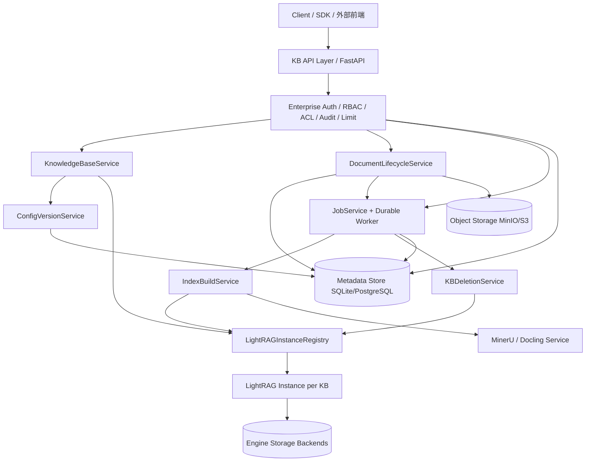

# LightRAG 生产级后端 + 企业能力 设计方案

> 文档版本：2026-06-08
> 文档定位：本文是 LightRAG 生产级 KB 后端与企业能力的**单一权威设计文档**，按架构分层组织，给出每个功能模块的实现状态与剩余缺口。
> 取代关系：本文整合并取代 `archive/生产级后端改造设计方案.md`、`archive/生产级后端改造待办清单.md`、`archive/生产级后端企业能力补齐执行清单.md`、`archive/企业级多用户权限管理改造设计方案.md`（均已移入 `docs/archive/`，保留历史进度记录）。
> 配套文档（专项详解，未并入本文）：
> - 接口契约：[`docs/API接口.md`](API接口.md)
> - KB 配置项字段速查：[`docs/KB配置项速查表.md`](KB配置项速查表.md)
> - 聚合任务流水线并发改造：[`docs/KB聚合任务流水线并发改造设计方案.md`](KB聚合任务流水线并发改造设计方案.md)
> - 备份恢复 Runbook：[`docs/生产级后端备份恢复Runbook.md`](生产级后端备份恢复Runbook.md)

---

## 状态图例

| 标记 | 含义 |
|---|---|
| ✅ | 已实现并有测试覆盖 |
| 🟡 | 部分完成：代码已落地，但功能不完整，或仅有 gated 测试 / 缺真实环境演练 |
| ⏳ | 未实现：明确推迟到后续平台阶段 |

> 状态以各源文档 2026-06-08 自述 + 测试运行记录为准。结构化清单（待办 P0–P4、企业能力补齐清单、企业验收清单）当时均 100% 勾选，因此本轮 API-only 交付范围内无"该做未做"项；🟡/⏳ 全部落在"做了没做完"与"后续平台能力"两类。

---

## 目录

- [1. 背景与设计结论](#1-背景与设计结论)
- [2. 目标与非目标](#2-目标与非目标)
- [3. 总体架构](#3-总体架构)
- [4. 分层功能清单与状态](#4-分层功能清单与状态)
- [5. 核心数据模型](#5-核心数据模型)
- [6. 关键机制](#6-关键机制)
- [7. 企业级权限模型](#7-企业级权限模型)
- [8. 状态机](#8-状态机)
- [9. 待实现 / 部分完成汇总](#9-待实现--部分完成汇总)
- [10. 兼容与迁移](#10-兼容与迁移)
- [11. 风险清单](#11-风险清单)

---

## 1. 背景与设计结论

### 1.1 底层已有能力

LightRAG 引擎层已具备：

- `lightrag/lightrag.py`：`LightRAG` 编排类，`workspace` 作为存储隔离字段，支持 KV / Vector / Graph / DocStatus 四类可插拔后端。
- `lightrag/pipeline.py`：native / mineru / docling 分队列解析、多模态分析、chunk、实体关系抽取、KG merge、向量写入的三层流水线。
- `lightrag/api/routers/`：全局 `/documents`、`/query`、`/graph` 接口（单一 server-level workspace）。
- `lightrag/parser/external/mineru/`：MinerU 外部解析、raw bundle 缓存、sidecar 归一化。

### 1.2 生产化缺口（改造起点）

1. 无知识库 CRUD，只有一个全局 workspace。
2. 全局 `/documents`、`/query`、`/graph` 无 request-scoped `kb_id` 路由。
3. 无 per-KB `LightRAG` 实例注册表，不能不同 KB 不同配置。
4. 无持久化任务中心；`pipeline_status` 只适合运行时观察，不能作为生产事实来源。
5. 缺分阶段接口（多文件上传、单文件解析、批量解析、单文档/批量构建）。
6. 缺 KB 级配置版本与 hash 策略，无法可靠判断增量解析/重建范围。
7. 删除一致性弱：必须同时处理 full docs / chunks / vectors / graph / doc status / artifacts / 输入文件 / 缓存。
8. 无多用户 / RBAC / ACL / 审计 / 配额。

### 1.3 核心设计结论

```text
kb_id -> workspace -> LightRAG instance -> storage namespace / input dir / artifacts / jobs / configs
```

不要用一个全局 `LightRAG` 实例承载所有知识库。生产层在 LightRAG 之上新增业务边界：

```
KnowledgeBaseService + LightRAGInstanceRegistry + DocumentLifecycleService
  + JobService + ConfigVersionService + IndexBuildService + KBDeletionService
  + （企业层）EnterpriseAuth / ACL / Audit / ServiceApiKey / Limit
```

上层做知识库业务隔离，底层复用 LightRAG 的 workspace 隔离与 pipeline 能力。

---

## 2. 目标与非目标

### 2.1 目标（已交付）

- KB 级 API：创建/查询/更新/删除知识库。
- 以 KB 为边界管理文档：批量上传、增量同步、列表、详情、删除、替换、重新解析、重新构建。
- 解析与索引解耦：单文件 / 批量解析；分阶段送入 chunk → 抽取 → KG → 向量。
- 增量更新：新文件只处理新增；删除文件清理相关存储。
- KB 级问答：`local/global/hybrid/naive/mix/bypass`。
- 不同 KB 不同配置：parser / chunk / embedding / extraction / query / LLM 角色默认值（部署级字段除外）。
- 所有耗时操作任务化，返回 `job_id`，支持查询/取消/重试/恢复。
- 企业模式：多用户、RBAC/ACL、审计、service key、默认关闭的配额/限流。

### 2.2 非目标（明确推迟，⏳）

- 计费/成本配额、分布式多实例 quota 共享计数、并发 jobs / token / cost 配额。
- metrics 告警 / SLO / dashboard / 延迟 histogram。
- SSO / OIDC / SAML。
- 内置 WebUI / 前端管理台（本轮为 **API-only** 交付，后续由独立前端系统对接已交付 API）。
- 复杂组织树 / 继承策略 / 跨租户共享 / tenant admin 自助。
- service key 过期 / rotation 后端策略。
- artifact 字段级 masking / per-artifact-type policy。
- Job worker 横向扩展、真实基础设施周期性备份恢复演练。

---

## 3. 总体架构

### 3.1 架构图



### 3.2 模块职责

| 模块 | 职责 |
|---|---|
| KB API Layer | 暴露 `/kbs/...`，解析 `kb_id`、参数校验、幂等 key、错误码。 |
| EnterpriseAuth / Authz | 企业模式下解析 `Principal`，做系统角色 / KB ACL / capability / anti-bypass 检查，写审计，做配额限流。 |
| KnowledgeBaseService | KB 生命周期、workspace 映射、状态、基础元数据。 |
| LightRAGInstanceRegistry | 按 `kb_id` 懒加载 / 缓存 / 回收 LightRAG 实例；single-flight、LRU/TTL、destructive_lock。 |
| ConfigVersionService | 不可变配置快照，派生 parser/index/query hash，diff，激活，运行时 overlay。 |
| DocumentLifecycleService | 文档元数据、状态机、source hash、artifact、`lightrag_doc_id` 映射、`source_key` 同步。 |
| JobService + Durable Worker | 持久化任务、状态机、进度、重试、取消、幂等、孤儿恢复、可恢复 job 续跑。 |
| IndexBuildService | 解析产物 → LightRAG pipeline（chunk/抽取/embedding/KG merge），三段 hash 增量，批量单次 drain。 |
| KBDeletionService | 硬删除编排：drop 全部引擎 storage、清目录/对象存储、purge 控制面。 |
| LightRAG | 底层 RAG 引擎：解析入库、抽取、KG merge、查询。 |

### 3.3 LightRAG 实例组成

`LightRAG` 由 mixin 组装（`_RoleLLMMixin → _StorageMigrationMixin → _PipelineMixin → object`），`@final`，外部不应继承。Registry 创建实例时注入 workspace + active config，并 `await initialize_storages()`。详见 `AGENTS.md`。

---

## 4. 分层功能清单与状态

> 这是本文核心。按架构层列出功能模块及其实现状态；接口路径与请求/响应字段见 [`docs/API接口.md`](API接口.md)。

### 4.1 KB 管理层

| 功能 | 状态 | 说明 |
|---|---|---|
| `KnowledgeBaseService` CRUD / soft delete / deleted tombstone 防复用 | ✅ | PATCH omitted-vs-null 语义；跨进程 metadata 写锁 |
| `kb_id -> workspace` 无碰撞安全映射 | ✅ | `_`/`-` 可区分编码，`a-b` 与 `a_b` 不冲突 |
| `LightRAGInstanceRegistry`：single-flight 初始化、缓存、discard、LRU(`max_entries`)、idle-TTL、`destructive_lock` / `force_evict` | ✅ | |
| `GET /kbs/{kb_id}/status` 聚合（KB / pipeline / storage workspace / running_jobs） | ✅ | |
| 软删除（默认）+ registry 卸载 | ✅ | |
| 硬删除：`adrop_all_storages` / `drop_kb_data` 显式 drop 全部 12 个引擎 storage（含外部后端）→ 删目录 → 清对象存储 → purge 控制面 | ✅ | 修复了"只删本地目录、外部后端残留、复用 workspace 读旧数据"的隔离 bug |
| HTTP `?hard=true` durable queueing：worker 支持 `clear_kb` 时入队 + tombstone 后仍可观察/重试；worker disabled 时同步执行 | ✅ | |
| 跨真实 PG/Milvus/Neo4j/MinIO 组合的硬删除清理一致性**生产周期性演练** | 🟡 | gated 集成测试已跑通（`test_hard_delete_external_backends.py`），真实基础设施周期性演练待做 |

### 4.2 文档生命周期层

| 功能 | 状态 | 说明 |
|---|---|---|
| 多文件上传 `:upload`（可选 auto_parse/auto_index） | ✅ | 同名文件独立目录 + `O_EXCL` 独占创建；扩展名/大小/文件数限制 |
| 文本导入 `:texts` | ✅ | 单文档/metadata/数量上限 |
| URL 导入 `:urls` | ✅ | SSRF 基线防护：禁 userinfo、拒 private/loopback/link-local、禁自动 redirect、peer address 复验防 DNS rebinding、streaming size cap |
| 本地 staged 文件导入 `:import` / 目录扫描 `:scan` | ✅ | `INPUT_DIR` containment、拒逃逸/symlink/空文件/超限 |
| 增量同步 `:sync`（`source_key` 稳定身份） | ✅ | 原子唯一约束；created/replaced/skipped/reparsed per-item |
| 列表 / 详情 / `PATCH`（metadata/enabled/archived） | ✅ | 拒覆盖内部控制面保留 key；`source_name` LIKE 过滤 |
| 独立 `:enable` / `:disable` | ✅ | 已接入检索层（disabled/archived 排除出 `QueryParam.ids`） |
| 单文档 `DELETE` / 批量 `:batch-delete`（job-based） | ✅ | 共享图谱策略 `strategy` + `delete_graph_orphans` |
| 文档替换 `:replace`（job-based） | ✅ | 清旧索引 → 换 source → 重置派生状态；active conflict 409 |
| 启用对象存储时 source 同步持久化 MinIO/S3 | ✅ | `metadata.source_object_uri`，本地 cache fallback |

### 4.3 解析层

| 功能 | 状态 | 说明 |
|---|---|---|
| 单文档 `:parse` / 批量 `:batch-parse`（parse-only） | ✅ | `auto_index` 为 parse-only 预留 no-op，固定不构建（in-process 与 worker 续跑一致） |
| 解析指令优先级（请求 > 文档 snapshot > active config > 文件/环境路由） | ✅ | |
| 解析缓存（MinerU/Docling raw bundle manifest 校验） + `force_reparse` 绕过 | ✅ | |
| 细粒度 artifact（original/sidecar/blocks/raw_dir + markdown/content_list/middle_json/model_json/image/layout_pdf） | ✅ | retry 自动替换旧 artifact |
| parse 阶段 await 内强制中断（在途 MinerU/Docling 可被 `:cancel` 立即打断，解析幂等可重跑） | ✅ | build/向量写入刻意只做阶段边界协作式取消 |
| live MinerU **超时 / 网络中断**真实行为 | 🟡 | 通用 parser 失败由 fake parser 覆盖；live parse→build→query 全链路为 gated 测试，故障注入待真实故障 endpoint |

### 4.4 索引构建层

| 功能 | 状态 | 说明 |
|---|---|---|
| 单文档 `:build-kg` / 批量 `:batch-build-kg` | ✅ | 三段 hash 增量；`index_hash` 命中且 ready 时 skip |
| 单文档 `:reindex` / 批量 `:batch-reindex`（默认全 force） | ✅ | force 时先 `adelete_by_doc_id` 清旧索引再 re-enqueue，绕过引擎去重 |
| 全 KB `:rebuild`（枚举可构建文档批量 force reindex） | ✅ | 空 KB no-op |
| 三段 hash 增量入库（`source_hash`/`parser_hash`/`index_hash`） | ✅ | 详见 [§6.1](#61-三段-hash-增量) |
| 聚合任务两阶段并发（Phase 1 并发解析 + Phase 2 单次批量 drain） | ✅ | 详见 [`KB聚合任务流水线并发改造设计方案.md`](KB聚合任务流水线并发改造设计方案.md) |
| 非强制重建陈旧计数 bug 修复（`_build_needs_engine_clear`） | ✅ | 已建文档非强制重建也真正重跑、回填新计数 |
| KB 级图谱只读：`graph/status`/`entities`/`relations`/`graph`（子图） | ✅ | workspace 隔离，有界全图扫描 + `is_truncated` |

### 4.5 查询层

| 功能 | 状态 | 说明 |
|---|---|---|
| `:query` / `:query/stream` / `:query/data` / `:retrieve` | ✅ | 复用 `aquery_llm`/`aquery_data`，带 KB 边界 |
| 查询模式 `local/global/hybrid/naive/mix/bypass` | ✅ | |
| `filters.doc_ids`（KB 归属校验 + 检索层 `QueryParam.ids` 白名单精确过滤） | ✅ | 修复了 `aquery_data` 漏传 `ids` 的真实 bug |
| `filters.metadata`（标量/列表 OR；与可检索集合取交集） | ✅ | |
| workspace 隔离 | ✅ | 引擎级双 KB 交叉 query 零泄漏测试守护 |
| active/删除中文档 query guard（命中 deleting/replacing 返回 409） | ✅ | |
| metadata 返回 active config（config_version_id / 三段 hash） | ✅ | |

### 4.6 任务中心

| 功能 | 状态 | 说明 |
|---|---|---|
| `JobService`：创建/列表/详情/`:wait`/`:cancel`/`:retry`/dead-letter | ✅ | 状态机 + 非法转换 409 |
| 批量聚合 job（`document_id=null` + `batch_id` + per-item result） | ✅ | |
| 幂等 key（`(kb_id, job_type, idempotency_key)` 唯一） | ✅ | 同指纹复用，异指纹 409 |
| 孤儿恢复（重启把 running 转 failed、文档回 `*_failed`） | ✅ | |
| 协作式取消检查点 + parse await 内强制中断 | ✅ | |
| 可选 durable worker（`LIGHTRAG_KB_JOB_WORKER`）：原子单赢 claim、`:retry` 自动消费、重启续跑 | ✅ | 覆盖 parse/build_kg/reindex/delete/replace/sync/clear_kb |
| replace / sync staged-bytes 续跑（含 hash 校验，不匹配 `*_not_resumable`） | ✅ | |
| server lifespan 真实启动 + queued job 自动消费 E2E | ✅ | `test_job_worker_server_wiring.py` |
| 真实多进程 / 多 worker 崩溃恢复演练 | 🟡 | 单进程 lifespan + executor 续跑已测；多 worker 部署演练待做 |

### 4.7 配置版本层

| 功能 | 状态 | 说明 |
|---|---|---|
| 创建 / 列表 / 详情 / `:activate` / `:diff` | ✅ | 不可变快照，激活写 `active_config_version_id` 并 discard 实例 |
| 严格校验：未知键 / 部署级字段（storage_config、parser 服务实例参数）创建时 400 | ✅ | 消除"存了不生效" |
| 运行时 overlay：`parser_config`/`chunk_config`/`embedding_config`/`query_config`/`extraction_config`/`llm_role_config` | ✅ | 字段速查见 [`KB配置项速查表.md`](KB配置项速查表.md) |
| `extraction_config` 端到端进入真实抽取 prompt | ✅ | `test_extraction_config_reaches_real_extraction_prompt` 守护 |
| `:activate` 的 `auto_enqueue` follow-up jobs（按 diff 创建 parse/reindex，幂等 key） | ✅ | query-only / 无 eligible 文档显式 no-op reason |

### 4.8 存储与持久化

| 功能 | 状态 | 说明 |
|---|---|---|
| 控制面 metadata：local SQLite | ✅ | `working_dir/metadata/{knowledge_bases.json, metadata.sqlite3}` |
| 控制面 metadata：PostgreSQL（`LIGHTRAG_KB_METADATA_BACKEND=postgres`） | ✅ | JSONB record + projection/index 表 |
| SQLite ↔ PostgreSQL 行为契约测试 | ✅ | SQLite 始终跑；PG gated（`LIGHTRAG_KB_POSTGRES_TEST_DSN`），已跑通 |
| JSON/SQLite → PostgreSQL 迁移/回填工具（`lightrag-migrate-kb-metadata`） | ✅ | 只迁控制面，不迁引擎 storage |
| 对象存储 MinIO/S3（`LIGHTRAG_OBJECT_STORAGE=minio\|s3`） | ✅ | source/artifact 持久化、restore、预签名 URL、delete/hard-delete 清理 |
| 对象存储出厂代码直测（boto3 边界打桩，离线） | ✅ | `test_object_storage_s3.py` |
| 备份恢复 runbook | ✅ | 文档见 [`生产级后端备份恢复Runbook.md`](生产级后端备份恢复Runbook.md)；真实基础设施周期性演练 🟡 待做 |

### 4.9 企业能力层

> 仅在 `LIGHTRAG_ENTERPRISE_AUTH_ENABLED=true` 时启用；默认关闭保持 legacy 单用户/API-key 兼容。权限模型见 [§7](#7-企业级权限模型)。

| 功能 | 状态 | 说明 |
|---|---|---|
| 企业模式开关 + fail-closed + 启动校验（非默认 TOKEN_SECRET、必配 super admin） | ✅ | |
| super admin bootstrap（`.env` 用户名 + 密码/hash），不能删最后一个 super admin | ✅ | |
| 企业用户表 + 生命周期：创建/列表/详情/更新/`:disable`/`:enable`/`:reset-password` | ✅ | token_version 失效旧 token |
| 登录/注册/改密（`/login`、`/auth/register`、`/auth/me`、`/auth/change-password`） | ✅ | 企业模式 `/auth-status` 不签发 guest token |
| 注册策略 `disabled/open/invite_only/admin_approval` 持久化 + 实时 API | ✅ | |
| invite_only 邀请码 + admin_approval 待审批工作流 | ✅ | `POST /admin/invitations` 颁发单次邀请(原子单用、可过期、可撤销);`admin_approval` 创建 pending 用户待管理员 `:enable` 审批 |
| KB ACL（user + tenant principal，`kb_owner/admin/editor/viewer`）+ `acl:batch-set` + KB 存在性校验 | ✅ | effective role 取 direct user ACL 与 tenant ACL 最高角色 |
| 租户治理：扁平 tenant membership / tenant role / tenant-scope KB ACL | ✅ | 复杂组织树/继承/跨租户共享/tenant admin 自助 ⏳ |
| service/scoped API key：创建/列表/撤销、hash 存储、`kb_roles` scope、即时失效、`expires_at` 过期(鉴权时校验) | ✅ | 不允许建 KB / 成 super admin；rotation 后端策略 ⏳ |
| 业务审计覆盖（KB/config/query/retrieve/artifact/document/job 全链路，白名单脱敏） | ✅ | append-only；不记录 raw query/正文/URL/path/presigned/密码/token |
| anti-bypass（受保护前缀不可 whitelist；全局 API_KEY 默认不绕 RBAC；legacy 全局路由默认禁用/super-admin-gated；bypass 按最终模式门控） | ✅ | |
| artifact 动作级权限 `LIGHTRAG_ENTERPRISE_ARTIFACT_DOWNLOAD_MIN_ROLE` | ✅ | 仅提升 `:download`/`:download-url`；per-type/字段级 ⏳ |
| 请求限流 / 配额（默认关闭，单进程内存固定窗口，user/tenant/key 分桶，429+Retry-After+审计） | ✅ | 分布式共享计数、token/cost 配额 ⏳ |
| 并发 jobs 配额（per principal/tenant 在途 job 数,默认关闭,job 创建时拦截,payload 打 principal 标记 + 跨 KB 计数） | ✅ | 分布式共享计数 ⏳ |
| 登录失败锁定（企业 `/login`,默认开启,per-username 窗口计数 + 锁定 + 审计,可配/可关） | ✅ | 单进程内存;分布式协调与注册失败限流 ⏳ |
| Prometheus `/metrics`（基础计数/gauge，`combined_auth` 保护） | 🟡 | 延迟 histogram / 告警规则 / SLO / dashboard ⏳ |
| `POST /admin/users/{user_id}/kb-access:batch-set`（按用户批量设置 KB） | ⏳ | 设计预留，当前仅按 KB 维度 `acl:batch-set` 实现 |
| SSO / OIDC / SAML | ⏳ | 明确降级；当前仅企业用户表 + JWT + service key |

---

## 5. 核心数据模型

> local 模式落 SQLite，PostgreSQL 模式落对应 JSONB + projection 表。

### 5.1 控制面（KB 业务）

| 表 | 关键字段 |
|---|---|
| `knowledge_bases` / `kb_catalog` | `id`、`name`、`description`、`workspace`、`status`(creating/active/disabled/deleting/deleted/error)、`active_config_version_id`、`owner_id`、`tenant_id`、`visibility`、时间戳 |
| `kb_config_versions` | `id`、`kb_id`、`version`(单调递增)、`parser_config`、`chunk_config`、`embedding_config`、`extraction_config`、`query_config`、`llm_role_config`、`parser_hash`、`index_hash`、`query_hash`、`created_by` |
| `documents` / `kb_documents` | `id`、`kb_id`、`lightrag_doc_id`、`source_type`、`source_name`、`source_uri`、`source_hash`、`parser_hash`、`index_hash`、`status`、`enabled`、`archived`、`chunks/entity/relation_count`、`error_*` |
| `document_artifacts` / `kb_document_artifacts` | `id`、`kb_id/doc_id`、`artifact_type`、`uri`、`checksum`、`metadata`(含 `object_uri`/`object_prefix_uri`) |
| `jobs` / `kb_jobs` | `id`、`kb_id`、`batch_id`、`doc_id`、`job_type`、`status`、`stage`、`progress`、`total/completed/failed_items`、`idempotency_key`、`payload`、`result`、`retry_count/max_retries`、`error_*`、时间戳 |

### 5.2 企业层

| 表 | 用途 |
|---|---|
| `enterprise_users` | 用户：`id`、`username`、`password_hash`、`system_role`、`status`、`tenant_id`、`can_create_kb`、`can_use_bypass_query`、`token_version` |
| `enterprise_system_settings` | 注册开关 / 模式等运行时设置 |
| `enterprise_kb_acl` | direct user KB ACL：`(kb_id, user_id) -> role` |
| `enterprise_tenant_memberships` | `(tenant_id, user_id) -> tenant_role` |
| `enterprise_tenant_kb_acl` | tenant-scoped KB ACL：`(tenant_id, kb_id) -> kb_role` |
| `enterprise_api_keys` | service key：`sha256` hash + preview + `kb_roles` scope + 状态 |
| `enterprise_audit_events` | append-only 审计：`event_type`、`actor_user_id`、`target_type/id`、白名单 `metadata`、`created_at` |

---

## 6. 关键机制

### 6.1 三段 hash 增量

| Hash | 派生因子 | 改动后最小动作 |
|---|---|---|
| `source_hash` | 上传/文本/URL/import/scan 内容字节 | 重新解析 + 重新构建 |
| `parser_hash` | 解析引擎 + process options | 重新解析 + 重新构建 |
| `index_hash` | active runtime 已接入的 chunk / embedding / extraction 配置 + `extract`/`vlm` 角色身份 | 仅重新构建索引（复用解析产物） |
| （`query_hash`） | `query_config` + `query`/`keyword` 角色身份 | 仅影响查询，不重建 |

`:build-kg` 命中 `index_hash` 且文档 ready 时 skip；`:reindex` 始终绕过 skip。字段→hash 映射详见 [`KB配置项速查表.md`](KB配置项速查表.md)。

### 6.2 并发与锁

| 锁 | 用途 |
|---|---|
| KB metadata 写锁（进程内 `asyncio.Lock` + 跨进程 `.lock` + reload-before-write + atomic replace） | 防并发写丢记录 |
| SQLite/PG 原子 claim（`queued → running` 单赢 CAS；文档 `parse_queued/building/deleting/replacing` claim） | 防同文档重入、防重复执行 |
| `destructive_lock:{kb_id}` | clear / hard delete / rebuild 期间保护存储一致性，阻止 discard/reap/重建 |

pipeline 并发契约（`busy`/`destructive_busy`/`scanning`/`pending_enqueues`/`request_pending`）见 `AGENTS.md`。

### 6.3 聚合任务流水线并发

聚合 parse job（`:upload`/`:texts` auto_parse、`:sync`、`:batch-parse` 及 worker 续跑）两阶段执行：Phase 1 受 `MAX_PARALLEL_PARSE_MINERU` 并发解析；Phase 2 全部成功文档一次性批量入队、单次 drain，使 analyze/extract/merge 跨文档重叠。HTTP 契约 / 状态机零变更。详见 [`KB聚合任务流水线并发改造设计方案.md`](KB聚合任务流水线并发改造设计方案.md)。

### 6.4 删除一致性与共享图谱策略

单文档/批量删除任务化、可重试、可 durable 续跑。共享图谱删除策略 `strategy`：

| strategy | 说明 |
|---|---|
| `safe` / `rebuild_doc_scope` | 复用 `adelete_by_doc_id` 内建 source-attribution，只删失去最后来源的实体/关系；共享实体保留 |
| `rebuild_kb` | 删除后对 KB 内剩余全部可构建文档保守 force-reindex（需 `IndexBuildService`，否则 503） |
| `rebuild_subgraph` | 删除前快照被删文档足迹，只对与足迹有交集的幸存文档 force-reindex（精确局部重建） |

`delete_graph_orphans` 默认 `true`（引擎始终修剪孤立实体/关系），显式 `false` 返回 400。

### 6.5 幂等

所有创建型接口支持 `idempotency_key`，唯一索引 `(kb_id, job_type, idempotency_key)`：同指纹返回原 job，异指纹 409。

### 6.6 durable worker 恢复

可恢复类型：单文档 parse/build_kg/reindex/delete/replace、聚合 parse/build_kg/reindex/sync、`documents:batch-delete`、`clear_kb`。续跑依据：源文件/产物已落盘（聚合 parse/build）、staged request bytes（replace/sync，带 hash 校验）、payload `document_ids`（batch-delete）、payload `kb_id/workspace`（clear_kb 幂等）。`queued_at` 早于 grace window 才认领，不抢新任务。

---

## 7. 企业级权限模型

### 7.1 Principal 与角色

认证成功返回 `Principal`（`subject_id`、`username`、`principal_type` ∈ {user, service_account, guest}、`system_role` ∈ {super_admin, user}、`tenant_id`、`auth_method`、`token_version`、`is_active`）。route handler 不信任请求体的 `owner_id`/`tenant_id`/`created_by`，一律从 Principal 派生。

- 系统角色：`super_admin`（平台治理，唯一可删 KB）/ `user`。
- 全局 capability：`can_create_kb`、`can_use_bypass_query`（其余 `can_create_service_api_key`/`max_kbs`/`max_concurrent_jobs` 为设计预留）。
- KB 角色阶梯：`kb_owner` > `kb_admin` > `kb_editor` > `kb_viewer`。删除 KB 不在 KB 角色内，统一 super_admin。

### 7.2 KB 路由权限矩阵

| 范围 | 最低角色 / 能力 |
|---|---|
| `POST /kbs` | super admin 或 `can_create_kb=true` |
| `GET /kbs` | super admin 全部；普通用户仅 direct/tenant ACL 授权；service key 仅 `kb_roles` scope |
| 读取（详情/status/artifact list/preview/doc/job/config/query/graph） | `kb_viewer`+ |
| query/stream/data/retrieve | `kb_viewer`+；最终 `mode="bypass"` 额外需 `can_use_bypass_query` |
| artifact `:download` / `:download-url` | `LIGHTRAG_ENTERPRISE_ARTIFACT_DOWNLOAD_MIN_ROLE`（默认 `kb_viewer`，可升级） |
| 文档写（upload/parse/build/delete/replace/sync）、job cancel/retry | `kb_editor`+ |
| KB 配置创建/激活/diff、`PATCH /kbs/{kb_id}` | `kb_admin`+ |
| `DELETE /kbs/{kb_id}`、`?hard=true`、`/admin/...` | super admin |

### 7.3 anti-bypass

企业模式下：受保护前缀（`/kbs`、`/documents`、`/query`、`/graph`、`/api`）不能被 `WHITELIST_PATHS` 放行；全局 `LIGHTRAG_API_KEY` 默认不绕过 RBAC（除非显式 `LIGHTRAG_ENTERPRISE_LEGACY_API_KEY_SUPERADMIN`）；legacy/global 路由在 `LIGHTRAG_ENTERPRISE_DISABLE_GLOBAL_ROUTES=true` 时默认禁用，否则 super-admin-gated；service key 只按 `kb_roles` scope，不隐式继承 tenant ACL。

### 7.4 安全原则

Fail Closed；服务端强制权限（前端只做展示）；最小权限（新用户默认无 KB 权限）；不存明文密码/key（仅 hash）；每次请求校验用户状态与 `token_version`；审计白名单脱敏。

---

## 8. 状态机

> 权威"当前实现"状态机以本节为准（早期蓝图里的 `index_queued/chunking/extracting_kg/embedding/merging_kg/committing` 等细粒度状态从未落地）。

### 8.1 文档状态机

```
created -> uploaded
        -> parse_queued -> parsing -> parsed
                                   -> parse_failed
parsed / ready / build_failed -> build_queued -> building -> ready
                                                          -> build_failed
uploaded/parsed/ready/parse_failed/build_failed/replace_failed
        -> replacing -> uploaded
                     -> replace_failed
辅助：disabled / archived / deleting / delete_failed / deleted
```

### 8.2 任务状态机

```
queued --> running --> succeeded
   |          |--> cancelling --> cancelled
   |          |--> failed
   +--> cancelled
   +--> failed
failed/cancelled --> retrying --> queued
```

job stage 实际取值：`uploading/parsing/building/deleting/syncing/replacing`。非法转换返回 409。

---

## 9. 待实现 / 部分完成汇总

> 本轮 API-only 交付范围内无"该做未做"。以下为剩余工作，按性质分两类。
>
> **2026-06-08 补齐**：invite_only/admin_approval 注册工作流、登录失败锁定、service key `expires_at` 过期、并发 jobs 配额 4 项功能缺口已实现并测试（详见 §4.9），不再列于下表。

### 9.1 做了但没做完（🟡 — 代码已落地，缺完整功能 / 真实环境验证）

| 项 | 现状 | 缺口 |
|---|---|---|
| Prometheus `/metrics` | 基础计数 + gauge | 延迟 histogram、告警规则、SLO、dashboard |
| 请求限流 / 配额 + 并发 jobs 配额 | 默认关闭、单进程内存计数 | 分布式共享计数、token/cost 配额、注册失败限流 |
| 租户 / 组织治理 | 扁平 membership + tenant ACL | 组织树、继承策略、跨租户共享、tenant admin 自助 |
| service/scoped API key | 创建/列表/撤销/scope/`expires_at` 过期 | rotation 后端策略、租户继承 |
| artifact 动作级权限 | role 阶梯可配 | per-artifact-type policy、字段级 masking、自定义 action policy |
| 真实后端硬删除清理一致性 | gated 集成测试跑通 | 跨真实 PG/Milvus/Neo4j/MinIO 组合的生产周期性演练 |
| live MinerU 故障 | 通用失败由 fake 覆盖、gated live 全链路 | 超时/网络中断真实行为（需故障 endpoint） |
| durable worker 崩溃恢复 | 单进程 lifespan + executor 续跑已测 | 真实多进程/多 worker 崩溃恢复演练 |
| 备份恢复 | runbook 文档完成 | 真实基础设施按 `BACKUP_ID` 周期性恢复演练 |

### 9.2 未实现（⏳ — 明确推迟到后续平台阶段）

| 项 | 说明 |
|---|---|
| SSO / OIDC / SAML | 明确降级；接入前需补 issuer/client/audience/redirect/certs 校验、回调 CSRF/state、用户映射、端到端回调测试 |
| 内置 WebUI / 前端管理台 | API-only 非目标；后续由独立前端系统对接已交付 Auth/Admin/KB API |
| `POST /admin/users/{user_id}/kb-access:batch-set` | 按用户批量设置可访问 KB；当前仅按 KB 维度 `acl:batch-set` |
| 分布式 / 成本配额 | 计费结算、token/cost 预算、跨实例共享计数（Redis/PG counter） |
| Job worker 横向扩展 + metrics 告警/dashboard | 平台化运维能力 |
| 复杂组织层级 / 跨租户共享 / 继承策略 | 多租户高级治理 |

---

## 10. 兼容与迁移

- `LIGHTRAG_ENTERPRISE_AUTH_ENABLED=false`（默认）：保持 `AUTH_ACCOUNTS` / JWT / `LIGHTRAG_API_KEY` 行为，不强制建企业表。
- 开启企业模式首次启动：初始化企业表、bootstrap super admin、现有 KB 归 default tenant、super admin 获全 KB 访问。
- legacy `/documents`、`/query`、`/graph` 短期保留（走 default workspace）；新接入统一用 `/kbs/...`；企业模式默认禁用/super-admin-gate 全局路由。
- 控制面 metadata 从 JSON/SQLite 迁 PostgreSQL：先 `lightrag-migrate-kb-metadata --dry-run`，再实迁；不迁引擎 storage（向量/图/chunks 需各自运维流程）。

---

## 11. 风险清单

| 风险 | 影响 | 缓解 |
|---|---|---|
| 单全局 LightRAG 实例承载多 KB | 配置/workspace/pipeline 状态混乱 | per-KB registry |
| 只依赖内存 pipeline status | 重启丢状态 | 持久化 jobs/documents |
| 删除共享图谱实体误删 | 查询结果损坏 | source attribution + 保守重建 + `strategy` |
| embedding/chunk 配置变化未重建 | 向量维度/语义不一致 | config version + 三段 hash diff |
| 硬删除外部后端残留 | workspace 复用读旧数据（隔离 bug） | `adrop_all_storages` 显式 drop + gated 集成测试（生产演练 🟡 待补） |
| 企业权限被 legacy route 绕过 | 越权读写 | anti-bypass：默认禁用/super-admin-gate 全局路由 |
| token 过期前权限仍有效 | 禁用用户继续访问 | 每请求校验 `token_version` |
| 请求体伪造 owner/tenant | 越权/伪造归属 | 服务端从 Principal 派生 actor 字段 |
| 配额仅单进程内存计数 | 多实例下不全局一致 | 默认关闭最小闭环；分布式计数 ⏳ 后续 |
